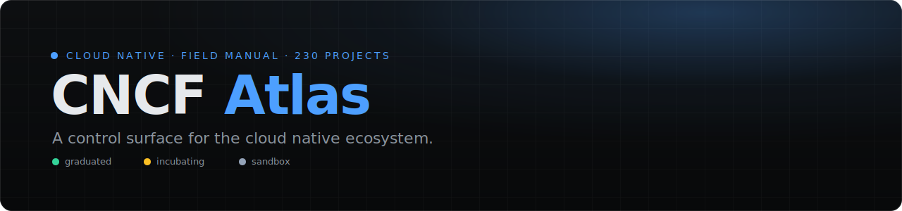

[](https://github.com/kanywst/cncf-atlas/actions/workflows/ci.yml)
[](https://github.com/kanywst/cncf-atlas/actions/workflows/security.yml)
[](https://github.com/kanywst/cncf-atlas/actions/workflows/deploy.yml)
[](./LICENSE)
[](https://github.com/kanywst/cncf-atlas)
[](https://kanywst.github.io/cncf-atlas/)

[English](./README.md) · **日本語**

## なぜ作るか

CNCF landscape は数百のプロジェクトをグリッド上のロゴとして並べる。プロジェクトが存在することは分かるが、それが何で、どう動き、自分のスタックに合うかは分からない。CNCF Atlas はそこを埋める。各プロジェクトに、実際のリポジトリを読んで書いたディープダイブを用意し、毎回同じ構成にする。だから上から下まで読めば理解して帰れる。

## できること

- カテゴリで辿れるドキュメントサイト。各プロジェクトに CNCF の成熟度タグが付く。
- プロジェクトごとに同じ順序の 6 セクション。どこを見ればいいか分かる。
- 既定は英語、完全な日本語版あり。どのページでも言語を切り替えられる。
- 著作エンジン: 2 つの Claude Code スキルがプロジェクトを調査し、統一構成のバイリンガル・ディープダイブを書く。

## ディープダイブが扱うこと

| セクション | 答えること |
| --- | --- |
| Overview | 何で、いつ使い、主要な事実は何か。 |
| History | どこから来て、どうここまで来たか。 |
| Architecture | コンポーネントと、リクエストがどう流れるか。 |
| Adoption & Ecosystem | 誰が運用し（出典付き）、周囲に何があり、代替は何か。 |
| Internals | 重要なコードパス、ソースからの引用。 |
| Getting Started | インストールして最初の構成を動かす。 |

## リポジトリ構成

```text
docs/                      VitePress サイト
  .vitepress/
    config.ts              i18n（英語ルート + 日本語）、サイドバーは tools.ts から生成
    tools.ts               カタログレジストリ、単一ソース
    theme/                 カスタムテーマ: カタログカード、ブランド CSS
  index.md                 英語ホーム
  tools/<slug>/            英語ディープダイブ（6 ページ）
  ja/                      日本語ミラー
templates/tool-doc/        writer がコピーする英日のセクション雛形
research/<tool>/           プロジェクトごとの作業領域（メモ・出典; src/ は gitignore）
scripts/check-tools.mjs    CI チェック: 各カタログ項目に全ページが揃っているか
```

## ローカルで動かす

```bash
npm install
npm run docs:dev      # http://localhost:5173
npm run docs:build    # docs/.vitepress/dist へ本番ビルド
npm test              # カタログレジストリとファイルの整合チェック
```

## プロジェクトを追加する

`.claude/skills/` の 2 スキルが作業する:

1. `atlas-recon <owner/repo>` が upstream を clone してコミットをピン留めし、アーキテクチャと重要パスを地図化、出典付きの歴史・採用素材を `research/<tool>/` に集める。
2. `atlas-write <tool>` がその調査をバイリンガル 6 セクションのディープダイブに起こし、`docs/.vitepress/tools.ts` にプロジェクトを登録する。

`tools.ts` に 1 エントリ足すと、サイドバーとホームのカタログが同時に更新される。

## ライセンス

[MIT](./LICENSE)。
