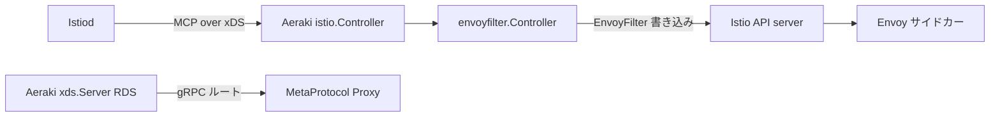

# アーキテクチャ

## 全体像

Aeraki はデータプレーンを持ちません。Istio と Envoy の上に乗るコントロールプレーンで、2 つの役割を担います。1 つ目は Istio `EnvoyFilter` リソースの生成です。Istiod を MCP over xDS で監視し、`ServiceEntry`・`VirtualService`・`Gateway`・Aeraki 独自の CRD (Custom Resource Definition) の変化に反応して対応する Envoy 設定を作り、Istio API server に書き戻します。2 つ目は MetaProtocol Proxy データプレーン向けの RDS (Route Discovery Service) サーバです。`MetaRouter` リソースから計算したルートを gRPC で push します。Envoy 自身の RDS は HTTP 専用なので、これにより任意の L7 プロトコル向けの動的ルート配信を提供します (`README.md:71`)。



## コンポーネント

各コンポーネントは `NewServer` (`internal/bootstrap/server.go:103`) で配線されます。

### istio.Controller

Istiod を MCP over xDS で監視します。`internal/bootstrap/server.go:113` の `istio.NewController` で生成されます。内部では Aggregated Discovery Service Client (`xdsMCP *adsc.ADSC`、`internal/controller/istio/controller.go:69`) を保持し、`adsc.New` で Istiod に接続します (`internal/controller/istio/controller.go:131`)。他コンポーネントが読む config の `Store` を公開します。

### envoyfilter.Controller

config 変化を `EnvoyFilter` リソースに変える本体です。`internal/bootstrap/server.go:120` の `envoyfilter.NewController` で生成されます。サーバは全 config イベントをここへ転送するハンドラを登録します (`internal/bootstrap/server.go:122-124`)。

```go
configController.RegisterEventHandler(func(_, _ *istioconfig.Config, event model.Event) {
    envoyFilterController.ConfigUpdated(event)
})
```

### xds.CacheMgr と xds.Server

MetaProtocol RDS のパスです。`xds.NewCacheMgr` (`internal/bootstrap/server.go:126`) がルートキャッシュを作り、`xds.NewServer` (`internal/bootstrap/server.go:132`) が gRPC で配信します。キャッシュマネージャは go-control-plane の snapshot cache と Istio config store を保持します (`internal/xds/cache_mgr.go:53`)。

### プロトコルジェネレータ

プロトコルから `Generator` 実装への map で、非 HTTP プロトコルごとに 1 つ持ちます。`initGenerators` が Thrift・Kafka・Zookeeper・MetaProtocol を登録します (`cmd/aeraki/main.go:145-152`)。Dubbo と Redis は controller-manager の client が必要なため後から追加されます (`internal/bootstrap/server.go:144-145`)。

```go
args.Protocols[protocol.Dubbo] = dubbo.NewGenerator(scalableCtrlMgr.GetConfig())
args.Protocols[protocol.Redis] = redis.New(cfg, configController.Store)
```

## リクエストの流れ

Istiod の config 変化から書き込まれる `EnvoyFilter` までを 1 つ追います。

1. Istiod が MCP で config 変化を送る。`istio.Controller` が登録済みハンドラを呼び、`envoyFilterController.ConfigUpdated(event)` を呼ぶ (`internal/bootstrap/server.go:122-124`)。
2. `ConfigUpdated` は内部チャネルにイベントを送るだけ (`internal/envoyfilter/controller.go:513-515`)。
3. `mainLoop` がそのチャネルを select し、`debounce.New(debounceAfter, debounceMax, callback, stop)` で debounce してから発火する (`internal/envoyfilter/controller.go:116`)。debounce 窓は最小 1 秒、最大 10 秒 (`internal/envoyfilter/controller.go:47-51`)。callback は `pushEnvoyFilters2APIServer` を呼び、失敗時は最大 3 回再投入する (`internal/envoyfilter/controller.go:100-115`)。
4. `pushEnvoyFilters2APIServer` (`internal/envoyfilter/controller.go:128`) が目標フィルタを生成し、ラベル `manager=aeraki` で既存を一覧 (`internal/envoyfilter/controller.go:135-137`)、reconcile する。削除 (`internal/envoyfilter/controller.go:140-149`)、`proto.Equal` で差分検出して変更 (`internal/envoyfilter/controller.go:156`)、新規作成 (`internal/envoyfilter/controller.go:171-178`)。
5. `generateEnvoyFilters` (`internal/envoyfilter/controller.go:200`) が全 `ServiceEntry` を一覧し (`internal/envoyfilter/controller.go:202`)、各 port で `protocol.GetLayer7ProtocolFromPortName(port.Name)` により port 名から L7 プロトコルを判定する (`internal/envoyfilter/controller.go:222`)。
6. そのプロトコルにジェネレータがあれば (`internal/envoyfilter/controller.go:223`)、`EnvoyFilterContext` を組み (`internal/envoyfilter/controller.go:226`)、`generator.Generate(ctx)` を呼ぶ (`internal/envoyfilter/controller.go:233`)。

## 主要な設計判断

一意な VIP (Virtual IP) の割り当ては単一の controller で行います。理由は、`EnvoyFilter` 生成時のマッチ条件に VIP を使うからです。Istio は `ServiceEntry` に VIP を割り当てますが、サイドカースコープなので mesh 全体では一貫しません。Aeraki は一貫性が必要なため、singleton controller が割り当てます (`internal/bootstrap/server.go:296-302`)。

スケールは非対称です。`EnvoyFilter` リソースの書き込みは leader のみで動きます。master モードではサーバが leader election 下でこの controller を動かします (`internal/bootstrap/server.go:341-351`)。RDS サーバ・ルートキャッシュ・config watcher は master/slave に関係なく全レプリカで動きます (`internal/bootstrap/server.go:355-368`)。書き込みは 1 インスタンスに集約し、読み取り側のルート配信は水平にスケールします。

## 拡張ポイント

唯一の拡張インターフェースは `Generator` (`internal/envoyfilter/generator.go:22`) で、メソッドは `Generate(context *model.EnvoyFilterContext) ([]*model.EnvoyFilterWrapper, error)` の 1 つです (`internal/envoyfilter/generator.go:23`)。新しいプロトコルはプロトコル map に `Generator` を登録します。さらに新規 MetaProtocol プロトコルは、`meta-protocol-proxy` データプレーンの codec と `MetaRouter` CRD だけで足り、新しいコントロールプレーンコンポーネントは不要です。
