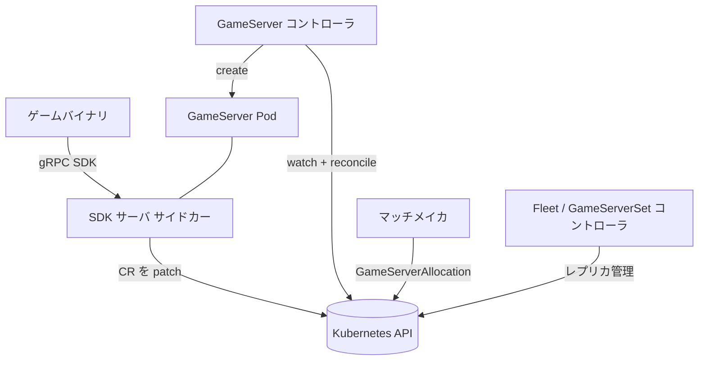

# アーキテクチャ

## 全体像

Agones は 2 つの要素からなる。ゲームサーバとそのグルーピングをモデル化する CRD (Custom Resource Definition) 群と、それらのリソースを稼働中の Pod へ調停するコントローラ群である。CRD 型は `pkg/apis` 配下に、リソースごとのコントローラは `pkg/` 配下に 1 パッケージずつ置かれる。ゲームサーバ Pod には Agones のサイドカー (SDK サーバ) が同居し、ゲームバイナリは gRPC でこれと話す。サイドカーが状態変化を Kubernetes API へ書き戻す。これによりゲームコードは Kubernetes から疎結合に保たれ、バイナリはローカルの SDK だけを知ればよい。

## コンポーネント

### CRD 型 (`pkg/apis`)

API 型は、ユーザとコントローラがやり取りするリソースを定義する。`agones/v1` は `GameServer` (`pkg/apis/agones/v1/gameserver.go:197`)、`Fleet` (`pkg/apis/agones/v1/fleet.go:41`)、`GameServerSet` (`pkg/apis/agones/v1/gameserverset.go:40`) を持つ。`allocation/v1` は `GameServerAllocation` (`pkg/apis/allocation/v1/gameserverallocation.go:52`)、`autoscaling/v1` は `FleetAutoscaler`、`multicluster` はクラスタ間アロケーションを扱う。

### GameServer コントローラ (`pkg/gameservers`)

単一 `GameServer` のライフサイクル (ポート割当、backing Pod の作成、アドレスの設定、`Ready` への遷移) を担う。リソースごとの調停エントリは `syncGameServer` (`pkg/gameservers/controller.go:471`)。

### 上位コントローラ (`pkg/gameserversets`, `pkg/fleets`, `pkg/fleetautoscalers`)

`GameServerSet` は同一ゲームサーバを所定数維持する (ReplicaSet 相当)。`Fleet` は `GameServerSet` 世代をまたぐローリング更新を司る (Deployment 相当)。`FleetAutoscaler` はバッファや負荷ポリシーに基づき `Fleet` をスケールする。

### アロケーション (`pkg/gameserverallocations`)

マッチメイカが 1 つの `Ready` なゲームサーバを確保し `Allocated` に移す。長命なオブジェクトではなく、一回限りのリクエストリソース (`GameServerAllocation`) である。

### ポートアロケータ (`pkg/portallocator`)

Agones は Kubernetes の `Service` を使わず、各ゲームサーバに Node の HostPort を自前で割り当てる。アロケータはノード単位のポート使用状況を追跡する (`pkg/portallocator/portallocator.go:115`)。

### SDK サーバ (`pkg/sdkserver`)

各ゲームサーバ Pod で動くサイドカー。ゲームバイナリに SDK gRPC サービスを公開し、バイナリに代わって `GameServer` リソースを patch する (`pkg/sdkserver/sdkserver.go:360`)。

## リクエストの流れ

`GameServer` が作成から `Ready` になるまでを追う。調停ループ `syncGameServer` (`pkg/gameservers/controller.go:471`) は状態別の sync 関数を 1 パスで順に呼ぶ。各関数は担当状態でなければ先頭で早期 return するため、1 回の調停で複数段進むことがある。

1. `syncGameServerPortAllocationState` (`pkg/gameservers/controller.go:565`) が `c.portAllocator.Allocate` (`pkg/gameservers/controller.go:570`) で動的 HostPort を割当て、状態を `Creating` に進める (`pkg/gameservers/controller.go:572`)。更新失敗時は `DeAllocate` でポートをプールに戻す (`pkg/gameservers/controller.go:580`)。
2. `syncGameServerCreatingState` (`pkg/gameservers/controller.go:589`) が `createGameServerPod` (`pkg/gameservers/controller.go:683`) で backing Pod を作り、`Starting` に進める (`pkg/gameservers/controller.go:631`)。
3. `syncGameServerStartingState` (`pkg/gameservers/controller.go:916`) が Pod の `NodeName` から Node を引き (`pkg/gameservers/controller.go:942`)、外部アドレスとポートを書き (`pkg/gameservers/controller.go:947`)、`Scheduled` にする (`pkg/gameservers/controller.go:954`)。
4. ゲームバイナリが SDK の `Ready()` を呼ぶ。サーバ側は `SDKServer.Ready` (`pkg/sdkserver/sdkserver.go:540`) で `RequestReady` への遷移をキューに積む (`pkg/sdkserver/sdkserver.go:543`)。実際の書き込みは `SDKServer.updateState` (`pkg/sdkserver/sdkserver.go:360`) が `gsCopy.Status.State = s.gsState` (`pkg/sdkserver/sdkserver.go:396`) で行う。
5. `syncGameServerRequestReadyState` (`pkg/gameservers/controller.go:967`) が `RequestReady` を検出し、未設定のアドレスを補完してから状態を `Ready` に確定し (`pkg/gameservers/controller.go:1014`)、`SDK.Ready() complete` イベントを記録する (`pkg/gameservers/controller.go:1023`)。

このパスが辿る状態定数は `pkg/apis/agones/v1/gameserver.go` に順に定義されている。`PortAllocation` (`:49`)、`Creating` (`:51`)、`Scheduled` (`:57`)、`RequestReady` (`:59`)、`Ready` (`:62`)。

## 主要な設計判断

コントローラは Kubernetes の `Service` や `NodePort` に頼らず、HostPort を直接割り当てる。ゲームトラフィックは UDP (User Datagram Protocol) 主体で、クライアントは Pod のホストポートに直結して遅延を最小化するためだ。アロケータはノード単位の使用ポートのビットマップを保持し (`pkg/portallocator/portallocator.go:119`)、起動時に informer の状態から再構築する。

調停ループは状態別 sync 関数を 1 パスで連鎖呼び出しする (`pkg/gameservers/controller.go:471`)。1 つの遷移が次の関数の入口条件になり、ワークキュー項目を再投入せずに複数段進める。各 sync は担当外の状態を先頭でガードする。例えば `syncGameServerPortAllocationState` は状態が `PortAllocation` でなければ早期 return する (`pkg/gameservers/controller.go:566`)。

ゲームバイナリは Kubernetes API に触れない。ローカルの SDK サイドカーにだけ話し、サイドカーがリソースを patch する (`pkg/sdkserver/sdkserver.go:419`)。これでゲームコードは Kubernetes の認証情報や API 形状から切り離される。

## 拡張ポイント

- **CRD**: `GameServer`, `Fleet`, `GameServerSet`, `FleetAutoscaler`, `GameServerAllocation` が公開 API 面で、標準の Kubernetes ツールで扱える。
- **SDK**: `sdks/` 配下の Go / C++ / C# / Rust / Node.js クライアントライブラリ。Unity や Unreal などのゲームエンジンから `Ready` / `Allocate` / `Health` / `Shutdown` を呼ぶ。
- **アロケーション API**: マッチメイカは `GameServerAllocation` CRD か Allocator gRPC サービス経由で統合する。
- **複数バイナリ**: `cmd/` は `controller` / `allocator` / `extensions` / `ping` / `processor` / `sdk-server` を提供し、コントローラのエントリは `cmd/controller/main.go:119`。
