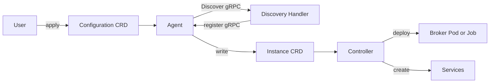

# アーキテクチャ

## 全体像

Akri は 5 つの可動部から成る。2 つの CustomResourceDefinition (CRD)、一連の Discovery Handler、全ノードで動く Agent、そして Controller である。ユーザは Configuration CRD を書いて何を探すかを宣言する。Discovery Handler (DH) は特定プロトコルでデバイスを見つける方法を知っている。Agent は各ノードで発見を駆動し、発見デバイスごとに 1 つの Instance CRD を書く。Controller は Instance を watch し、broker ワークロードと Service を配備する。

## 構成要素

### Configuration CRD

Configuration は「何を発見するか」のユーザ向け宣言である。型は `shared/src/akri/configuration.rs:114` の `ConfigurationSpec` で、group `akri.sh` version `v0` として `shared/src/akri/configuration.rs:106` で登録される。`discovery_handler` (どの DH を使うか + その details)、`capacity` (発見デバイスごとにワークロードをスケジュールできるノード数)、任意の `broker_spec`、任意の `instance_service_spec` と `configuration_service_spec`、`broker_properties` を持つ。broker は Pod か Job のいずれかで、`shared/src/akri/configuration.rs:90` の `BrokerSpec` enum でモデル化される。

### Instance CRD

各 Instance は 1 つの発見デバイスを表す。型は `shared/src/akri/instance.rs:54` の `InstanceSpec`、short name `akrii` は `shared/src/akri/instance.rs:27` で宣言される。主要フィールドは `cdi_name` (`shared/src/akri/instance.rs:59`)、`shared` (`shared/src/akri/instance.rs:76`)、`nodes` (`shared/src/akri/instance.rs:81`)、`device_usage` (`shared/src/akri/instance.rs:90`)。`device_usage` map は capacity スロットを追跡し、各スロットはそれを確保したノード名、または未確保なら空文字列にマップする。

### Discovery Handler

Discovery Handler は 1 つのプロトコル (カメラ向け ONVIF、ローカルデバイス向け udev、OPC UA、テスト向け debug-echo) を知るプロセスである。DH は gRPC で Agent と通信する。プロトコルは `discovery-utils/proto/discovery.proto` に定義される。Agent は `discovery-utils/proto/discovery.proto:7` で `Registration` サービスを広告する。DH は `discovery-utils/proto/discovery.proto:8` の `RegisterDiscoveryHandler` を呼び、名前、Unix Domain Socket (UDS) か NETWORK アドレスのいずれかのエンドポイント (`discovery-utils/proto/discovery.proto:19` の `EndpointType` enum)、`shared` フラグ (`discovery-utils/proto/discovery.proto:26`) を渡す。Agent は次に `discovery-utils/proto/discovery.proto:32` の `DiscoveryHandler` サービス経由で DH を呼び戻す。その `Discover` RPC は `discovery-utils/proto/discovery.proto:33` で `stream DiscoverResponse` を返す (server streaming なので DH はデバイスリストの更新を push できる)。

### Agent

Agent は DaemonSet で、エントリポイントは `agent/src/main.rs:23` の `main`。起動時に `agent/src/main.rs:42` の `new_registry` で DH registry を構築し、`agent/src/main.rs:49` の `run_registration_server` で登録サーバを起動し、`agent/src/main.rs:58` で `InMemoryManager`、`agent/src/main.rs:61` で `DevicePluginManager` を生成し、`agent/src/main.rs:69` の `start_dpm` で device plugin manager を起動し、`agent/src/main.rs:75` の `start_reclaimer` でスロット reclaimer を起動し、最後に `agent/src/main.rs:89` の `start_controller` で Configuration controller を起動する。

### Controller

Controller のエントリポイントは `controller/src/main.rs:21` の `main`。`controller/src/main.rs:42` の `handle_existing_instances`、`controller/src/main.rs:48` の `do_instance_watch`、`controller/src/main.rs:56` の `NodeWatcher`、`controller/src/main.rs:63` の `BrokerPodWatcher` を spawn する。各 Instance イベントに応じて broker ワークロードを配備または削除する。アクション種別は `controller/src/util/instance_action.rs:46` の `InstanceAction` enum。

## リクエストの流れ

1 つのデバイスが発見から稼働 broker になるまでを追う。

1. Discovery Handler が起動し、登録ソケット経由で Agent に登録する (`RegisterDiscoveryHandler`、`discovery-utils/proto/discovery.proto:8`)。Agent 側の受け口は `agent/src/main.rs:49` で spawn される `run_registration_server`。
2. ユーザが Configuration を apply する。Agent の Configuration controller が `agent/src/util/discovery_configuration_controller.rs:80` の `reconcile` で reconcile し、finalizer がなければ `agent/src/util/discovery_configuration_controller.rs:99` で付与する。
3. 初回 reconcile では request がまだないので、controller は `new_request` を呼んで空リストを返す。None 分岐は `agent/src/util/discovery_configuration_controller.rs:134` から始まり、`agent/src/util/discovery_configuration_controller.rs:145` で `vec![]` を返す。
4. request は登録済み各 DH に gRPC で問い合わせる。`agent/src/discovery_handler_manager/discovery_handler_registry.rs:309` の `query` が `agent/src/discovery_handler_manager/discovery_handler_registry.rs:314` で `DiscoverRequest` を組み立て、`agent/src/discovery_handler_manager/discovery_handler_registry.rs:322` の `solve_discovery_properties` で discovery property を ConfigMap や Secret から解決する。
5. DH からのデバイスリストは `agent/src/discovery_handler_manager/discovery_handler_registry.rs:249` の `watch_devices` が監視し、`agent/src/discovery_handler_manager/discovery_handler_registry.rs:285` で CDI fully qualified name により重複排除し、`agent/src/discovery_handler_manager/discovery_handler_registry.rs:288` の `send_replace` で device plugin 層へ push する。
6. 後続の reconcile では `get_request` が hit し、`agent/src/discovery_handler_manager/discovery_handler_registry.rs:186` の `get_instances` が各エンドポイントの最新デバイスを `agent/src/discovery_handler_manager/discovery_handler_registry.rs:213` の `device_to_instance` で Instance に変換する。Instance 名は `agent/src/discovery_handler_manager/discovery_handler_registry.rs:239` の `format!("{}-{}", self.key, dev.device_hash())`。
7. reconcile は各 Instance にローカルノード名と owner reference を `agent/src/util/discovery_configuration_controller.rs:127` で刻み、消えたデバイスの Instance を `agent/src/util/discovery_configuration_controller.rs:149` で削除し、現存分を `agent/src/util/discovery_configuration_controller.rs:164` で server-side apply する。
8. Controller は `controller/src/main.rs:48` で Instance イベントを watch し、`InstanceAction` に応じて capacity までノードごとに broker Pod、または Job を配備し、Instance と Configuration の Service を作る。挙動表は `controller/src/util/instance_action.rs:32` に記載される。
9. reconcile 成功時は 600 秒後に requeue する (`agent/src/util/discovery_configuration_controller.rs:38` の `SUCCESS_REQUEUE`)。失敗時は `agent/src/util/discovery_configuration_controller.rs:176` の `error_policy` で 500 ms から指数バックオフする。

## 主要な設計判断

デバイスの `shared` フラグが、それを複数ノードにまたがる 1 リソースにするか、ノードごとに 1 つにするかを決める。その仕組みは Instance 名のハッシュの取り方だけにある ([内部実装](./internals) 参照)。共有デバイスは id 単独をハッシュするので各ノードが同じ Instance に解決し、ローカルデバイスはノード名をハッシュに織り込むので同じ id がノードごとに別 Instance になる。capacity は `InstanceSpec` の `device_usage` スロット map (`shared/src/akri/instance.rs:90`) で強制される。

デバイス注入は device plugin の Allocate レスポンスから Container Device Interface (CDI) v0.6.0 スキーマへ移された。スキーマモジュールは spec URL を `agent/src/device_manager/cdi.rs:1` に記録する。

## 拡張ポイント

- **Discovery Handler**: `discovery-utils/proto/discovery.proto:32` の `DiscoveryHandler` gRPC サービスを実装するプロセスなら登録して Agent にデバイスを供給できるので、新プロトコルに Agent の変更は不要。
- **CRD**: Configuration と Instance は group `akri.sh` の標準 Kubernetes CRD (`shared/src/akri/configuration.rs:106`) なので、通常の `kubectl` や RBAC と統合できる。
- **Broker**: Akri がデバイスごとにスケジュールするワークロードは、Configuration に与える任意の PodSpec か JobSpec (`shared/src/akri/configuration.rs:90` の `BrokerSpec`)。
