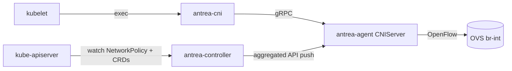

# アーキテクチャ

## 全体像

Antrea は 3 つのバイナリである。Antrea Controller はクラスタに 1 つ動き、Kubernetes と Antrea のポリシーオブジェクトをコンパクトな内部形式に変換する。Antrea Agent は各 Node に常駐し、その Node の Open vSwitch (OVS) ブリッジを所有する。Antrea CNI は kubelet が Pod ごとに起動する薄い実行ファイルで、リクエストをローカルの Agent へ転送する。ポリシーは中央で計算され、アグリゲート API サーバ経由で Agent へ push される。各 Agent は自 Node に適用される分だけを受け取る。



## コンポーネント

### Antrea Controller

Controller は Kubernetes NetworkPolicy と Antrea 独自の Custom Resource Definition (CRD、カスタムリソース定義) を監視し、内部グループへ計算する。中核は `NetworkPolicyController` (`pkg/controller/networkpolicy/networkpolicy_controller.go:136`) で、Kubernetes NetworkPolicy、Antrea ClusterNetworkPolicy、Antrea NetworkPolicy、Tier、ClusterGroup、Namespace、Service、Node の informer / lister を集約する。Deployment として 1 つだけ動く。計算済みオブジェクトは `pkg/apiserver/` のアグリゲート API サーバから配信される。

### Antrea Agent

Agent は DaemonSet として Node ごとに 1 Pod 動く。エントリポイントは `newAgentCommand` (`cmd/antrea-agent/main.go:37`) で、`main` (`cmd/antrea-agent/main.go:31`) から呼ばれる。Agent は OVS の統合ブリッジ (`br-int`) を所有し、Pod インターフェースを接続し、OpenFlow エントリを書き込み、ルーティングとトンネルを設定し、Controller のアグリゲート API を watch してポリシーをデータプレーンへ落とし込む。CNI リクエスト処理は `pkg/agent/cniserver/` に、OpenFlow の抽象は `pkg/agent/openflow/` にある。

### Antrea CNI

CNI バイナリは kubelet が起動する薄いシムである。`main` が CNI の各動詞のハンドラを登録する (`cmd/antrea-cni/main.go:28`):

```go
    funcs := skel.CNIFuncs{
        Add:   cni.ActionAdd.Request,
        Del:   cni.ActionDel.Request,
        Check: cni.ActionCheck.Request,
    }
```

各ハンドラはローカルの Agent CNIServer へ gRPC リクエストを送る。バイナリ自体はネットワークロジックを持たない。

## リクエストの流れ

Pod の起動は CNI ADD を引き起こす。以下のトレースは OVS ポートと OpenFlow ルールが入るところで終わる。

1. kubelet が CNI バイナリを起動し、`cni.ActionAdd.Request` を ADD ハンドラに登録して Agent へ gRPC でリクエストを送る (`cmd/antrea-cni/main.go:29`)。
2. Agent は `CNIServer.CmdAdd` で処理する (`pkg/agent/cniserver/server.go:433`)。リクエストを検証し、Pod ネットワークの準備完了を待ち (`pkg/agent/cniserver/server.go:449`)、ADD 失敗時に `cmdDel` を実行するロールバック `defer` を仕込み (`pkg/agent/cniserver/server.go:462`)、同一 Pod の CNI 呼び出しを per-container ロックで直列化する (`pkg/agent/cniserver/server.go:477`)。
3. `ipam.ExecIPAMAdd` で IPAM ドライバから Pod の IP を確保する (`pkg/agent/cniserver/server.go:498`)。
4. `s.podConfigurator.configureInterfaces` を呼ぶ (`pkg/agent/cniserver/server.go:515`)。
5. これは `configureInterfacesCommon` に至り (`pkg/agent/cniserver/pod_configuration.go:244`)、veth ペアを作成し、`ifConfigurator.configureContainerLink` でコンテナ側を設定する (`pkg/agent/cniserver/pod_configuration.go:248`)。
6. host 側は `connectInterfaceToOVS` で OVS に接続される (`pkg/agent/cniserver/pod_configuration_linux.go:34`)。host veth 名が OVS ポート名になり (`pkg/agent/cniserver/pod_configuration_linux.go:41`)、`createOVSPort` がポートを作成し (`pkg/agent/cniserver/pod_configuration_linux.go:48`)、`GetOFPort` が OpenFlow ポート番号を読み戻す (`pkg/agent/cniserver/pod_configuration_linux.go:63`)。
7. OpenFlow エントリは `pc.ofClient.InstallPodFlows` で入る (`pkg/agent/cniserver/pod_configuration_linux.go:68`)。続いてインターフェースが `ifaceStore.AddInterface` でローカルキャッシュに記録される (`pkg/agent/cniserver/pod_configuration_linux.go:75`)。
8. `InstallPodFlows` (`pkg/agent/openflow/client.go:643`) が per-pod のフローを組み立てる。`podClassifierFlow` (`pkg/agent/openflow/client.go:653`)、`l2ForwardCalcFlow` (`pkg/agent/openflow/client.go:654`)、`arpSpoofGuardFlow` (`pkg/agent/openflow/client.go:659`)、`podIPSpoofGuardFlow` (`pkg/agent/openflow/client.go:662`)、`l3FwdFlowToPod` (`pkg/agent/openflow/client.go:664`) を作り、`c.modifyFlows` で一括書き込みする (`pkg/agent/openflow/client.go:680`)。

成功すると Agent は CNI Result を返し、kubelet は Pod の IP を受け取る。失敗するとロールバック `defer` (`pkg/agent/cniserver/server.go:462`) が `cmdDel` を実行し、OVS ポートと veth を巻き戻す。

## 主要な設計判断

決定的な選択は、ポリシーを中央で一度だけ計算して push することである。各 Agent が全 Pod・全 NetworkPolicy を watch して自前計算するのではなく、Controller が各ポリシーを 3 つの内部オブジェクトに事前計算する。`AppliedToGroup` (ポリシーを適用する対象)、`AddressGroup` (ルールの from/to が参照する IP 集合)、`NetworkPolicy` (計算済みポリシー) である。これらは `controlplane.antrea.io/v1beta2` のアグリゲート API サーバから公開される。REST ストレージは `installAPIGroup` で構築され、`pkg/apiserver/apiserver.go:206` (`addressgroup.NewREST`)、`pkg/apiserver/apiserver.go:207` (`appliedtogroup.NewREST`)、`pkg/apiserver/apiserver.go:208` (`networkpolicy.NewREST`) で生成し、`pkg/apiserver/apiserver.go:221` 以降で API パスへ割り当てる。各 Agent は自 Node に関係するスライスだけを watch するため、Pod 数・ポリシー数が増えても Agent の負荷は平坦に保たれる。内部実装ページで詳しく追う。

2 つめの選択は、データプレーンを stage × pipeline の二次元 OpenFlow パイプラインとして `pkg/agent/openflow/pipeline.go` でモデル化したことである。フラットなテーブル一覧ではない。これは内部実装ページで扱う。

## 拡張ポイント

- Antrea CRD: NetworkPolicy、ClusterNetworkPolicy、Tier、ClusterGroup、Egress など。`NetworkPolicyController` (`pkg/controller/networkpolicy/networkpolicy_controller.go:136`) が計算する。
- Agent が消費するアグリゲート API グループ `controlplane.antrea.io/v1beta2` (`pkg/apiserver/apiserver.go` から配信)。
- IPAM は `pkg/agent/cniserver/server.go:498` で呼ばれる IPAM ドライバを通じて差し替え可能。
