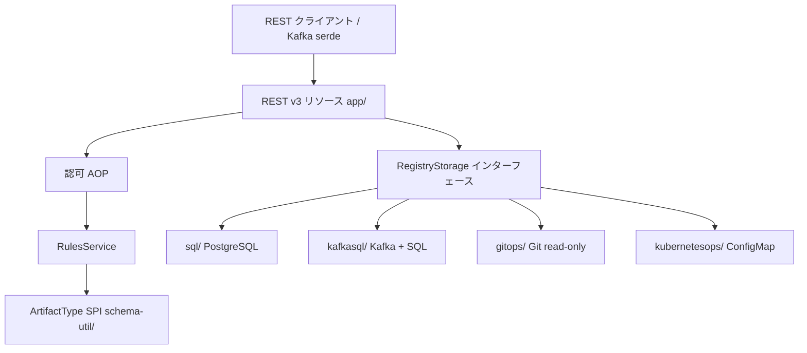

# Architecture

## 全体像

Apicurio Registry は約 30 モジュールのマルチモジュール Maven プロジェクト。サーバ本体は `app/` の Quarkus アプリケーション。その周りにスキーマ型ユーティリティ、クライアント SDK（Software Development Kit）、Kafka 用の serializer/deserializer、Kubernetes operator、React 製 UI が並ぶ。リクエストは REST リソースから入り、認可とルールエンジンを通り、差し替え可能なストレージバックエンドに着地する。



## コンポーネント

### REST API サーバ（`app/`）

`app/` モジュールが Quarkus アプリケーション本体で、REST API・認証・ストレージのオーケストレーション・ルールエンジンを持つ。プロセスのエントリポイントは `@QuarkusMain` を付け Quarkus に委譲するだけの `RegistryQuarkusMain`:

```java
@QuarkusMain(name = "RegistryQuarkusMain")
public class RegistryQuarkusMain {
    public static void main(String... args) {
        Quarkus.run(args);
    }
}
```

これが `app/src/main/java/io/apicurio/registry/RegistryQuarkusMain.java:6` のクラス全体。現行 REST API は `/apis/registry/v3/` でバージョン管理され、実装は `app/src/main/java/io/apicurio/registry/rest/v3/impl/` 配下。v2 API は後方互換で残る。サーバは `app/src/main/java/io/apicurio/registry/ccompat/rest/` で Confluent Schema Registry 互換 API も公開し、`v7` と `v8` の両パッケージを持つ。

### スキーマ型ユーティリティ（`schema-util/`）

artifact type ごと（Avro, Protobuf, JSON Schema, OpenAPI, AsyncAPI, GraphQL, XSD, WSDL ほか）に `schema-util/` 配下のモジュールがある。サーバが全 type を一様に扱えるよう Service Provider Interface（SPI）を実装する。その契約が `schema-util/util-provider/src/main/java/io/apicurio/registry/types/provider/ArtifactTypeUtilProvider.java:20` の `ArtifactTypeUtilProvider` で、1 つの type の canonicalizer・validator・compatibility checker などを束ねる。

### ストレージバックエンド（`app/.../storage/impl/`）

`app/src/main/java/io/apicurio/registry/storage/RegistryStorage.java` の `RegistryStorage` インターフェースが全バックエンドの実装する境界。実装は `app/src/main/java/io/apicurio/registry/storage/impl/` 配下にあり、ランタイムで `APICURIO_STORAGE_KIND` により選択される:

- `sql/`: JDBC（Java Database Connectivity）経由の PostgreSQL。正典実装。SQL Server / MySQL は方言で対応。
- `kafkasql/`: Kafka を journal、SQL を snapshot にする。状態変更を Kafka topic から replay。
- `gitops/`: Git リポジトリを read-only な backing store にする（実験的、3.3.0 で追加）。
- `kubernetesops/`: Kubernetes ConfigMap を backing store にする。

### 周辺モジュール

`serdes/` モジュールは Kafka / NATS / Pulsar の serializer/deserializer を持つ。`operator/` モジュールは Kubernetes operator。`ui/` モジュールは独立した npm/Vite ビルドを持つ React + TypeScript フロントエンド。クライアント SDK は Java / Go / Python / TypeScript 向けに提供され、`mcp/` モジュールは Model Context Protocol（MCP）サーバを提供する。

## リクエストの流れ

artifact 作成 `POST /apis/registry/v3/groups/{groupId}/artifacts` を追う。

1. 認可が最初に走る。ハンドラには `app/src/main/java/io/apicurio/registry/rest/v3/impl/GroupsResourceImpl.java:1281` で `@Authorized(style = AuthorizedStyle.GroupOnly, level = AuthorizedLevel.Write, dryRunParam = 3)` が付き、本体実行前にアスペクト指向の割り込みで書き込み権限を強制する。
2. メソッド本体 `createArtifact(...)` は `GroupsResourceImpl.java:1282` から始まる。パラメータを検証し、`artifactId` 未指定なら `GroupsResourceImpl.java:1363` の `idGenerator.generate()` で生成する。
3. artifact type は `GroupsResourceImpl.java:1369` の `ArtifactTypeUtil.determineArtifactType(...)` で content から推定する。
4. 参照スキーマは `GroupsResourceImpl.java:1422` の `RegistryContentUtils.recursivelyResolveReferences(...)` で解決する。
5. draft でない限り（または draft production mode 有効時）、`GroupsResourceImpl.java:1428` で `rulesService.applyRules(..., RuleApplicationType.CREATE, ...)` が走る。
6. 処理は `GroupsResourceImpl.java:1434` の `storage.createArtifact(...)` に渡される。
7. ハンドラは `GroupsResourceImpl.java:1448` で `CreateArtifactResponse` を組んで返す。

ルール適用は階層型。`app/src/main/java/io/apicurio/registry/rules/RulesServiceImpl.java` では `RulesServiceImpl.java:106` で `RuleType.values()` を回し、各ルール種別について最も具体的な設定 1 つ（artifact → group → global → 設定された default global rule）を選ぶ（`RulesServiceImpl.java:107` から `RulesServiceImpl.java:116`）。選ばれた各ルールは `RulesServiceImpl.java:146` の `factory.createExecutor(ruleType)` から得た executor を通り、`RulesServiceImpl.java:152` の `executor.execute(context)` で実行される。失敗したルールは例外を投げて書き込みを中断する。

その後 SQL バックエンドが artifact を永続化する。`app/src/main/java/io/apicurio/registry/storage/impl/sql/AbstractSqlRegistryStorage.java` の `createArtifact(...)` は `AbstractSqlRegistryStorage.java:486` から始まる。`AbstractSqlRegistryStorage.java:501` で group を必要に応じて自動作成し、`AbstractSqlRegistryStorage.java:516` で content を保存して識別子を取得し、`AbstractSqlRegistryStorage.java:521` で `handles.withHandle` の JDBI トランザクションを開き（dry run では `AbstractSqlRegistryStorage.java:523` で rollback を設定）、`AbstractSqlRegistryStorage.java:531` で artifact 行を insert し、`AbstractSqlRegistryStorage.java:557` で初版を作成し、`AbstractSqlRegistryStorage.java:566` でストレージイベントを発火する:

```java
                outboxEvent.fire(SqlOutboxEvent.of(ArtifactCreated.of(amdDto)));
```

PK 違反は `AbstractSqlRegistryStorage.java:571` で `ArtifactAlreadyExistsException` に変換される。

## 主要な設計判断

最も影響の大きい判断はストレージ抽象化。1 つのインターフェース `RegistryStorage` により、同じサーバが REST 層を変えずに PostgreSQL・Kafka・Git・ConfigMap 上で動く。`storage/dto/` 配下の DTO（data transfer object）は KafkaSQL バックエンドが journal にシリアライズするため serializable を保つ必要がある。

ルールは階層型でマージしない。各ルール種別は最も具体的な 1 階層だけに解決され、上位階層は結合されず無視される（`RulesServiceImpl.java:106` から `RulesServiceImpl.java:116`）。これによりルール評価が予測可能になる。artifact レベルの compatibility ルールは global を完全に上書きする。

状態変更は outbox パターンを使う。SQL バックエンドは同一トランザクション内で `outboxEvent.fire(...)` を呼び（`AbstractSqlRegistryStorage.java:566`）、KafkaSQL バックエンドは journal イベントを replay して SQL snapshot を構築する。

## 拡張ポイント

新しい artifact type は新規 `schema-util/<type>/` モジュールで `ArtifactTypeUtilProvider` SPI（`ArtifactTypeUtilProvider.java:20`）を実装すれば追加でき、サーバ core の変更は不要。新しいストレージバックエンドは `RegistryStorage` インターフェース（`RegistryStorage.java`）を実装する。`app/.../ccompat/rest/` の Confluent 互換 REST 層により既存 Kafka クライアントはコード変更なしで統合でき、クライアント SDK は Java / Go / Python / TypeScript に存在する。
