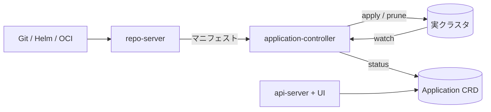

# アーキテクチャ

## 全体像

Argo CD は単一バイナリではなく、協調する複数プロセスとして動く。これらは 1 つの実行ファイルを共有し、バイナリ名で分岐する。`cmd/main.go:1` は multi-call エントリポイントで、`ARGOCD_BINARY_NAME` に応じて適切なサブコマンドへディスパッチする。中核は application-controller (`controller/`)、repo-server (`reposerver/`)、api-server (`server/`) で、applicationset-controller (`applicationset/`)、commit-server (`commitserver/`)、config management plugin の cmp-server (`cmpserver/`)、notifications、SSO 用の Dex が補助する。

## コンポーネント

### application-controller (`controller/`)

システムの心臓部。各 `Application` リソースを reconcile する。Git 由来の望ましい状態と実クラスタの状態を比較し、auto-sync が有効なら差分を適用する。reconcile ループは `controller/appcontroller.go:908` の `Run()` が駆動し、rate-limited なワークキュー上で worker goroutine を回す。

### repo-server (`reposerver/`)

リポジトリ参照をレンダリング済み Kubernetes マニフェストに変える gRPC サービス。素のマニフェスト、Helm、Kustomize、OCI を扱う。コントローラは `GetRepoObjs` (`controller/state.go:206`) 経由でこれを叩き、repo の列挙とマニフェスト生成を要求する。これは reconcile 内で最も高コストな処理であり、設計の多くを左右する (主要な設計判断を参照)。

### api-server (`server/`)

gRPC と REST API を提供し、認証と RBAC を処理し、web UI を配信する。コントローラが操作する `Application` リソースを読み書きする。

### gitops-engine (`gitops-engine/`)

共有の差分・同期ライブラリで、ローカル module として monorepo に取り込まれている (`go.mod:374`)。コントローラの比較と同期の双方が呼び込む、実際の reconcile と apply のプリミティブを持つ。

## リクエストの流れ

1 つの Application を refresh から auto-sync まで追う。

1. コントローラは `controller/appcontroller.go:908` で起動する。`Run()` が status processor を立ち上げ、`appRefreshQueue` (`controller/appcontroller.go:118` で宣言、`controller/appcontroller.go:200` で rate-limited キューとして生成) を処理する。
2. 1 件の refresh は `controller/appcontroller.go:1728` の `processAppRefreshQueueItem()` が処理する。informer の indexer から Application を取得し (`controller/appcontroller.go:1746`)、`needRefreshAppStatus` で refresh の要否と比較レベルを決める (`controller/appcontroller.go:1761`)。`defer` で key を `appOperationQueue` に積み替え、sync が refresh の後に走るようにする (`controller/appcontroller.go:1743`、issue #18500 の順序修正)。
3. レベルが `ComparisonWithNothing` なら repo-server を一切叩かず、キャッシュ済み managed resources からリソースツリーを再構築して return する (`controller/appcontroller.go:1797`)。
4. それ以外では `CompareAppState(...)` (`controller/appcontroller.go:1876`) で状態を計算する。本体は `controller/state.go:632`。`GetRepoObjs` でターゲットマニフェストを生成し (`controller/state.go:694`)、`GetManagedLiveObjs` でクラスタキャッシュから live state を読み (`controller/state.go:773`)、gitops-engine の `Reconcile()` が target と live を対応付けた後 (`gitops-engine/pkg/sync/reconcile.go:71`)、`argodiff.StateDiffs(...)` で差分を取る (`controller/state.go:917`)。リソース毎の sync code が全体の `syncStatus.Status` に集約される (`controller/state.go:990`, `controller/state.go:1039`)。
5. auto-sync は project の sync window でゲートされ (`controller/appcontroller.go:1900`)、続けて `ctrl.autoSync(...)` が走る (`controller/appcontroller.go:1908`)。OutOfSync かつ auto-sync が有効なら Operation を発行する。
6. 同期は operation queue 側の `SyncAppState()` (`controller/sync.go:101`) で実行する。`sync.NewSyncContext(...)` で gitops-engine の sync context を組み立て (`controller/sync.go:319`)、server-side apply / prune / hooks / sync wave のオプションを注入する (`controller/sync.go:300`)。`syncCtx.Sync()` が apply を行い (`controller/sync.go:343`)、`syncCtx.GetState()` が結果を収集する (`controller/sync.go:347`)。
7. コントローラは `Status.Sync` / `Status.Health` / `Status.Resources` を書き戻し (`controller/appcontroller.go:1929`)、CRD を patch する。

## 主要な設計判断

- pull 型 GitOps。外部 CI が push するのではなく、コントローラが Git を真実として継続的に reconcile する。これにより deployment が監査可能になる。Intuit が選んだ理由でもある。
- refresh と operation のキュー分離。`appRefreshQueue` と `appOperationQueue` は別で、refresh 完了時に operation queue へ積み替えることで sync が比較の後に必ず走り、race を避ける (`controller/appcontroller.go:1743`、issue #18500)。
- 段階的な比較。repo-server のマニフェスト生成が高コストなため、コントローラは毎回フル diff をしない。項目ごとに比較レベルを選び (`controller/appcontroller.go:1761`)、多くの refresh を最小作業に抑える ([内部実装](./internals) 参照)。
- repo エラーの grace period。一時的な Git 失敗で即 OutOfSync や Unknown にせず、`repoErrorGracePeriod` 内なら前回状態を維持する (`controller/state.go:699`)。

## 拡張ポイント

- `Application` と `AppProject` CRD (`pkg/apis/application/v1alpha1/types.go:68`) が主たる宣言的インターフェース。
- config management plugin は cmp-server (`cmpserver/`) で動き、独自のマニフェスト生成を担う。
- ApplicationSet (`applicationset/`) は generator から Application を生成し、マルチクラスタやモノレポ構成に使う。
- notifications と Dex ベースの SSO が api-server に差し込まれる。
