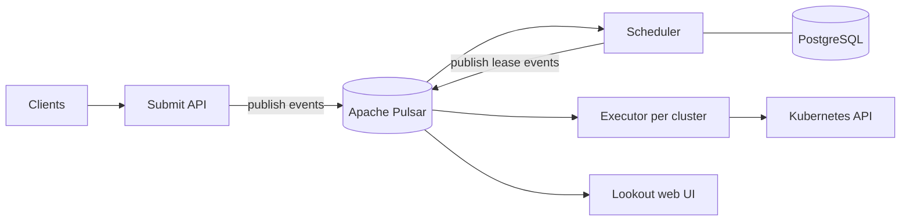

# アーキテクチャ

## 全体像

Armada は control plane と executor 群に分かれる。control plane がジョブを受理・スケジュール・状態追跡する。executor は worker cluster ごとに 1 つ動き、control plane と当該クラスタの Kubernetes API を橋渡しする (`docs/system_overview.md:21`)。クライアントは control plane にジョブを投入し、ジョブはスケジュール後にはじめて worker cluster へ転送される (`docs/system_overview.md:20`)。

各サービスはイベントソーシングで通信する。メッセージルーティングは全サービスが共有する log-based message broker である Apache Pulsar を通る。ログが source of truth であり、各サブシステムはメッセージを再生して内部状態を復元できる (`docs/system_overview.md:62-70`)。

## コンポーネント

### control plane のサブシステム

control plane はジョブ投入とスケジューリングを担うコンポーネント群である (`docs/system_overview.md:54`)。内訳は、ジョブの投入・制御 (submit / reprioritise / cancel)、ジョブ状態の問い合わせ、ストリーミングでのジョブ状態問い合わせ、クラスタ・ノードへの割り当てを行う scheduler、ジョブ状態を表示する Web UI の Lookout (`docs/system_overview.md:56-60`)。各サブシステムは `cmd/` 配下のバイナリで、例えば `cmd/server/main.go` や `cmd/scheduler` がある。

### executor

executor は worker cluster ごとに 1 つ動く (`docs/system_overview.md:21`)。Armada control plane と Kubernetes control plane 間の通信を担う (`docs/system_overview.md:21`)。scheduler がジョブを leased 状態にすると、executor は当該クラスタにジョブの Kubernetes リソースを作成し、割り当てられたノードに Pod を bind する (`docs/system_overview.md:45-46`)。

### 依存ミドルウェア

Armada はメッセージルーティングに Apache Pulsar を用いる (`docs/system_overview.md:62`)。scheduler と Lookout は PostgreSQL に永続化し、Redis はローカル開発スタックに含まれる (README:81)。ローカルスタックは Docker Compose で redis・postgres・pulsar を立ち上げる (README:81)。

## リクエストの流れ

ジョブ投入は `internal/server/submit/submit.go` の submit サーバを通る。`Server` 型は、旧 Armada submit API を受けてその呼び出しに基づき Pulsar にメッセージを publish するサービスである (`internal/server/submit/submit.go:30-32`)。

1. 入口 `func (s *Server) SubmitJobs(...)` (`internal/server/submit/submit.go:72`)。
2. 認可: `s.authorize(ctx, req.Queue, permissions.SubmitAnyJobs, queue.PermissionVerbSubmit)` で呼び出し元を確認。失敗時は `codes.PermissionDenied` を返す (`internal/server/submit/submit.go:76-79`)。
3. バリデーション: `validation.ValidateSubmitRequest(req, s.submissionConfig)`。失敗時は `codes.InvalidArgument` を返す (`internal/server/submit/submit.go:82-84`)。
4. 重複排除: `s.deduplicator.GetOriginalJobIds(ctx, req.Queue, req.JobRequestItems)` が client id を既存 job id に対応づける。dedup は best-effort なので、ここでのエラーはログのみで致命ではない (`internal/server/submit/submit.go:88-92`)。重複した request item は既存 id を返して skip する (`internal/server/submit/submit.go:101-106`)。
5. 変換: 非重複の各 item を `conversion.SubmitJobFromApiRequest(...)` で SubmitJob イベントに変換し (`internal/server/submit/submit.go:109`)、`EventSequence_Event_SubmitJob` として詰める (`internal/server/submit/submit.go:111-116`)。
6. publish: イベントを `EventSequence` に組み立て (`internal/server/submit/submit.go:133-139`)、`s.publisher.PublishMessages(ctx, es)` で送る。失敗時は `codes.Internal` を返す (`internal/server/submit/submit.go:141-145`)。
7. publish 成功後に `s.deduplicator.StoreOriginalJobIds(...)` で dedup id を保存する (`internal/server/submit/submit.go:149`)。この保存は成功時のみ走るため、Pulsar への部分的な投入は重複ジョブを生みうると、コメントが指摘している (`internal/server/submit/submit.go:147-148`)。

その後 scheduler が引き取る。`func (s *Scheduler) Run(...)` (`internal/scheduler/scheduler.go:147`) が cycle period ごとに ticker で回る (`internal/scheduler/scheduler.go:159`, `:164-169`)。スケジュールできるのは leader だけで (`internal/scheduler/scheduler.go:49-50`)、publish するのも leader だけである (`internal/scheduler/scheduler.go:56`)。leader になった瞬間は、スケジュール前に `s.ensureDbUpToDate(...)` で Pulsar の全メッセージに追いつく (`internal/scheduler/scheduler.go:186-189`)。1 サイクルの本体は `func (s *Scheduler) cycle(...)` (`internal/scheduler/scheduler.go:281`)。

## 主要な設計判断

Pulsar を source of truth とするイベントソーシングが中核の判断である。サブシステムは状態を更新してログに publish し直し、どのサブシステムも再生で復元できる (`docs/system_overview.md:62-70`)。そのため submit パスはジョブを DB に書かず Pulsar に publish するだけで、永続化は下流の consumer に委ねる (`internal/server/submit/submit.go:141`)。

スケジューリングは leader のみが行う。単一の leader がスケジュールと publish を担うことで、2 つの scheduler が矛盾する配置判断を下すのを防ぐ (`internal/scheduler/scheduler.go:49-50`, `:56`)。正しさを保つため、新しい leader はスケジュール前に Pulsar への追いつきを待つ (`internal/scheduler/scheduler.go:186-189`)。

scheduler は全ジョブをインメモリのトランザクショナルストア `JobDb` に保持し、ホットループを DB I/O から切り離している (`internal/scheduler/jobdb/jobdb.go:68`)。詳細は [内部実装](./internals) を参照。

## 拡張ポイント

Armada は gRPC と REST の submit API を公開しており、複数言語のクライアントがサーバを変更せずに駆動できる。Python・Java・.NET のクライアントライブラリがある (`docs/client_libraries.md`)。Airflow operator は Armada を Airflow DAG に統合する (`docs/armada_airflow_operator.md`)。ジョブのスケジューリング挙動は priority class や DRF (Dominant Resource Fairness、複数リソース下での公平配分) の設定で構成でき、scheduler がこれを消費する (`internal/scheduler/scheduling/fairness/fairness.go:43`)。
