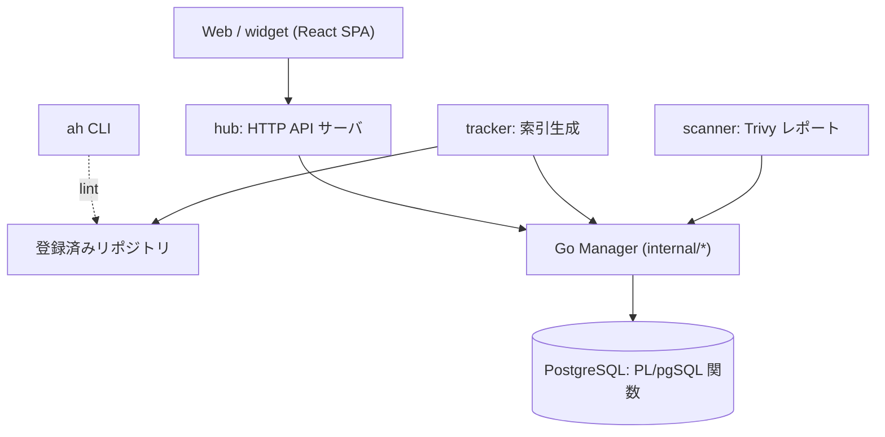

# アーキテクチャ

## 全体像

プロジェクト自身の `docs/architecture.md` は、各層がその外側の層にサービスを提供する層構造を記す。内側から外へ、PostgreSQL データベース (その関数が API として振る舞う)、Go の各 Manager、バックエンドのバイナリ (`hub`、`tracker`、`scanner`)、そして React の Web / widget 層だ。publisher 向けに `ah` CLI が並ぶ。

## コンポーネント

### hub (HTTP API サーバ)

API サーバの entrypoint は `cmd/hub/main.go:35`。`util.SetupDB` で pgx の DB プールを (`cmd/hub/main.go:48`)、`authz.NewAuthorizer` で OPA ベースの認可器を (`cmd/hub/main.go:56`) 用意する。全 Manager は `handlers.Services` 構造体に注入され (`cmd/hub/main.go:65`)、organization / user / repository / package / subscription / webhook / API key / stats の各 Manager と image store、OCI puller を保持する。HTTP ルータを提供し (`cmd/hub/main.go:91`)、Prometheus メトリクスは別ポートで公開する (`cmd/hub/main.go:101`)。

### tracker (索引生成)

tracker は登録済みリポジトリを走査して索引を最新に保つ。リポジトリを読み込み (`cmd/tracker/main.go:93`)、`tracker.concurrency` (既定 1、`cmd/tracker/main.go:147`) と `tracker.repositoryTimeout` (既定 15 分、`cmd/tracker/main.go:148`) で制限しつつ各リポジトリを処理する。起動時に外部ツール `opm` の存在を必須チェックする (`cmd/tracker/main.go:53`)。

### scanner (脆弱性レポート)

scanner は Trivy をライブラリとして使い、コンテナイメージの脆弱性レポートを生成する。`github.com/aquasecurity/trivy/pkg/types` を import する (`internal/scanner/alerts.go:10`)。

### Go の各 Manager

各ドメインは `internal/` 配下に Manager を持つ (例: `internal/pkg`、`internal/repo`、`internal/org`、`internal/user`)。Manager は DB 関数を呼び、上位のバイナリに高レベルな Go API を出す。

### データベース

PostgreSQL がスキーマと、Tern migration (`database/migrations/`) で管理される PL/pgSQL 関数群を保持する。`docs/architecture.md` が明言するとおり、これらの関数が外側の層に対する API として働き、スキーマ詳細を隠す。

## リクエストの流れ

リポジトリの tracking が代表的なオペレーションだ。tracker は `Tracker` を生成して `Run()` を呼ぶ (`cmd/tracker/main.go:125`)。`Run()` の中 (`internal/tracker/tracker.go:34`):

1. `GetRemoteDigest` でリモート digest を取得する (`internal/tracker/tracker.go:36`)。保存済みの digest と一致すれば、何もせず return する (`internal/tracker/tracker.go:41`)。これが「変わっていなければ処理しない」最適化だ。
2. kind が必要とする場合のみリポジトリを clone する (`internal/tracker/tracker.go:50`)。Helm / Container / Kagent は clone せず `index.yaml` や OCI タグを直接読む。
3. 既登録パッケージの digest を `GetPackagesDigest` で読み込む (`internal/tracker/tracker.go:64`)。
4. kind 別の source を `SetupTrackerSource` で構築し (`internal/tracker/tracker.go:86`)、`GetPackagesAvailable()` でパッケージ一覧を得る (`internal/tracker/tracker.go:87`)。
5. 各パッケージについて、未変更ならスキップし (`internal/tracker/tracker.go:103`)、ignore ルールを適用し (`internal/tracker/tracker.go:108`)、未設定なら category を推定し (`internal/tracker/tracker.go:115`)、`Pm.Register` で登録する (`internal/tracker/tracker.go:122`)。

パッケージ Manager の `Register` (`internal/pkg/manager.go:243`) は Go 側でフィールドを検証し、パッケージを JSON 化し (`internal/pkg/manager.go:313`)、DB 関数を呼ぶ (`internal/pkg/manager.go:317`)。

## 主要な設計判断

永続化とクエリのロジックの大半は Go ではなく PostgreSQL の関数にある。Go 側は `hub.Package` をシリアライズして `select register_package($1::jsonb)` を実行する (`internal/pkg/manager.go:43`)。読み取りも同様で、`select get_package($1::jsonb)` (`internal/pkg/manager.go:30`) や `search_packages` を使う。これでクエリ最適化と JSON 整形を DB に寄せられるが、ロジックが SQL に散る代償がある。

もう 1 つは差分 tracking だ。リポジトリ単位 (`internal/tracker/tracker.go:41`) とパッケージ単位 (`internal/tracker/tracker.go:103`) の digest 比較で、未変更の処理を丸ごとスキップできる。大量の巨大リポジトリを走査するときに効く。

## 拡張ポイント

主な拡張軸はアーティファクト種別だ。`TrackerSource` インタフェース (`internal/hub/tracker.go:37`) はメソッド `GetPackagesAvailable()` を 1 つだけ持ち、`SetupSource` が各 `RepositoryKind` を具体実装にディスパッチする (`internal/tracker/helpers.go:92`)。Helm と Kagent は `helm`、Krew は `krew`、OLM は `olm`、Tekton は `tekton`、Container は `container`、その他多数は `generic` source に対応する。publisher は対応する kind のリポジトリを登録して拡張する。`ah` CLI は公開前に `ah lint` でそのリポジトリのメタデータを検証する。
