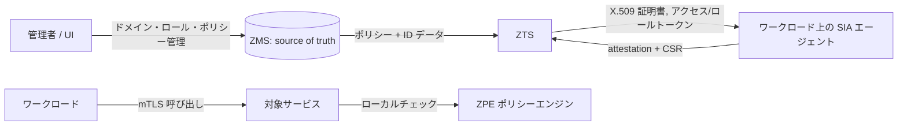

# アーキテクチャ

## 全体像

Athenz には 2 つのサーバロールと、エージェント・クライアントライブラリ群がある。ZMS は認可データを所有し中央アクセスチェックに応答する中央権威。ZTS はエッジに位置し、ZMS のデータをローカルにキャッシュして、短命なクレデンシャル (X.509 ID 証明書・ロール証明書・OAuth2 アクセストークン・ロールトークン) をワークロードに発行する。SIA エージェントは各プラットフォーム上で動き、ワークロードの ID 証明書を取得・更新する。ZPE はクライアント側ポリシーエンジンで、分散・オフライン強制を担う。両サーバとも embedded Jetty 上の REST サービスとして動く。

## コンポーネント

### ZMS (Athenz Management System)

認可データの source of truth。ドメイン・ロール・ポリシー・サービス ID の CRUD を扱い、中央集権的アクセスチェックに応答する。中核ロジックは `servers/zms/src/main/java/com/yahoo/athenz/zms/ZMSImpl.java`、永続化は `servers/zms/src/main/java/com/yahoo/athenz/zms/DBService.java` で、MySQL スキーマ `servers/zms/schema/zms_server.sql` に支えられる。

### ZTS (Athenz Token System)

分散認可向けのクレデンシャル発行サービス。ZMS データのローカルコピーを `servers/zts/src/main/java/com/yahoo/athenz/zts/store/DataStore.java` に保持し、X.509 ID 証明書・ロール証明書・アクセストークン・ロールトークンを発行する。本体は `servers/zts/src/main/java/com/yahoo/athenz/zts/ZTSImpl.java`、証明書管理は `servers/zts/src/main/java/com/yahoo/athenz/zts/cert/InstanceCertManager.java`。

### auth_core

Principal / Authority の抽象に加え、認証実装とトークン/証明書ユーティリティ。`libs/java/auth_core/src/main/java/com/yahoo/athenz/auth/` 以下にある。`Authority` がプラガブル認証の SPI、`Principal` が認証済み主体の抽象。

### SIA (Service Identity Agent)

各プラットフォームでワークロードの ID 証明書を取得・更新する Go エージェント。共通コードは `libs/go/sia/`、プラットフォーム別のエントリポイントは `provider/{aws,gcp,azure,github,buildkite,harness,spacelift}/.../cmd/siad/main.go`。

### ZPE (クライアント側ポリシーエンジン)

クライアント側での分散強制。実装は `clients/go/zpe` と `clients/nodejs/zpe`。

### サーバエントリポイント

ZMS / ZTS とも embedded Jetty 上で REST を提供する。起動エントリポイントは `containers/jetty/src/main/java/com/yahoo/athenz/container/AthenzJettyContainer.java:759` の `main`。

## リクエストの流れ

ZMS の中央集権アクセスチェックを追う。エントリポイントは `servers/zms/src/main/java/com/yahoo/athenz/zms/ZMSImpl.java:3648` の `ZMSImpl.access(action, resource, principal, trustDomain)`。

1. 入力を小文字化し principal を解決する (`user.` principal の home ドメイン変換)。次に、その Authority が認可判定に使えるかを確認する。
2. resource からドメインを解決する。ドメインが無ければ 404、無効なら 403 を返す。
3. `servers/zms/src/main/java/com/yahoo/athenz/zms/ZMSImpl.java:3708` の `hasAccess(...)` が走る。ロールトークンベースのチェックでは `:3717` でまずロールトークンを検証する。
4. `servers/zms/src/main/java/com/yahoo/athenz/zms/ZMSImpl.java:3530` の `evaluateAccess(...)` が中核処理。mTLS restricted 証明書は即 DENY し、続いて active な全ポリシー・全 assertion を走査する。
5. `servers/zms/src/main/java/com/yahoo/athenz/zms/ZMSImpl.java:6809` の `assertionMatch(...)` が action・resource・role を突合する。各 glob パターンは `libs/java/auth_core/src/main/java/com/yahoo/athenz/auth/util/StringUtils.java:47` の `StringUtils.patternFromGlob` で正規表現に変換される。

クレデンシャルのブートストラップは ZTS 側を通る。これは [内部実装](./internals) で段階を追って辿る。

## 主要な設計判断

注目すべきは explicit-deny-wins。`evaluateAccess` は最初の ALLOW で短絡しない。全ポリシー・全 assertion を走査し続け、後続の DENY assertion が広い ALLOW を上書きできるようにし、最後に確定したステータスだけを返す (`servers/zms/src/main/java/com/yahoo/athenz/zms/ZMSImpl.java:3583`-`3607`)。マッチが glob ベースなので、deny を後勝ちにすることで初めて、狭い DENY が広い ALLOW に穴を開けられる。

2 つ目は「中央は push、エッジは pull」。ZMS が権威だが、ZTS は `DataStore.java` で ZMS データをまるごとキャッシュし、分散強制がリクエストごとに ZMS へ往復しないようにする。

3 つ目は contract-first な API。REST インターフェースとデータモデルは RDL (REST Description Language) 定義 (`servers/zms/src/main/rdl/ZMS.rdl`、`servers/zts/src/main/rdl/ZTS.rdl` など) から生成され、互換性管理を IDL に寄せている。

## 拡張ポイント

`Authority` (`libs/java/auth_core/src/main/java/com/yahoo/athenz/auth/Authority.java:30`) はプラガブル認証の SPI で、証明書・トークン・ヘッダ認証を差し替えられる。ZTS 側では `InstanceProvider` 実装がプラットフォームの attestation (AWS、GCP、Azure、Kubernetes、GitHub Actions ほか) を検証してから CA がワークロード証明書に署名する。
