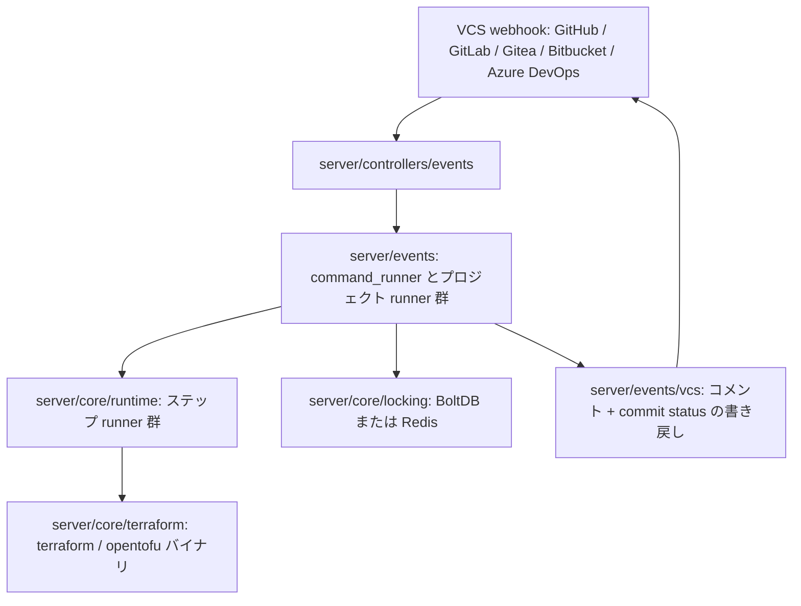

# アーキテクチャ

## 全体像

Atlantis は HTTP サーバを公開する 1 つの Go プロセスである。エントリポイント `main.go` は `cmd.RootCmd` に 3 つのサブコマンド `server` / `version` / `testdrive` を登録する (`main.go:52-54`)。実際の処理は `server` で起きる。その内部では 4 つのレイヤが積み重なる。HTTP コントローラが webhook を受け、events レイヤがコメントを順序付きのプロジェクトコマンド群に変換し、core レイヤが Terraform バイナリを実行しロックを保持し、VCS クライアントレイヤが結果を Pull Request に書き戻す。

## コンポーネント

### HTTP コントローラ (`server/controllers`)

このレイヤは webhook エンドポイントと付随する Web ページを持つ。`VCSEventsController.Post` がすべての VCS に対する唯一の POST ハンドラである (`server/controllers/events/events_controller.go:101`)。リクエストヘッダを調べてどのホストからのイベントかを判定し、GitHub 分岐は GitHub ヘッダを確認して `handleGithubPost` を呼ぶ (`server/controllers/events/events_controller.go:110-117`)。ハンドラ定義は `server/controllers/events/events_controller.go:169`。同ディレクトリにはロック UI、ジョブ stream エンドポイント、ステータスエンドポイント、API コントローラもある。

### events レイヤ (`server/events`)

ここがドメインの中核だ。コメントを解釈し、権限を確認し、プロジェクト単位のコマンドを構築し、各実行をオーケストレーションする。`DefaultCommandRunner.RunCommentCommand` がハブである (`server/events/command_runner.go:292`)。コマンド種別ごとの固有処理は `plan_command_runner.go`、`apply_command_runner.go`、そしてプロジェクト単位の `project_command_runner.go` にある。コメント文法は `comment_parser.go`。

### VCS クライアント (`server/events/vcs`)

サポート対象ホストごとに 1 つずつ用意されたクライアント実装。GitHub・GitLab・Gitea・Bitbucket Cloud と Server・Azure DevOps。「コメントを投稿する」「commit status を設定する」「変更ファイルを取得する」を 1 つのインターフェースの背後に抽象化し、events レイヤがどのホストと話しているかを意識しないようにする。

### core (`server/core`)

実行の基盤。`server/core/terraform` が Terraform / OpenTofu バイナリをダウンロードし実行する。`server/core/runtime` がステップ runner 群を持つ (ワークフローのステップ init / plan / apply / policy_check / run / env など、各 1 つ)。`server/core/locking` と `server/core/db` (BoltDB と Redis backend 付き) がロックを永続化する。BoltDB が組み込みのデフォルトだ。`server/core/config/valid` がリポジトリの `atlantis.yaml` を型付き構造体にパース・検証する。

## リクエストの流れ

`atlantis plan` コメント 1 つを webhook から Pull Request への返信までたどる。

1. POST は `VCSEventsController.Post` に到達し、GitHub イベントなら `handleGithubPost` に振り分けられる (`server/controllers/events/events_controller.go:101`、分岐は `:110-117`、ハンドラは `:169`)。
2. コメントイベントは `handleCommentEvent` に集約される (`server/controllers/events/events_controller.go:673`)。コメントがコマンドとして解釈でき、リポジトリが allowlist を通れば、処理を goroutine で起動する: `go e.CommandRunner.RunCommentCommand(...)` (`server/controllers/events/events_controller.go:742`)。HTTP レスポンスは即座に返り、結果は後でコメントとして返ってくる。
3. コメント本文は `CommentParser.Parse` が解釈する (`server/events/comment_parser.go:156`)。先頭トークンを小文字化して実行名と照合し、`atlantis` の代わりに `terraform` と打った場合は「もしかして」ヒントを返す (`server/events/comment_parser.go:172-181`)。
4. `DefaultCommandRunner.RunCommentCommand` が実行をオーケストレーションする (`server/events/command_runner.go:292`)。drainer でシャットダウン中の処理をはじき (`:293`)、team allowlist を確認し (`:313-329`)、リクエストスコープの `command.Context` を組み立て (`:351`)、commit status を pending に設定し (`:372-381`)、pre-workflow hook を実行し (`:386`)、`buildCommentCommandRunner` でコマンド種別ごとの runner を取得して `Run` を呼び (`:416-418`)、最後に post-workflow hook を実行する (`:420`)。
5. plan の場合の runner は `PlanCommandRunner.run` (`server/events/plan_command_runner.go:194`)。Pull Request の変更ファイルから対象プロジェクト群を `BuildPlanCommands` で構築し (`:214`)、generic な plan のときは過去の plan とロックを破棄し (`:270-277`)、`runProjectCmdsWithCancellationTracker(..., p.prjCmdRunner.Plan)` で各プロジェクトを (必要なら並列で) 実行する (`:279`)。
6. プロジェクト単位では `DefaultProjectCommandRunner.Plan` が `doPlan` を呼ぶ (`server/events/project_command_runner.go:242`, `:666`)。これは永続的な Atlantis ロックを取得し、プロセス内の作業ディレクトリロックを取得し、リポを clone し、ワークフローのステップを実行する (詳細は [内部実装](./internals))。
7. plan ステップ自体は `planStepRunner.Run` でバイナリを起動する (`server/core/runtime/plan_step_runner.go:50`)。Terraform の distribution とバージョンを解決し、`TerraformExecutor.RunCommandWithVersion` を呼ぶ (`:62`)。
8. 出力は Markdown に整形され、VCS クライアント経由で Pull Request に書き戻され、commit status が更新される。

## 主要な設計判断

- **サーバサイド実行。** Atlantis は Terraform / OpenTofu バイナリを自身のディスク上で動かす (`server/core/runtime/plan_step_runner.go:62`)。state はユーザの backend に残り、Atlantis はロックと plan メタデータのみを永続化する。クレデンシャルは開発者のマシンではなくサーバにある。
- **pull ではなく push。** Atlantis は VCS の webhook とコメントで起動する。desired と live を継続的に比較する reconcile ループは持たない。フローは命令的でコメント駆動であり、Flux や Argo CD のような GitOps コントローラとは対極にある。
- **2 層のロック。** 永続的なプロジェクトロックが Pull Request をまたいで plan / apply を直列化し、別のプロセス内ロックが作業ディレクトリのファイルシステム競合を防ぐ。詳細は [内部実装](./internals)。

## 拡張ポイント

主な拡張ポイントは `atlantis.yaml` のカスタムワークフローである。`valid.Workflow` は `Apply` / `Plan` / `PolicyCheck` / `Import` / `StateRm` の stage を持ち (`server/core/config/valid/repo_cfg.go:252`)、各 stage は `valid.Step` のリストである (`server/core/config/valid/repo_cfg.go:231`)。`run` ステップで運用者が任意のシェルコマンドを差し込めるため、Terragrunt・Conftest によるポリシーチェック・Infracost といった周辺ツールはこの仕組みで組み込まれる。
