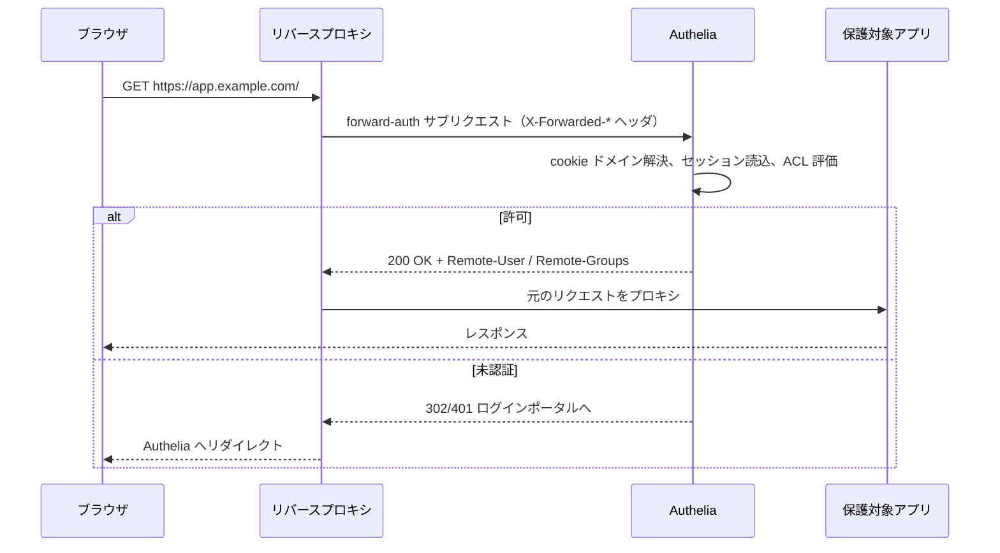

# アーキテクチャ

## 全体像

Authelia は HTTP API とログインポータルを公開する単一の Go バイナリ。バックエンドは `internal/` 配下のパッケージ群として構成され、各々が 1 つの関心事を持つ。フロントエンドは静的アセットとして配信される React アプリ。状態は SQL データベースに、セッションは任意で Redis に置かれる。

最も重要なリクエストはブラウザから直接は来ない。リバースプロキシから来る。プロキシは受け取ったリクエストを通してよいか Authelia に問い合わせる。下のシーケンスが、保護対象の全リクエストが通る forward-auth フロー。

## コンポーネント

`internal/` 配下の主要パッケージ:

| パッケージ | 責務 |
| --- | --- |
| `internal/authorization` | アクセス制御エンジン: ルール、レベル、判定。 |
| `internal/session` | ドメインごとのセッションプロバイダと `UserSession` 型。 |
| `internal/authentication` | ユーザバックエンド（file, LDAP）とパスワード照合。 |
| `internal/handlers` | HTTP ハンドラ群。forward-auth フレームワークを含む。 |
| `internal/oidc` | OpenID Connect プロバイダ。 |
| `internal/storage` | SQL 永続化とマイグレーション。 |
| `internal/middlewares` | リクエストコンテキストと authz フレームワークが乗るブリッジ。 |
| `internal/notification` | 検証・リセット用のメール/ファイル通知。 |
| `internal/totp`, `internal/webauthn`, `internal/duo` | 第二要素の各方式。 |
| `internal/configuration` | 設定の読み込みとエンジンが消費する型付きスキーマ。 |

エントリポイントは `cmd/authelia/main.go`。`internal/commands` で定義された Cobra ルートコマンドを実行する。

## リクエストの流れ

1 つのハンドラが 4 種のリバースプロキシ方言をさばく。プロキシごとにハンドラを分けるのではなく、ビルダーが共有ハンドラにプロキシ固有の振る舞いを注入する。実装は `internal/handlers/handler_authz_types.go:141` に列挙される: `AuthzImplLegacy`、`AuthzImplForwardAuth`（Traefik, Caddy, Skipper）、`AuthzImplAuthRequest`（NGINX）、`AuthzImplExtAuthz`（Envoy）。`AuthzBuilder.Build` が実装ごとの関数ポインタを `internal/handlers/handler_authz_builder.go:128` で結線する。

共有のエントリは `internal/handlers/handler_authz.go:146` の `func (authz *Authz) Handler`。次の手順を踏む:

1. **対象オブジェクトの抽出。** `authz.handleGetObject` がプロキシのヘッダを読む。ForwardAuth は `X-Forwarded-Proto/Host/Uri`（`internal/handlers/handler_authz_impl_forwardauth.go:12`）、AuthRequest は `X-Original-URL`（`handler_authz_impl_authrequest.go:13`）、ExtAuthz は実際の `Host` とパス（`handler_authz_impl_extauthz.go:13`）。
2. **セキュアなスキームを要求。** 非 `https` の対象は `handler_authz.go:162` で拒否する。セッション cookie はセキュアに運ばれねばならないため。
3. **セッション解決。** `ctx.GetSessionManagerByTargetURI`（`handler_authz.go:170`）が対象の cookie ドメインに対応するセッションプロバイダを選ぶ。実装は `internal/middlewares/authelia_context.go:322`。
4. **サブジェクトの認証。** `authz.authn`（`handler_authz.go:191`）が各ストラテジを試す: cookie セッション、または Basic 認証情報か OIDC ベアラトークンを載せた `Authorization` ヘッダ。失敗すればレベルは未認証になる。
5. **認可の評価。** `ctx.GetProviders().Authorizer.GetRequiredLevel`（`handler_authz.go:196`）がこのサブジェクトとオブジェクトにルールが要求するレベルを返す。
6. **レスポンス判定。** `handler_authz.go:225` が認証済みレベルと要求レベルを突き合わせる: `Remote-User` と `Remote-Groups` ヘッダ付きの `200 OK`、`403` Forbidden、またはポータルへのリダイレクト。

手順 5 の認可判定は [内部実装](./internals) で詳しく追う。

## 主要な設計判断

- **1 ハンドラ、4 プロキシ。** Traefik・NGINX・Envoy の差はただのデータ: ヘッダ名と、未認証時にどのステータスコードを使うか。共有ハンドラはどのプロキシを相手にしているか知らない（`handler_authz_builder.go:128`）。
- **ベアラトークンは第一級の authz 経路。** `Authorization: Bearer` トークンは Authelia の OAuth2 アクセストークンとして introspection され、同じアクセス制御ルールで検査される。API アクセスもブラウザアクセスと同じ機構を通る。
- **セッションは cookie ドメインごとに分割**され、各々が独自の暗号化ストアを持ち、埋め込まれたドメインと一致しないドメインに届いたセッションは破棄される。詳細は [内部実装](./internals)。

## 拡張ポイント

OpenID Connect プロバイダ（`internal/oidc`）により、アプリはプロキシ経由ではなく OIDC を話して統合できる。認証バックエンドはフラットファイルと LDAP の間で差し替え可能。通知は SMTP とファイルシステム通知の間で差し替え可能。

## 出典

- コミット `06af72a`（v4.39.20）のソースを読んだもの。上記パスはリポジトリルートからの相対。
- [プロキシ統合の対応表](https://www.authelia.com/integration/proxies/support/)
