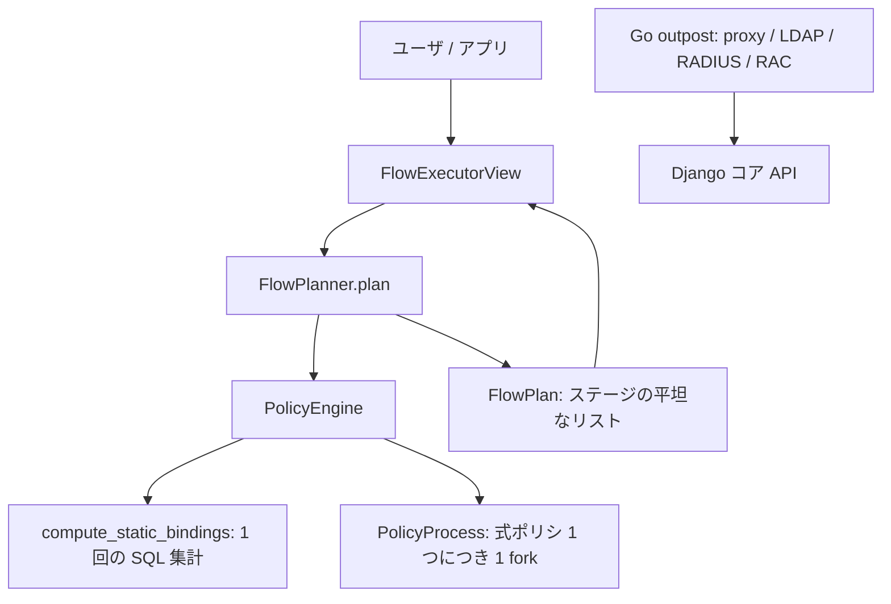

# アーキテクチャ

## 全体像

authentik は 3 言語を責務で分けた 1 つのリポジトリ。`authentik/` 配下の Python/Django コアが、データモデル・プロトコルプロバイダ・ポリシ/フローエンジンを所有する。`cmd/` と `internal/` 配下の Go プログラムが outpost で、プロトコルを終端 (forward-auth proxy、LDAP、RADIUS、RAC) してコアにコールバックする独立プロセスだ。`web/` は管理 UI とフロー executor 画面のための TypeScript/Lit フロントエンド。

## コンポーネント

### Django コア (`authentik/`)

コアが状態を持つものすべてを所有する。サブパッケージが機能を所有する: `policies/` は認可ポリシエンジン、`flows/` は認証フローのプランナと executor、`providers/` はプロトコル実装 (`oauth2`、`saml`、`ldap`、`proxy`、`rac`、`radius`、`scim`)、`sources/` は外部 IdP・ディレクトリ連携、`stages/` は個々のフローステップ、`core/` は `User`・`Group`・`Application`・`Token` を定義する。宣言的設定は `blueprints/` にある。Enterprise エディションは独自ライセンスの下 `authentik/enterprise/` にある。

### Go outpost 群 (`cmd/`、`internal/`)

各 outpost は独立した Go バイナリ: `cmd/proxy`、`cmd/ldap`、`cmd/radius`、`cmd/rac`、そして統合エントリポイントの `cmd/server`。forward-auth リバースプロキシは `internal/outpost/proxyv2/` にある。outpost はエッジで自分のプロトコルを終端し、ID 判定はコアに委ねる。

### Web UI (`web/`)

管理インターフェースと、各ステージを描画するユーザ向けのフロー executor の双方を提供する TypeScript + Lit のアプリ。

## リクエストの流れ

フローに紐づく保護対象アプリにユーザが到達するケースを追う。

1. `FlowExecutorView` が HTTP エントリポイント。計画されたフローをセッションの `SESSION_KEY_PLAN = "authentik/flows/plan"` に保持する (`authentik/flows/views/executor.py:66`)。
2. `FlowPlanner.plan()` はまずフロー自身の直接ポリシバインディングを、フロー用の `PolicyEngine` を構築して評価し、結果が pass しなければ `FlowNonApplicableException` を投げる (`authentik/flows/planner.py:279-285`)。
3. ユーザが pass し、キャッシュ済みプランがあればそれを返す。なければ `_build_plan()` が各 `FlowStageBinding` のポリシを評価してステージを組み立てる (`authentik/flows/planner.py:286-308`)。
4. 結果は `FlowPlan` で、`bindings` と `markers` の平坦な並行リストだ (`authentik/flows/planner.py:63-73`)。`FlowPlan.next()` が marker に処理を委ねて次の保留ステージを返す (`authentik/flows/planner.py:94-112`)。
5. executor は連続する GET/POST でプランをステージごとに進める。

forward-auth リクエストでは、Go outpost の `ProxyServer.Handle` (`internal/outpost/proxyv2/handlers.go:87`) が `lookupApp` で対象アプリを解決する (`internal/outpost/proxyv2/handlers.go:43`)。

## 主要な設計判断

非自明な判断はポリシ評価の方法だ。ユーザ定義の式ポリシは任意の Python を実行しうるため、各々を fork した `multiprocessing` コンテキストの専用 OS プロセスに隔離し、バインディングごとのタイムアウトで打ち切る ([内部実装](./internals) 参照)。静的な user/group バインディングはプロセスを一切生成せず、`compute_static_bindings()` で 1 回の SQL 集計に畳み込まれる (`authentik/policies/engine.py:105-146`)。合成モード (`all` か `any`) は対象オブジェクトの属性で、`PolicyEngineMode` が定義する (`authentik/policies/models.py:20-24`)。

プランとポリシ結果はキャッシュされる。フロープランナはフローとユーザをキーに構築済みプランをキャッシュし (`authentik/flows/planner.py:288-305`)、ポリシエンジンはバインディングごとの結果をキャッシュする ([内部実装](./internals) 参照)。

## 拡張ポイント

- 式ポリシ: 管理者が与える Python を `PolicyEvaluator` が評価する (`authentik/policies/expression/evaluator.py:65-89`)。
- `authentik/sources/` 配下の sources が外部 IdP・ディレクトリと連携する。
- `authentik/blueprints/` 配下の blueprint が YAML でリソースを宣言的に定義する。
- outpost: Go の proxy/LDAP/RADIUS/RAC プロセスはどこでも動かしてコアに接続でき、forward-auth として Traefik・nginx・Envoy の前段に置ける。
