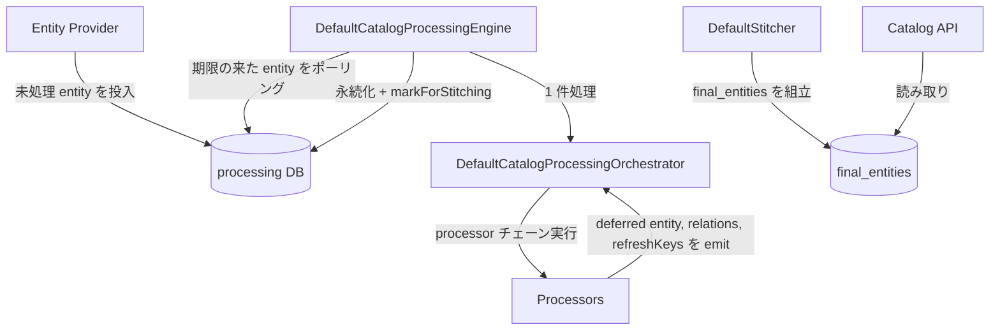

# アーキテクチャ

## 全体像

Backstage はトップレベルで 2 つの半分からなるモノレポだ。`packages/*` がフレームワーク本体、`plugins/*` が実作業を担う 159 個のプラグイン。採用者はこれらからフロントエンドの React アプリとバックエンドの Node を組み立てる。概念的な中心は Software Catalog で、Entity を保存し、CRUD ストアではなく Kubernetes を模した reconcile ループで鮮度を保つ。Templates・TechDocs・Search はすべてカタログの上に乗る。以降で何度も出てくる stitching とは、entity の relations を全 source から 1 つの最終レコードに統合し、API が配信する形にするステップだ。

## コンポーネント

### Catalog model (`packages/catalog-model`)

他のすべてのコンポーネントがキーにする Entity の形と entity ref ユーティリティを定義する。`Entity` は `apiVersion`・`kind`・`metadata`・`spec`・`relations` を持ち、docstring は模倣元として Kubernetes objects ドキュメントを直接指している (`packages/catalog-model/src/entity/Entity.ts:24-28`, `:28-54`)。標準 kind 群 (Component, API, Resource, System, Domain, Group, User, Location) は `packages/catalog-model/src/kinds/` にある。

### Catalog backend (`plugins/catalog-backend`)

処理ループ・stitching・データベースを担う。ここで entity は「取り込んだばかりの生」から「最終形、配信可能」へと変わる。Knex を介して Postgres または SQLite を使う。

### Backend framework (`packages/backend-plugin-api`, `packages/backend`)

依存性注入の配線。auth・cache・database・discovery・httpRouter といった core service は `createServiceRef` で `packages/backend-plugin-api/src/services/definitions/CoreServices.ts:34` に宣言され、プラグインとモジュールは `createBackendPlugin` (`packages/backend-plugin-api/src/wiring/createBackendPlugin.ts:53`) と `createBackendModule` (`createBackendModule.ts:58`) で宣言する。サンプルバックエンドは `packages/backend/src/index.ts:24-80` でポータルを組み立てる。

## リクエストの流れ

1 つの entity を取り込みから API 配信まで追う:

1. エンジンが起動する。`DefaultCatalogProcessingEngine.start()` が処理パイプラインと孤児クリーンアップループを起動する (`plugins/catalog-backend/src/processing/DefaultCatalogProcessingEngine.ts:114-126`)。
2. パイプラインはポーリング駆動。`startPipeline` が `startTaskPipeline` を `lowWatermark: 5` / `highWatermark: 10` で呼び、`loadTasks` が `getProcessableEntities` で期限の来た entity を DB から取得する (`DefaultCatalogProcessingEngine.ts:135-154`, `processing/TaskPipeline.ts:66-75`)。
3. 各アイテムについて `processTask` が `orchestrator.process({ entity, state })` を呼ぶ (`DefaultCatalogProcessingEngine.ts:155-172`)。
4. オーケストレータは `processSingleEntity` で登録済み processor を順に適用する: envelope 検証、preProcess、policy、validate、(Location なら) 特別な location 処理、postProcess (envelope 検証は `processing/DefaultCatalogProcessingOrchestrator.ts:139`、順序付きステップは `:158-164`)。
5. processor は副産物を `collector` に emit する: 派生 (deferred) entity、relations、refresh keys。emit された各 entity は `rulesEnforcer.isAllowed` で検査され、その location が許される kind しか発生させられない。これが越境注入を防ぐ (`DefaultCatalogProcessingOrchestrator.ts:166-186`)。
6. エンジンに戻ると出力がハッシュ化される。新しい `resultHash` が前回と同一なら、エンジンは何も書かず stitching も完全にスキップする (`DefaultCatalogProcessingEngine.ts:219-249`)。
7. 実際に変化があれば `updateProcessedEntity` で結果を永続化し、旧/新の relation source の差分から `setOfThingsToStitch` を組み、`markForStitching` でそれらの entity に DB フラグを立てる (`DefaultCatalogProcessingEngine.ts:292-342`)。
8. 別フェーズの Stitcher (`plugins/catalog-backend/src/stitching/DefaultStitcher.ts`) が、全 source の relations から最終 entity を組み立てる。`final_entities` テーブルへの実際の書き込みは `plugins/catalog-backend/src/database/operations/stitcher/performStitching.ts:225` で行われる。この最終 entity が Catalog API の返す姿だ。

## 主要な設計判断

処理と stitching は直接呼び出しではなく DB フラグで意図的に疎結合にしている。1 entity の更新が他 entity の relations に波及しうるため、エンジンは影響を受ける集合 (`setOfThingsToStitch`) だけを計算し、全体を再計算せずそこだけを再 stitch する (`DefaultCatalogProcessingEngine.ts:325-342`)。

2 つ目の鍵は no-op ファストパスだ。生成した出力をハッシュ化し、何も変わっていなければ中断する。これにより、頻繁にポーリングされる大規模カタログが毎サイクル書き込みと stitching をするのを防ぐ (`DefaultCatalogProcessingEngine.ts:219-249`)。

## 拡張ポイント

主な拡張面は 2 つ。Entity Provider (未処理 entity を DB に投入する) と Processor (entity を検証し、派生 entity・relations・refresh keys を emit する) だ。バックエンドではサードパーティが `createBackendPlugin` のプラグインと `createBackendModule` のモジュールを出荷し、ホストがそれらを組み立てる。複数の feature は `createBackendFeatureLoader` でまとめられ、サンプルバックエンドは search でそうしている (`packages/backend/src/index.ts:27-41`)。
