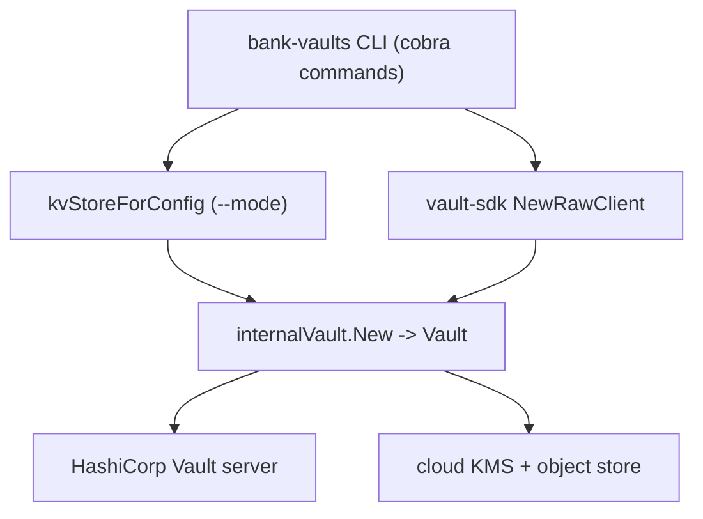

# アーキテクチャ

## 全体像

CLI は 2 つのものを組み立てて束ねる。unseal キーと root token を保持する key-value (KV) ストアと、1 つの Vault サーバーを指す HashiCorp Vault Application Programming Interface (API) クライアントである。`--mode` フラグがどの KV バックエンドを作るかを選び、Vault SDK がクライアントを作り、`internalVault.New` が両者を 1 つの `vault` 値に束ねて、すべてのサブコマンドがそれ越しに操作する (`cmd/bank-vaults/unseal.go:86`)。コマンドが触るのは `Vault` interface だけである (`internal/vault/operator_client.go:44`)。

## コンポーネント

### CLI コマンド

`cmd/bank-vaults/` パッケージが cobra のサブコマンド群を持つ。`main.go` が root コマンド・全フラグ・`--mode` 定数を定義する (`cmd/bank-vaults/main.go:39`)。`init.go`・`unseal.go`・`configure.go` が 3 つの中核ジョブで、`metrics.go` が Prometheus exporter を、`common.go` が共有の KV ストアビルダーを持つ。`main()` はフラグをパースして `execute()` を呼び cobra root を実行する (`cmd/bank-vaults/main.go:300`、`cmd/bank-vaults/main.go:140`)。

### Vault 操作 (`internal/vault`)

`internal/vault/operator_client.go` が操作の中核である。`Vault` interface (`internal/vault/operator_client.go:44`) と、それを実装する `vault` 構造体 (`internal/vault/operator_client.go:120`) を宣言する。兄弟ファイルが `configure` の各部を実装する: `auth_methods.go`・`secrets_engines.go`・`policies.go`・`audits.go`・`plugins.go`・`identity_groups.go`・`startup_secrets.go`。

### KV バックエンド (`pkg/kv`)

`pkg/kv/kv.go` が全バックエンド共通の `Service` interface を宣言し、メソッドは `Set` と `Get` の 2 つだけである (`pkg/kv/kv.go:53`)。各サブディレクトリが 1 つのバックエンドで、`awskms`・`gckms`・`azurekv`・`alibabakms`/`alibabaoss`・`ocikms`/`oci`・`s3`・`gcs`・`vault`・`k8s`・`hsm`・`file`・`dev`・`multi` がある。

### Vault SDK (外部)

CLI は自前の Vault クライアントを持たない。`github.com/bank-vaults/vault-sdk/vault` を import し、`vault.NewRawClient()` で HashiCorp Vault API クライアントを得る (`cmd/bank-vaults/unseal.go:24`、`cmd/bank-vaults/unseal.go:80`)。

## リクエストの流れ

`bank-vaults unseal --mode aws-kms-s3` を追う:

1. コマンドの `Run` がフラグを `unsealCfg` に読み込む (`cmd/bank-vaults/unseal.go:60`、`cmd/bank-vaults/unseal.go:65`)。
2. `kvStoreForConfig` が選んだ mode 用の KV ストアを作る (`cmd/bank-vaults/unseal.go:74`)。`aws-kms-s3` では `s3.New` で S3 バックエンドを作り、`awskms.New` で包み、複数リージョンをまとめられるよう `multi.New(services)` を返す (`cmd/bank-vaults/common.go:162`、`cmd/bank-vaults/common.go:175`、`cmd/bank-vaults/common.go:185`)。
3. `vault.NewRawClient()` が Vault API クライアントを作る (`cmd/bank-vaults/unseal.go:80`)。
4. `internalVault.New` がストアとクライアントを `vault` 値に束ねる (`cmd/bank-vaults/unseal.go:86`)。
5. コマンドは `unseal(ctx, unsealConfig, v)` を呼び、試行間で `unsealPeriod` だけスリープするループに入る (`cmd/bank-vaults/unseal.go:137`)。
6. `unseal` は `v.Sealed()` を確認し、既に unseal 済みなら早期 return、そうでなければ `v.Unseal(ctx)` を呼ぶ (`cmd/bank-vaults/unseal.go:154`、`cmd/bank-vaults/unseal.go:162`、`cmd/bank-vaults/unseal.go:170`)。
7. `(*vault).Unseal` がキー ID をループし、各キーを KV ストアから取って Vault に送る (`internal/vault/operator_client.go:197`)。awskms バックエンドでは `Get` が S3 から暗号文を読み、KMS で復号してからキーが Vault に届く (`pkg/kv/awskms/awskms.go:86`)。

## 主要な設計判断

KV ストアは envelope encryption のために 2 層化されている。KMS バックエンドは `kv.Service` を実装しつつ、内側に別の `kv.Service` を抱える。`awsKMS` は `store kv.Service` フィールドを持つ (`pkg/kv/awskms/awskms.go:38`)。`Set` は暗号化してから内側ストアに書き、`Get` は内側ストアから読んでから復号する (`pkg/kv/awskms/awskms.go:109`、`pkg/kv/awskms/awskms.go:86`)。unseal キーはオブジェクトストア上では常に暗号文である。

`multi` ストアは 1 つの論理ストアを複数バックエンドに多重化する。これにより AWS 経路は複数リージョンの S3 バケットへ同じキーを書ける (`cmd/bank-vaults/common.go:185`)。

設定デコーダは未知のキーでエラーにする。`Configure` は mapstructure decoder に `ErrorUnused: true` を設定し、YAML の typo を無言の no-op ではなくエラーにする (`internal/vault/operator_client.go:574`)。これは purge モードが YAML に無い Vault の状態を削除するため重要である。

## 拡張ポイント

- KV バックエンドは 2 メソッドの `kv.Service` interface を実装する (`pkg/kv/kv.go:53`)。新しい鍵ストアは `pkg/kv` 配下の新パッケージと、`kvStoreForConfig` への case 追加で済む (`cmd/bank-vaults/common.go:81`)。
- `--mode` 定数がサポートするバックエンドを列挙し、PKCS#11 デバイス向けの `hsm` と `hsm-k8s` も含む (`cmd/bank-vaults/main.go:39`、`cmd/bank-vaults/common.go:303`)。
- より広い umbrella は Operator の CRD と Secrets Webhook (別リポジトリ) を通じて Vault を拡張する。
