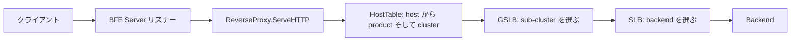

# アーキテクチャ

## 全体像

BFE システム全体はデータプレーンとコントロールプレーンに分かれる (出典 [8])。本リポジトリはデータプレーン、つまり BFE Server である。接続を受け、バックエンドを選び、転送する単一の Go プロセスだ。コントロールプレーンは bfenetworks 組織配下の別リポジトリにある。API-Server が設定を保存・生成・検証し、Conf-Agent が最新設定を取得してサーバにリロードを促し、Dashboard が GUI を提供する (出典 [7])。

サーバ内部では、トラフィックはルーティング階層を通る。リクエストはホスト名から product (論理的なテナント) へ、次に cluster へ、さらに二段階ロードバランスを経て sub-cluster、最後に 1 つの backend へとマップされる。



## コンポーネント

### BFE Server (`bfe_server/`)

プロセス起動、リスナー、コネクション処理、リバースプロキシループを担う。`StartUp` が `main` からの入口である (`bfe_server/bfe_server_init.go:28`)。`BfeServer` 構造体 (`bfe_server/bfe_server.go:45`) がリスナー群、`ReverseProxy`、TLS 状態、モジュールコールバック、ルーティング/バランステーブルを束ねる。

### ルーティング (`bfe_route/`)

リクエストを product へ、次に cluster へ解決する。`HostTable` (`bfe_route/host_table.go:41`) が host から product へのマップ、反転 FQDN (Fully Qualified Domain Name、完全修飾ドメイン名) の trie、basic/advanced のルートルールを保持する。

### ロードバランス (`bfe_balance/`)

二段階構成。GSLB (Global Server Load Balance、広域負荷分散) 層は `bfe_balance/bal_gslb/` で sub-cluster を選ぶ。SLB (Server Load Balance、サーバ負荷分散) 層は `bfe_balance/bal_slb/` でその sub-cluster 内の backend を選ぶ。

### リクエストモデルと条件言語 (`bfe_basic/`)

`bfe_basic/request.go` がパイプライン全体を通る内部リクエスト型を定義する。`bfe_basic/condition/` は advanced routing とモジュール条件が使うドメイン特化言語 (DSL) である。

### モジュール (`bfe_module/` と `bfe_modules/`)

`bfe_module/` がプラグインフレームワーク、`bfe_modules/` が 30 個の組み込みモジュール (例: `mod_block`, `mod_rewrite`, `mod_waf`, `mod_trace`, `mod_compress`) を持つ。

### プロトコル実装

ワイヤプロトコルは別パッケージで実装される。`bfe_http`, `bfe_http2`, `bfe_spdy`, `bfe_stream`, `bfe_tls`, `bfe_websocket`, `bfe_fcgi`、そして `bfe_proxy` (PROXY プロトコル) である。`bfe_wasmplugin` は proxy-wasm 拡張をホストする。

## リクエストの流れ

1 つの HTTP リクエストは `func (p *ReverseProxy) ServeHTTP(rw, basicReq)` で処理される (`bfe_server/reverseproxy.go:663`)。以下の手順で端から端まで追う。

1. `setClientAddr(basicReq)` で実クライアント IP を確定する (`bfe_server/reverseproxy.go:689`)。

2. `HandleBeforeLocation` のモジュールコールバックを実行する (`bfe_server/reverseproxy.go:692`)。返り値で close / finish / redirect / 早期応答に分岐できる。

3. `srv.findProduct(basicReq)` で product を解決する (`bfe_server/reverseproxy.go:718`)。これは `HostTable.LookupHostTagAndProduct` を呼び (`bfe_route/host_table.go:114`)、ホスト名で引き、失敗時は VIP テーブル、さらに default product へフォールバックする (`bfe_route/host_table.go:121-130`)。

4. `HandleFoundProduct` のコールバックを実行する (`bfe_server/reverseproxy.go:732`)。

5. `srv.findCluster(basicReq)` で cluster を解決する (`bfe_server/reverseproxy.go:758`)。これは `HostTable.LookupCluster` を呼び (`bfe_route/host_table.go:141`)、まず host と path で basic route の木を引き (`bfe_route/host_table.go:145-160`)、当たらなければ advanced route ルールを `rule.Cond.Match(req)` で順に評価する (`bfe_route/host_table.go:171-176`)。

6. `serverConf.ClusterTable.Lookup(clusterName)` で cluster 設定を取得する (`bfe_server/reverseproxy.go:773`)。

7. `HandleAfterLocation` のコールバックを実行する (`bfe_server/reverseproxy.go:804`)。

8. out request を組み立てる。`*outreq = *req` (`bfe_server/reverseproxy.go:837`) のあと `hopByHopHeaderRemove(outreq, req)` で hop-by-hop ヘッダを除去する (`bfe_server/reverseproxy.go:843`)。

9. `p.clusterInvoke(srv, cluster, basicReq, rw)` で backend へ転送する (`bfe_server/reverseproxy.go:898`、定義は `bfe_server/reverseproxy.go:307`)。

10. `HandleReadResponse` のコールバック後 (`bfe_server/reverseproxy.go:967`)、`p.sendResponse(rw, res, ...)` で応答をクライアントへコピーする (`bfe_server/reverseproxy.go:990`、定義は `bfe_server/reverseproxy.go:527`)。

## 主要な設計判断

モジュールのフックは固定された 9 段階のコールバックポイントである (`bfe_module/bfe_callback.go:33-41`)。各モジュールは起動時にこれらのポイントへハンドラを登録するので、転送ループは固定のまま、振る舞いは端で追加できる。

```go
const (
    HandleAccept = iota
    HandleHandshake
    HandleBeforeLocation
    HandleFoundProduct
    HandleAfterLocation
    HandleForward
    HandleReadResponse
    HandleRequestFinish
    HandleFinish
)
```

ルーティングは内容ベースで、host と path のプレフィックスだけでなく条件として表現される。advanced route ルールはリクエストに対して評価される `Cond` を持つ (`bfe_route/host_table.go:171-176`)。これはモジュールが自身の条件に使うのと同じ DSL であり、1 つの言語でルーティングとモジュールのゲートの両方をカバーする。

## 拡張ポイント

- 9 つのコールバックポイントに登録される組み込み/カスタムモジュール (`bfe_module/`)。
- `bfe_wasmplugin` 経由の proxy-wasm プラグイン。
- advanced routing とモジュール条件のための条件 DSL (`bfe_basic/condition/`)。
- GSLB 層の EPP モード。外部プロセッサを呼び、Envoy の `go-control-plane` の型を使う (`bfe_balance/bal_gslb/bal_gslb.go:39`)。
