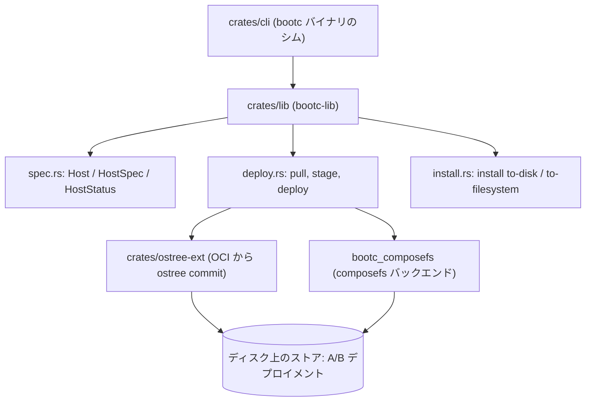

# アーキテクチャ

## 全体像

bootc は Cargo workspace である。ルートの manifest は `members = ["crates/*"]` を宣言し (`Cargo.toml:2`)、bootc バイナリは共有ライブラリへの薄いシムにすぎない。CLI クレートはグローバル初期化を行い、シングルスレッドの async ランタイムを作り、ライブラリを呼ぶ (`crates/cli/src/main.rs:20-32`)。実ロジックはすべて `bootc-lib` にある。コマンドのパース、status、pull、deploy、install、そして 2 つのストレージバックエンドだ。

## コンポーネント

### crates/cli

実行バイナリ。`crates/cli/src/main.rs` は意図的に小さい。`run()` はスレッドが生まれる前に `bootc_lib::cli::global_init()` を呼び (`crates/cli/src/main.rs:22`)、続いて current-thread の Tokio ランタイムを作る。bootc は CPU 重い async 作業をほとんど行わず、明示的なスレッドには `spawn_blocking` を使うからだ (`crates/cli/src/main.rs:27-30`)。`async_main` がライブラリのエントリポイントへ引き渡す (`crates/cli/src/main.rs:15`)。

### crates/lib (bootc-lib)

中核。CLI 面 (`crates/lib/src/cli.rs`)、宣言的なホストモデル (`crates/lib/src/spec.rs`)、pull/stage/deploy パイプライン (`crates/lib/src/deploy.rs`)、インストール (`crates/lib/src/install.rs`) を定義する。他のすべてが依存するクレートだ。

### crates/ostree-ext

libostree の上の Rust ラッパ。OCI イメージと ostree commit を import/export し、`bootc upgrade --check` が使う `ManifestDiff` も含む (`crates/lib/src/cli.rs:1250`)。元来のストレージパスである。

### bootc_composefs バックエンド

`crates/lib/src/bootc_composefs/` 配下の新しいバッキングストア。独自の boot / update / switch / rollback モジュールを持つ (`boot.rs`、`update.rs`、`switch.rs`、`rollback.rs`)。ランタイムは起動中のストレージ種別に応じてオペレーションごとに選択する。

## リクエストの流れ

`bootc upgrade` を追う。現在のイメージの新しいバージョンを fetch し、次回ブート向けに queue するオペレーションだ。

1. バイナリが `bootc_lib::cli::run_from_iter(std::env::args())` を呼ぶ (`crates/cli/src/main.rs:15`)。
2. `run_from_iter` が引数をパースし `run_from_opt` へ委譲する (`crates/lib/src/cli.rs:1718`)。パースは `Opt::parse_including_static` を通り、argv0 を見て `ostree-container` や systemd ジェネレータとして起動された場合は内部サブコマンドへ振り替える (`crates/lib/src/cli.rs:1736`、`crates/lib/src/cli.rs:1750`)。
3. `run_from_opt` が `Opt::Upgrade` にマッチし、storage を取得して `storage.kind()` で分岐する。ostree バックエンドは `upgrade`、composefs バックエンドは `upgrade_composefs` を呼ぶ (`crates/lib/src/cli.rs:1771-1780`)。
4. `upgrade` は `status::get_status` で現在の `Host` を読み、`host.spec.image` から目標イメージを取る (`crates/lib/src/cli.rs:1161-1162`)。`--tag` 引数は現在のイメージから新しい参照を派生する (`crates/lib/src/cli.rs:1165-1172`)。
5. ローカルの rpm-ostree 改変があれば upgrade はエラーで止まる (`crates/lib/src/cli.rs:1183-1187`)。`--check` では fetch せずに import を prepare し、`ManifestDiff` を表示する (`crates/lib/src/cli.rs:1231-1252`)。
6. それ以外は fetch する。イメージが unified storage に既存なら `pull_unified`、そうでなければ `pull` (`crates/lib/src/cli.rs:1256-1277`)。
7. fetch した digest を staged / booted の digest と比較する (`crates/lib/src/cli.rs:1278-1289`)。変化がなければ `No update available.` を表示し、新イメージがあれば `deploy::stage` を呼ぶ (`crates/lib/src/cli.rs:1325`、`crates/lib/src/cli.rs:1329`)。
8. `stage` は journal にエントリを記録し、3 ステップ (merging / deploying / bound images) の進捗を出しつつ `deploy` を呼び、続いて logically bound images を pull する (`crates/lib/src/deploy.rs:1075-1099`)。

## 主要な設計判断

ホストは Kubernetes 風の宣言的オブジェクトとしてモデル化される。`spec.rs` は `API_VERSION = "org.containers.bootc/v1"` と `KIND = "BootcHost"` を設定し (`crates/lib/src/spec.rs:18-19`)、`Host` 構造体は k8s の `Resource` を flatten して apiVersion / kind / metadata を持ち、`spec` (意図) と `status` (観測) を分ける (`crates/lib/src/spec.rs:29-35`)。`bootc edit` はヘルプで `kubectl apply` のように動くと説明され、`spec` セクションの変更のみを honor する (`crates/lib/src/cli.rs:891-899`)。

更新は A/B かつ pull ベースだ。`Upgrade` のヘルプは、更新が稼働システムに触れず、`bootc status` で `staged` として見え、`--apply` を渡さない限り shutdown 時に `ostree-finalize-staged.service` で適用されると記す (`crates/lib/src/cli.rs:842-855`)。`switch` は `upgrade` とほぼ同じだがイメージ参照も変える操作として説明され、よくあるパターンは管理エージェントがイメージタグで更新を制御することだ (`crates/lib/src/cli.rs:856-866`)。

ランタイムはコンテナの外に出る。README のとおり、カーネルはイメージに同梱されてホストを起動するが、稼働中のユーザ空間はコンテナの中にはなく systemd が pid1 である (`README.md:14-17`)。コンテナは配送フォーマットにすぎない。

## 拡張ポイント

- インストール設定: `/usr/lib/bootc/install/` 配下に TOML を置くと、ルートファイルシステム型などのデフォルトを設定できる。アルファ数字順にマージされる (`docs/src/bootc-install.md` に記載)。
- ブートローダのインストールは外部の `bootupd` プロジェクトに委譲され、`bootc install` が呼び出す (`docs/src/bootc-install.md`)。
- Logically bound images: ホストイメージが参照するイメージは staging 中に `boundimage::pull_bound_images` で pull される (`crates/lib/src/deploy.rs:1099`)。
- ストレージバックエンド: ostree-container と composefs のストアは `storage.kind()` で選択される (`crates/lib/src/cli.rs:1773`)。

## 出典

1. [bootc ソース (コミット a7f95e7)](https://github.com/bootc-dev/bootc/tree/a7f95e743aa54a2f966edc1a0417ef6d509df9af)
2. [bootc 公式サイト・ドキュメント](https://bootc.dev/bootc/)
