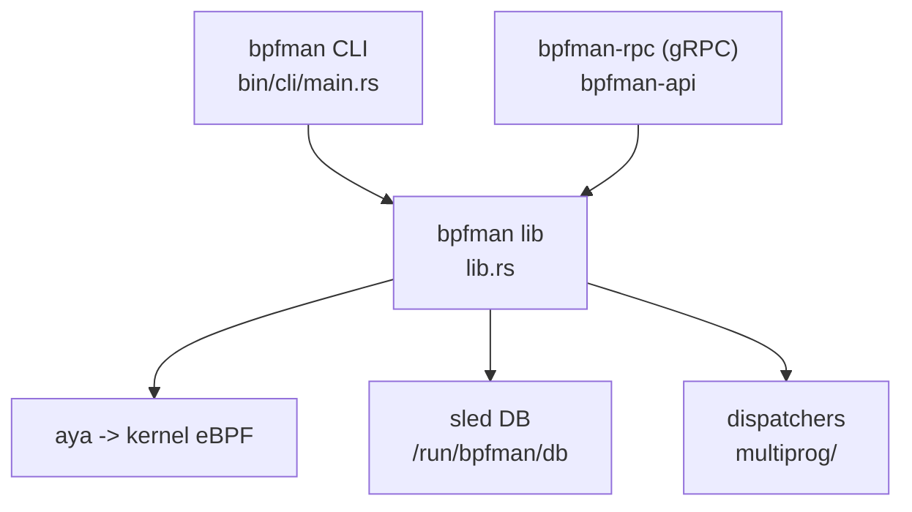

# アーキテクチャ

## 全体像

bpfman は複数 crate からなる Cargo workspace だ (`Cargo.toml`)。中核は `bpfman` crate で、ライブラリと CLI からなり、`aya` という Rust 製 eBPF (extended Berkeley Packet Filter) ライブラリを通じてプログラムをロード/アタッチし、状態を `sled` 組込みデータベースに永続化する。CLI はこのライブラリを自プロセス内で呼ぶため、ローカル利用にデーモンは不要だ。別に gRPC (gRPC Remote Procedure Call) サーバ `bpfman-rpc` バイナリ (crate は `bpfman-api`) があり、同じライブラリを Kubernetes など遠隔・権限分離の呼び出し向けにラップする。補助 crate が CSI (Container Storage Interface) ドライバ、ネットワーク名前空間ヘルパ、OpenTelemetry exporter を提供する。

## コンポーネント

### bpfman (ライブラリと CLI)

中核ロジック。CLI バイナリのエントリポイントは `fn main` (`bpfman/src/bin/cli/main.rs:23`) で、`Commands::execute` (`bpfman/src/bin/cli/main.rs:33`) でサブコマンドを振り分ける。ライブラリは CLI が呼ぶ操作を公開する。例えば `add_programs` (`bpfman/src/lib.rs:193`) や `attach_program` (`bpfman/src/lib.rs:428`)。CLI はこれらを `bpfman` crate から直接 import する (`bpfman/src/bin/cli/load.rs:7`)。

### bpfman-api (bpfman-rpc)

同じライブラリ関数をラップする `tonic` ベースの gRPC サーバ。遠隔・権限分離の経路で、Kubernetes agent や CSI ドライバが使う。ローカル CLI 利用では任意。

### csi

BPF ファイルシステムを Pod にマウントし、コンテナが pin された map に到達できるようにする CSI ドライバ。

### bpfman-ns と exporter

`bpfman-ns` はネットワーク名前空間に入ってコンテナ内で操作する (例: uprobe)。`bpf-log-exporter` と `bpf-metrics-exporter` はログとメトリクスを OpenTelemetry へ送る。

## リクエストの流れ

CLI から XDP (eXpress Data Path) プログラムをロードする場合:

1. `bpfman load image ...` は `fn main` (`bpfman/src/bin/cli/main.rs:23`) に入り、`Commands::execute` (`bpfman/src/bin/cli/main.rs:33`) を経て load サブコマンドへ向かう。
2. `execute_load_file` (`bpfman/src/bin/cli/load.rs:30`) が `setup()` (`bpfman/src/bin/cli/load.rs:31`) を呼んで `(Config, Db)` を得て、CLI 引数から `ProgramData` を組み、型文字列を `Program::Xdp(XdpProgram::new(data)?)` などのバリアントへ振り分ける (`bpfman/src/bin/cli/load.rs:52`)。
3. `add_programs` (`bpfman/src/bin/cli/load.rs:71`) を呼ぶ。これは `bpfman::add_programs` (`bpfman/src/lib.rs:193`) で、`add_programs_internal` (`bpfman/src/lib.rs:221`) へ委譲する。
4. `add_programs_internal` は各プログラムの一時 DB tree を `get_data_mut().load(root_db)` で書き (`bpfman/src/lib.rs:228`)、OCI (Open Container Initiative) bytecode を `set_program_bytes` で引く (`bpfman/src/lib.rs:251`)。
5. `EbpfLoader::new()` を 1 つだけ作り (`bpfman/src/lib.rs:257`)、同じイメージ由来の全プログラムが `loader.set_global(...)` で global data を共有する (`bpfman/src/lib.rs:263`)。XDP と非 TCX の TC は `loader.extension(extension)` で拡張として登録する (`bpfman/src/lib.rs:276`)。
6. `loader.load(...)` で bytecode をカーネルへロードし (`bpfman/src/lib.rs:281`)、各プログラムは `load_program` (`bpfman/src/lib.rs:287`、定義は `bpfman/src/lib.rs:1232`) を通る。
7. 失敗時はエラー分岐が `program.delete(root_db)` で全プログラムを削除してロールバックする (`bpfman/src/lib.rs:303`)。成功時はカーネルが採番した id で `save_map` (`bpfman/src/lib.rs:311`) と `finalize` (`bpfman/src/lib.rs:315`) を実行する。

アタッチは別呼び出しだ。`attach_program` (`bpfman/src/lib.rs:428`) が `prog.add_link()` で link を作り (`bpfman/src/lib.rs:458`)、`link.attach(...)` の後に `attach_program_internal` (`bpfman/src/lib.rs:481`) を呼ぶ。XDP と TC は `attach_multi_attach_program` (`bpfman/src/lib.rs:491`)、単一アタッチ型は `attach_single_attach_program` (`bpfman/src/lib.rs:499`) を通る。成功は `link.finalize` (`bpfman/src/lib.rs:506`) で終わる。

## 主要な設計判断

定義的な判断は **ローカルの daemonless 動作**だ。`setup()` (`bpfman/src/lib.rs:1226`) は設定ファイルを開いて DB を初期化するだけで、CLI はロードロジックを同一プロセスで走らせる。真実の源はサーバではなく状態だ。状態は `/run/bpfman/db` (`bpfman/src/lib.rs:92`) の sled DB にあり、`get_db_config` (`bpfman/src/lib.rs:96`) で構成される。gRPC デーモンは、Kubernetes や socket activation による権限分離が必要なときだけ起動する。

2 つ目の判断は XDP/TC の **ディスパッチャパターン**だ。カーネルはこれらのフックで 1 インターフェース 1 プログラムしか許さない。bpfman は自前の小さな eBPF ディスパッチャをその唯一のスロットに置き、ユーザプログラムを freplace 拡張として差し込み、優先度順に呼び出す (`bpfman/src/multiprog/xdp.rs:50`)。これが「1 インターフェースに複数 XDP プログラム」を実現する。

## 拡張ポイント

bpfman は CLI、gRPC API (`proto/bpfman.proto`)、そして Kubernetes 上では別の operator と agent が扱う Custom Resource Definition (CRD) を通じて利用される。eBPF bytecode は OCI イメージとして配布されるので、任意の registry がプログラムを提供できる。OpenTelemetry exporter と CSI ドライバが、可観測性とストレージの連携点だ。
