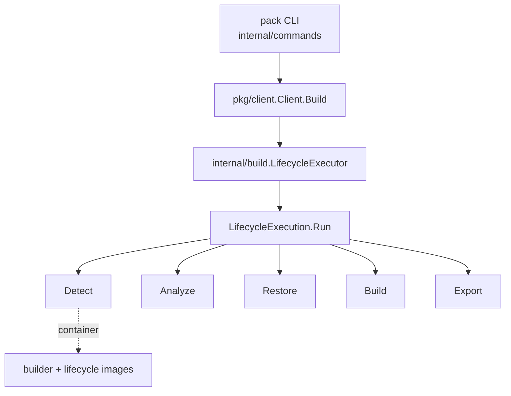

# アーキテクチャ

## 全体像

CNB は層構造を取る。本リポジトリの `pack` CLI はプラットフォーム実装であり、自分でイメージをコンパイルしたり組み立てたりはしない。builder イメージを解決し、`lifecycle` バイナリ群をコンテナとして起動して各ビルドフェーズを駆動する。参照ビルドエンジンは別リポジトリ `buildpacks/lifecycle` にあり、言語ごとのビルドロジックは個々の buildpack にある。`pack` は `lifecycle` と契約だけを共有する。ビルドコードではなく `github.com/buildpacks/lifecycle/api` と lifecycle のファイルフォーマットを import している (`internal/build/lifecycle_executor.go:9`)。

## コンポーネント

### CLI 層 (`internal/commands`)

各サブコマンドがフラグを定義し入力を検証する。`Build` (`internal/commands/build.go:70`) はイメージ参照をパースし、`project.toml` を読み、builder を解決し、trust を判定し、すべてを `client.BuildOptions` に詰めてから client を呼ぶ (`internal/commands/build.go:177`)。

### Client API 層 (`pkg/client`)

`Client.Build` (`pkg/client/build.go:308`) が `pack build` のオーケストレーション本体だ。app パス・builder 名・platform target を正規化し、`processBuildpacks` で buildpack の order を解決し (`pkg/client/build.go:436`)、`createEphemeralBuilder` で ephemeral builder を生成し (`pkg/client/build.go:568`)、`build.LifecycleOptions` を組み立て (`pkg/client/build.go:637`)、executor に引き渡す (`pkg/client/build.go:834`)。

### lifecycle 実行エンジン (`internal/build`)

`LifecycleExecutor.Execute` (`internal/build/lifecycle_executor.go:118`) は tmp ディレクトリを作り、`LifecycleExecution` を組み (`internal/build/lifecycle_executor.go:124`)、`Run` を呼ぶ (`internal/build/lifecycle_executor.go:131`)。`Run` (`internal/build/lifecycle_execution.go:170`) はキャッシュを解決し、ephemeral な bridge ネットワークを作り、各フェーズをコンテナとして起動する。

### distribution・image パッケージ

`pkg/dist` は buildpack や builder のディスク上メタデータ型を持つ。例えば `Order` (`pkg/dist/dist.go:41`)。`pkg/image`・`pkg/cache`・`pkg/blob`・`internal/builder`・`internal/container` がイメージ取得・キャッシュ・builder のインメモリ表現・Docker コンテナ操作を担う。

## ビルドの流れ

`pack build <image>` のエンドツーエンドは次のようにトレースできる。

1. `internal/commands/build.go:70` がフラグをパースし、`project.toml` を読み、builder を解決し、trust を計算する。
2. `internal/commands/build.go:177` が `packClient.Build` を呼ぶ。`TrustBuilder` フィールドは `func(string) bool` クロージャとして渡る。
3. `pkg/client/build.go:308` が入力を正規化し、buildpack の order を解決し、ephemeral builder を作り、`LifecycleOptions` を組む。trusted builder のときは `UseCreator = true` をセットする (`pkg/client/build.go:679`)。
4. `pkg/client/build.go:834` が `c.lifecycleExecutor.Execute` を呼ぶ。
5. `internal/build/lifecycle_executor.go:118` が実行を組み、`Run` を呼ぶ (`internal/build/lifecycle_executor.go:131`)。
6. `internal/build/lifecycle_execution.go:170` がキャッシュを解決し、bridge ネットワークを作り (`internal/build/lifecycle_execution.go:217`)、各フェーズを実行する (`Detect` は `internal/build/lifecycle_execution.go:482`、加えて Analyze・Restore・Build・Export)。各フェーズは `NewPhaseConfigProvider` と `phaseFactory.New(...).Run(ctx)` で動く。

## 主要な設計判断

trust の有無でコンテナ実行モデルが変わる。builder が trusted のときは `UseCreator = true` となり、lifecycle の `creator` バイナリが全フェーズを単一コンテナで実行する (`internal/build/lifecycle_execution.go:349`)。速いが root 権限フェーズが同居する。untrusted のときは detect・analyze・restore・build・export を別々のコンテナで実行し、root が要るフェーズだけを使い捨ての信頼コンテナで走らせ、それ以外は CNB ユーザに降格する (`internal/build/lifecycle_execution.go:240`)。CLI はこの意図をログに出す (`internal/commands/build.go:130`)。

Platform API のバージョンでフェーズ順序が入れ替わる。0.7 未満では DETECT → ANALYZE、0.7 以上では ANALYZE → DETECT になる (`internal/build/lifecycle_execution.go:241`)。`pack` は `SupportedPlatformAPIVersions` で Platform API 0.3 から 0.15 をサポートし (`internal/build/lifecycle_executor.go:24`)、builder と lifecycle が宣言するバージョンと突き合わせて決める (`internal/build/lifecycle_execution.go:48`)。

image extension (Dockerfile で build/run イメージを拡張する仕組み) は API 0.10 から使え、kaniko キャッシュを用いる。`ExtendBuild` と `ExtendRun` は errgroup で並行実行される (`internal/build/lifecycle_execution.go:319`)。

## 拡張ポイント

- buildpack: `dist.Order` (`pkg/dist/dist.go:41`) を通じて解決される言語ごとの単位。サードパーティが独自に公開する。
- builder と stack: buildpack と lifecycle を束ねた builder イメージ。インメモリでは `builder.Builder` で表現される (`internal/builder/builder.go:71`)。
- image extension: build/run イメージを拡張する Dockerfile。kaniko ベースの extend フェーズで実行される (`internal/build/lifecycle_execution.go:319`)。
- Platform API: 他プラットフォームが同じ lifecycle を駆動できるようにする、ネゴシエートされる契約。

## 出典

1. [buildpacks/pack リポジトリ](https://github.com/buildpacks/pack)
2. [buildpacks/lifecycle リポジトリ](https://github.com/buildpacks/lifecycle)
3. [buildpacks/spec リポジトリ](https://github.com/buildpacks/spec)
