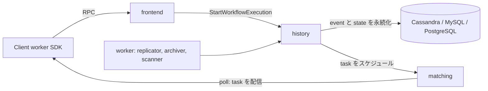

# アーキテクチャ

## 全体像

Cadence クラスタは 1 つのバイナリを 4 つの role で動かしたものである: frontend、history、matching、worker。各 role はリポジトリの `service/` 配下にある。frontend はステートレスな API の受け口、history はワークフロー状態を所有する中核、matching は worker に task を渡す係、worker は内部システムワークフローを動かす。あなた自身のワークフローとアクティビティのコードは、クライアント SDK を使ってクラスタの外の別プロセスで動く (`README.md:13-15`)。状態は Cassandra / MySQL / PostgreSQL に永続化される。

## コンポーネント

### frontend

全 API 呼び出しのステートレスな入口。認証・バリデーション・レート制限を行い、リクエストを適切なバックエンドサービスへルーティングする。`service/frontend/api/handler.go` の `WorkflowHandler` が公開面で、たとえば `StartWorkflowExecution` はリクエストを検証して history サービスへ転送する (`service/frontend/api/handler.go:1650`)。

### history

中核サービス。各ワークフロー run の mutable state と event history を所有し、shard で分割する。durable execution のロジックはここにある。`service/history/engine/engineimpl` の `historyEngineImpl` がワークフロー起動などの操作を実装する (`service/history/engine/engineimpl/start_workflow_execution.go:53`)。shard は `shard.Context` で表され (`service/history/shard/context.go:55`)、自分が所有するワークフローへの全書き込みを直列化する。

### matching

task list (task queue とも呼ぶ) をホストし、decision task と activity task を poll してくる worker に配る。history がスケジュールした task を、worker が poll するまで保持する。

### worker

内部システムワークフローを動かす: replicator (クラスタ間レプリケーション)、archiver (closed history をコールドストレージへ移動)、各種 scanner。これらはクラスタ自身を運用する Cadence ワークフローである。

### sharddistributor

`service/sharddistributor` 配下の新しめのサービスで、history ホスト間での shard 割り当てを分散管理する。

## リクエストの流れ

`StartWorkflowExecution` を入口からストレージまで追う。

1. リクエストは `WorkflowHandler.StartWorkflowExecution` に届く (`service/frontend/api/handler.go:1650`)。shutdown チェックの後、`validateStartWorkflowExecutionRequest` を呼び (`service/frontend/api/handler.go:1658`)、domain 名から domain ID を解決し (`service/frontend/api/handler.go:1663`)、`CreateHistoryStartWorkflowRequest` で history 用リクエストを組み立て (`service/frontend/api/handler.go:1667`)、history クライアント経由で転送する (`service/frontend/api/handler.go:1687`)。
2. history サービスでは `historyEngineImpl.StartWorkflowExecution` が domain を引き (`service/history/engine/engineimpl/start_workflow_execution.go:57`)、`startWorkflowHelper` に委譲する (`service/history/engine/engineimpl/start_workflow_execution.go:62`)。失敗時は `handleCreateWorkflowExecutionFailureCleanup` で孤立した history branch を後始末する (`service/history/engine/engineimpl/start_workflow_execution.go:69`)。
3. `startWorkflowHelper` は domain が登録済みかを確認し (`service/history/engine/engineimpl/start_workflow_execution.go:89`)、リクエストを再検証し (`service/history/engine/engineimpl/start_workflow_execution.go:94`)、同一 workflowID の並行 start を防ぐため current execution をロックとして取得する (`service/history/engine/engineimpl/start_workflow_execution.go:109`)。新しい run ID を採番し (`service/history/engine/engineimpl/start_workflow_execution.go:124`)、`createMutableState` で空の mutable state を構築する (`service/history/engine/engineimpl/start_workflow_execution.go:126`)。
4. `addStartEventsAndTasks` が `WorkflowExecutionStarted` イベントを積み、最初の decision task をスケジュールする (`service/history/engine/engineimpl/start_workflow_execution.go:181`)。トランザクションを確定し (`service/history/engine/engineimpl/start_workflow_execution.go:204`)、イベントを永続化し (`service/history/engine/engineimpl/start_workflow_execution.go:211`)、`CreateWorkflowExecution` を brand-new モードで書き込む (`service/history/engine/engineimpl/start_workflow_execution.go:236`)。
5. ここから先は event-sourcing で進む。worker が matching から decision task を poll し、SDK 上でワークフロー関数を replay し、次の決定 (アクティビティ起動など) を history に commit する。この決定ループがワークフロー完了まで回り続ける。

## 主要な設計判断

最も強い設計判断は、history サービスが重いロックサービス無しで強整合を保つ点である。shard ごとの単一書き手は rangeID という monotonic な世代番号で保証され、shard 更新のたびに `PreviousRangeID` 条件付きの compare-and-set で検査される (`service/history/shard/context.go:1128`)。古いオーナーの書き込みは失敗し、そのホストは自分の shard を閉じる。詳細は内部実装ページで追う。

2 つめは start パスの冪等性である。重複した start リクエストはエラーではなく既存の run ID を返す。これは `AsDuplicateRequestError` で扱われ (`service/history/engine/engineimpl/start_workflow_execution.go:245`)、request ID が一致するなら `WorkflowExecutionAlreadyStartedError` を吸収する (`service/history/engine/engineimpl/start_workflow_execution.go:255`)。

## 拡張ポイント

- クライアント SDK が worker 側を実装する。公式の [Go](https://github.com/cadence-workflow/cadence-go-client) / [Java](https://github.com/cadence-workflow/cadence-java-client) クライアントがユーザのワークフロー・アクティビティコードを動かす。
- 永続化プラグインはサーバの入口で blank import によって読み込まれるので、Cassandra / MySQL / PostgreSQL / SQLite、Kafka 非同期ワークフローキュー、gcloud archiver がすべて差し替え可能 (`cmd/server/main.go:30-36`)。
- [iWF](https://github.com/indeedeng/iwf) は Cadence の上で動く DSL フレームワークである (`README.md:42`)。
