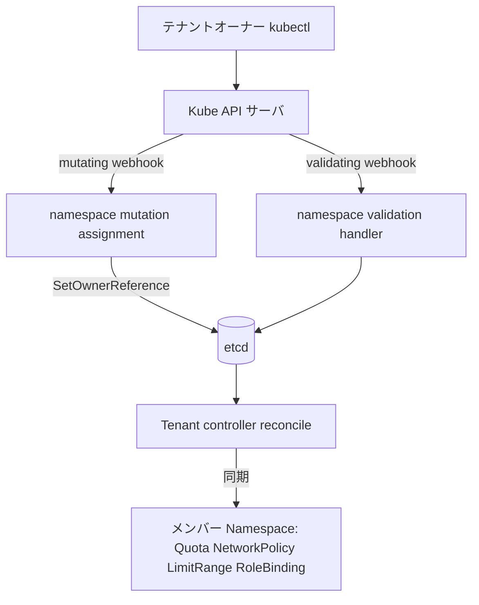

# アーキテクチャ

## 全体像

Capsule は共有クラスタ上で 2 つの役割を担う単一の Go バイナリである。1 つは `internal/controllers/` 配下の controller-runtime reconciler 群で、メンバー Namespace を所属 `Tenant` のポリシーに同期し続ける。もう 1 つは `internal/webhook/` 配下の admission webhook 群で、API サーバが永続化する前にリクエストを検査または改変する。両者は `func main()` (`cmd/controller/main.go:115`) で 1 つの controller-runtime Manager に組み込まれ、webhook パッケージはそのファイル冒頭付近でまとめて import される (`cmd/controller/main.go:62-83`)。

## コンポーネント

### API 型 (`api/v1beta1`, `api/v1beta2`)

CRD の型定義。`api/v1beta2` が storage version (`api/v1beta2/tenant_types.go:141`)。中心の型は `Tenant` で、クラスタスコープ、短縮名 `tnt` (`api/v1beta2/tenant_types.go:152`)。同グループには `CapsuleConfiguration` (クラスタ全体設定)、`ResourcePool` と `GlobalResourcePool` (Namespace 横断の共有 quota)、`TenantResource`、`CustomResourceQuota` などがある。

### コントローラ (`internal/controllers/`)

reconciler 群。中核はテナント reconciler である。`Manager.Reconcile` (`internal/controllers/tenant/manager.go:237`) が `Tenant` の変更に反応し、`reconcile` (`internal/controllers/tenant/manager.go:308`) を呼ぶ。`reconcile` は RBAC を収集し Namespace を同期した後、各メンバー Namespace に metadata・NetworkPolicy・LimitRange・ResourceQuota・RoleBinding を適用する。兄弟コントローラは ResourcePool、RBAC、PersistentVolume、service ラベル、そして Capsule が自身の webhook を提供するために使う Transport Layer Security (TLS) 証明書を扱う。

### Webhook (`internal/webhook/`)

admission ハンドラ群。Namespace の mutation と validation、tenant、pod、ingress、persistent volume claim (PVC)、service、owners、node、gateway、Dynamic Resource Allocation (動的リソース割り当て、DRA)、resource pool のリクエストをカバーする。最も重要なのは Namespace パスで、mutating ハンドラが Namespace をテナントに割り当て、validating ハンドラが quota・prefix・metadata のルールを強制する。

### 再利用パッケージ (`pkg/`)

コントローラでも webhook でもない共有ロジック。`pkg/tenant` はオーナーと所有権を解決し、`pkg/api` は RBAC・ルール・quota の型を持ち、`pkg/ruleengine` と `pkg/template` はポリシーとテンプレートを実装し、`pkg/runtime` はフィールドインデクサ・証明書処理・admission ヘルパ・イベントレコーダを持つ。

## リクエストの流れ

テナントオーナーが Namespace を作るケースを追う。

1. API サーバが Capsule の mutating webhook `ownerReferenceHandler.OnCreate` (`internal/webhook/namespace/mutation/assignment.go:37`) を呼ぶ。`utils.GetNamespaceTenant` でリクエストユーザとラベルから所属テナントを解決する (`internal/webhook/namespace/mutation/assignment.go:46`)。テナント未解決の管理者は素通し (`internal/webhook/namespace/mutation/assignment.go:53`)、それ以外の未解決ケースはテナントラベルを使えという deny になる (`internal/webhook/namespace/mutation/assignment.go:57-63`)。テナントが解決できたらテナント名ラベルを付け (`internal/webhook/namespace/mutation/assignment.go:66-68`)、`assignToTenant` が `controllerutil.SetOwnerReference(tnt, ns, ...)` を呼んでテナントを Namespace のオーナーにする (`internal/webhook/namespace/mutation/assignment.go:182`)。

2. 続いて API サーバが validating ハンドラ `handler.OnCreate` (`internal/webhook/namespace/validation/handler.go:35`) を呼ぶ。`tenant.ResolveNamespaceTenant` でテナントを再解決し (`internal/webhook/namespace/validation/handler.go:53`)、非管理者かつ非 Capsule ユーザがテナント所有 Namespace を作る場合は deny し (`internal/webhook/namespace/validation/handler.go:58-60`)、テナントが無関係なら nil を返す (`internal/webhook/namespace/validation/handler.go:62-64`)。削除中テナントへの新規 Namespace は `rejectOnTermination` で拒否し (`internal/webhook/namespace/validation/handler.go:66-73`)、その後サブハンドラを順に実行する (`internal/webhook/namespace/validation/handler.go:75-79`)。

3. quota サブハンドラ `quotaHandler.handle` (`internal/webhook/namespace/validation/quota.go:71`) は `tnt.IsFull()` (`internal/webhook/namespace/validation/quota.go:79`) なら deny するが、対象 Namespace が既に存在する場合は nil を返し、API サーバ自身の `AlreadyExists` 応答に委ねる (`internal/webhook/namespace/validation/quota.go:84-86`)。

4. prefix サブハンドラ `prefixHandler.OnCreate` (`internal/webhook/namespace/validation/prefix.go:33`) は保護対象の正規表現に一致する名前を拒否し (`internal/webhook/namespace/validation/prefix.go:43-50`)、prefix 強制が有効なら `<tenant>-` 接頭辞を要求する (`internal/webhook/namespace/validation/prefix.go:61-79`)。

5. オブジェクト永続化後、Tenant controller が reconcile する。`reconcile` (`internal/controllers/tenant/manager.go:308`) は RBAC を収集し、`reconcileNamespaces` (`internal/controllers/tenant/manager.go:319`) を呼び、続いて metadata・NetworkPolicy・LimitRange・ResourceQuota・RoleBinding を適用する (`internal/controllers/tenant/manager.go:312-363`)。

## 主要な設計判断

所属はラベルではなく Kubernetes の OwnerReference で表す。mutating webhook は Namespace を割り当てる際にテナントを Namespace のオーナーに設定する (`internal/webhook/namespace/mutation/assignment.go:182`)。コントローラはメンバーを `.metadata.ownerReferences[*].capsule` をキーとするフィールドインデックスで引く (`pkg/runtime/indexers/namespace/const.go:7`)。これによりテナント削除が Kubernetes のガベージコレクションに紐づき、テナントを削除すると所属 Namespace が cascading delete される一方、コントローラは効率的な逆引きを得る。

quota webhook は再適用時に API サーバへ委ねる。テナントが full でも Namespace が既に存在する場合、ハンドラは独自の quota エラーではなく nil を返す (`internal/webhook/namespace/validation/quota.go:84-86`)。これによりユーザは Capsule 固有の拒否ではなく native な `AlreadyExists` 応答を受け取る。

## 拡張ポイント

`api/v1beta2` の `Tenant`・`CapsuleConfiguration`・`ResourcePool` などの CRD が主要な宣言的サーフェスである。クラスタ全体の挙動は `CapsuleConfigurationSpec` (`api/v1beta2/capsuleconfiguration_types.go:16`) で調整し、Capsule に含めるエンティティ、グローバルな prefix 強制フラグ、保護対象 Namespace の正規表現、webhook secret 名を設定する。admission webhook 自体が実行時の拡張サーフェスであり、リクエストパスに座って deny や mutate を行う。
