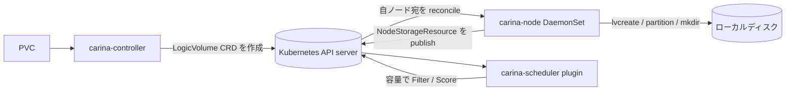

# アーキテクチャ

## 全体像

Carina は 3 つのコンポーネントを持ち、互いに直接やり取りしない。コントローラが custom resource を書き、ノードエージェントがそれを読み、Kubernetes API server がその間にメッセージバスとして座る。コントローラはボリュームを置く場所を決め、ノードエージェントが実際の `lvcreate` を実行し、スケジューラプラグインが空き容量に基づいてノードを選ぶ。

## コンポーネント

### carina-controller

クラスタ単位の CSI (Container Storage Interface) コントローラ。CSI の `CreateVolume` 呼び出しで PVC (PersistentVolumeClaim) リクエストを受け、`LogicVolume` custom resource definition (CRD) を作る。ディスクには一切触れない。エントリポイントは `controllerService.CreateVolume` (`pkg/csidriver/driver/controller.go:54`) で、コントロールプレーンの deployment として動く。

### carina-node

全ノード上の DaemonSet。自ノード宛の `LogicVolume` リソースを reconcile し、LVM・raw パーティション・ホストディレクトリで実際のディスク操作を行う。reconcile ループは `LogicVolumeReconciler.Reconcile` (`controllers/logicvolume_controller.go:60`) で、ディスク実装は `DeviceManager` (`pkg/devicemanager/manager.go:54`) が束ねる。また各ノードの容量を `NodeStorageResource` CRD に publish する。

### carina-scheduler

`Filter` と `Score` ステージを追加する kube-scheduler フレームワークプラグイン。`Filter` は空き容量が足りないノードを拒否し (`scheduler/schedulerplugin/localstorage/storage-plugins.go:93`)、`Score` は binpack または spreadout で残りを順位付けする (`scheduler/schedulerplugin/localstorage/storage-plugins.go:153`)。

## リクエストの流れ

PVC がローカル論理ボリュームになるまでを端から端まで追う。

1. `controllerService.CreateVolume` が呼ばれる (`pkg/csidriver/driver/controller.go:54`)。許可されるアクセスモードは `SINGLE_NODE_WRITER` のみ (`pkg/csidriver/driver/controller.go:109`)。要求サイズは `convertRequestCapacity` で GiB に切り上げられ (`pkg/csidriver/driver/controller.go:452`)、`(requestBytes-1)>>30 + 1` を返す (`pkg/csidriver/driver/controller.go:469`)。
2. ノードとデバイスグループを選ぶ。スケジューラが既にノードをバインドしていれば `HaveSelectedNode` が返し (`pkg/csidriver/driver/controller.go:122`)、未定なら `SelectNode` でコントローラ側が選ぶ (`pkg/csidriver/driver/controller.go:170`)。
3. コントローラが `s.lvService.CreateVolume(...)` を呼ぶ (`pkg/csidriver/driver/controller.go:192`)。
4. `LogicVolumeService.CreateVolume` (`pkg/csidriver/driver/k8s/logicvolume_service.go:161`) が `LogicVolume` オブジェクトを組み (`pkg/csidriver/driver/k8s/logicvolume_service.go:164`)、finalizer を付け (`pkg/csidriver/driver/k8s/logicvolume_service.go:182`)、作成する (`pkg/csidriver/driver/k8s/logicvolume_service.go:195`)。その後 100ms ごとに `.status.volumeID` をポーリングし (`pkg/csidriver/driver/k8s/logicvolume_service.go:210`)、フィールドが埋まったら返す (`pkg/csidriver/driver/k8s/logicvolume_service.go:224`)。
5. 対象ノードで `LogicVolumeReconciler.Reconcile` が発火する (`controllers/logicvolume_controller.go:60`)。`VolumeID` が空なら `createLV` を呼ぶ (`controllers/logicvolume_controller.go:74`)。`createLV` (`controllers/logicvolume_controller.go:153`) はボリュームタイプ annotation で分岐し、LVM 型なら `r.dm.VolumeManager.CreateVolume(...)` を最大 3 回リトライで呼び (`controllers/logicvolume_controller.go:165`)、成功時に `lv.Status.VolumeID = carina.VolumePrefix + lv.Name` を設定 (`controllers/logicvolume_controller.go:178`) してから status を更新する (`controllers/logicvolume_controller.go:262`)。
6. `LocalVolumeImplement.CreateVolume` (`pkg/devicemanager/volume/volume.go:48`) がグローバルロックを取り (`pkg/devicemanager/volume/volume.go:49`)、`VGDisplay` で空き容量を確認し (`pkg/devicemanager/volume/volume.go:55`)、予約マージンを割り込むなら `ResourceExhausted` を返し (`pkg/devicemanager/volume/volume.go:65`)、最後に `LVCreateFromVG` を呼ぶ (`pkg/devicemanager/volume/volume.go:79`)。
7. `Lvm2Implement.LVCreateFromVG` (`pkg/devicemanager/lvmd/lvm.go:258`) が `lvcreate` の引数を組み (`pkg/devicemanager/lvmd/lvm.go:259`)、コマンドを実行する (`pkg/devicemanager/lvmd/lvm.go:274`)。

## 主要な設計判断

決定的な選択は、CSI コントローラがディスクに一切触れないことである。`LogicVolume` CRD を作って待ち、ノードエージェントが埋めるまで `.status.volumeID` をポーリングする (`pkg/csidriver/driver/k8s/logicvolume_service.go:210`)。実際の `lvcreate` は対象ノードで起きる。これにより Kubernetes API server がコントローラとノードエージェント間のメッセージバスになる。ノードエージェントは `logicVolumeFilter` (`controllers/logicvolume_controller.go:356`) で自分宛のリソースだけを拾い、`lv.Spec.NodeName == f.nodeName` で判定する (`controllers/logicvolume_controller.go:364`)。この CRD 仲介パターンは、LVM ベースのローカル CSI ドライバの同系統である TopoLVM 由来である。

第二の選択は、容量がノードだけでなくクラスタに存在することである。各ノードエージェントが自分の volume group・ディスク・RAID 状態を `NodeStorageResource` CRD に publish し、コントローラとスケジューラがそれを読んで配置を決める。スケジューリングは正反対の 2 戦略をサポートする。spreadout はノードを `1.0 - request/allocatable` で採点し (`scheduler/schedulerplugin/localstorage/storage-plugins.go:200`)、binpack は `request/allocatable` で採点する (`scheduler/schedulerplugin/localstorage/storage-plugins.go:203`)。既に PV を載せるノードは最大スコアを得る (`scheduler/schedulerplugin/localstorage/storage-plugins.go:162`)。

## 拡張ポイント

- **StorageClass パラメータ**: ドライバはディスクグループ・キャッシュ比率・キャッシュポリシーなど標準 CSI パラメータで設定する (`constants.go:42`、`constants.go:47`、`constants.go:49`)。
- **Custom resource**: `LogicVolume` (`api/v1/logicvolume_types.go:63`) と `NodeStorageResource` (`api/v1beta1/nodestorageresource_types.go:65`) がコンポーネント間の契約である。
- **スケジューラフレームワークプラグイン**: `LocalStorage` プラグインが kube-scheduler フレームワークに対し `Filter` と `Score` を実装する (`scheduler/schedulerplugin/localstorage/storage-plugins.go:93`)。
- **メトリクス**: Prometheus 連携は `pkg/metrics` に実装され、ServiceMonitor マニフェストは `deploy/kubernetes/prometheus-service-monitor.yaml` にある。
