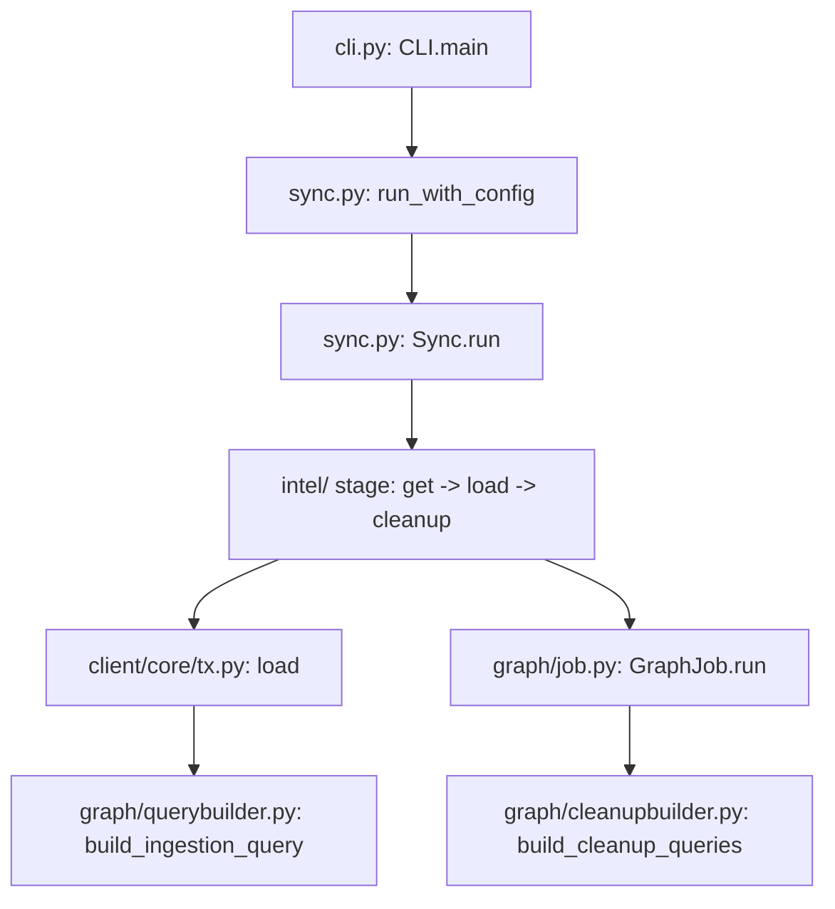

# アーキテクチャ

## 全体像

Cartography はデーモンではなくバッチツールである。1 回の実行が 1 回の sync だ。プロバイダの API (Application Programming Interface) から読み、Neo4j にノードと関係を書き込み、その実行で触れなかったものを削除する。コマンドラインのエントリポイントがステージの順序付きリストを構築し、オーケストレータが各ステージを 1 つの Neo4j セッション内で実行する。各ステージは同じ `get / transform / load / cleanup` の形に従うプロバイダモジュールである。

## コンポーネント

### コマンドラインインターフェース (`cartography/cli.py`)

`CLI` クラス (cli.py:210) が引数を解析し、どのステージを走らせるかを決める。`--selected-modules` が指定されていれば `build_sync(selected_modules)` を、なければ `build_default_sync()` を呼ぶ (cli.py:2047-2049)。その後 `run_with_config(sync, config)` を呼ぶ (cli.py:2757)。プロセスのエントリポイントは `main` (cli.py:2762) で、`python -m cartography` も `__main__.py` 経由でここに到達する (cartography/__main__.py:7)。

### オーケストレータ (`cartography/sync.py`)

`Sync` (sync.py:137) が順序付きステージを保持して実行する。`TOP_LEVEL_MODULES` は `OrderedDict` で、その挿入順が実行順になる (sync.py:45)。順序は重要だ。`create-indexes` が先頭 (sync.py:47)、`analysis` が末尾 (sync.py:132) である。`run_with_config` (sync.py:374) が Neo4j ドライバを生成して update tag を採番し、`Sync.run` (sync.py:225) を呼ぶ。`Sync.run` はステージを反復し、各ステージを `stage_func(neo4j_session, config)` として呼び出す (sync.py:270)。

### プロバイダモジュール (`cartography/intel/`)

各プロバイダは `cartography/intel` 配下にある。モジュールはプロバイダ API から取得し、グラフへ load し、cleanup を走らせる。AWS EMR (Elastic MapReduce) が代表例だ。そのステージ関数 `sync` (cartography/intel/aws/emr.py:104) はリージョンごとにループし、`get_emr_clusters` が取得し (emr.py:28)、`load_emr_clusters` が書き込み (emr.py:73)、`cleanup` が古いデータを削除する (emr.py:94)。

### グラフ書込・スキーマ層 (`cartography/client`、`cartography/graph`、`cartography/models`)

モジュールは Cypher を手書きしない。`cartography/models` 配下に frozen dataclass のスキーマを定義し、`load` を呼ぶ (cartography/client/core/tx.py:784)。`load` は `build_ingestion_query` (cartography/graph/querybuilder.py:1128) を呼んでスキーマから MERGE クエリを生成する。cleanup クエリは `build_cleanup_queries` (cartography/graph/cleanupbuilder.py:16) が生成し、`GraphJob` (cartography/graph/job.py) が実行する。

## sync の流れ

1 回の AWS EMR sync は各層を順に通過する。

1. `main` (cli.py:2762) が引数を解析し `run_with_config` を呼ぶ (cli.py:2757)。
2. `run_with_config` (sync.py:374) が Neo4j ドライバを生成し、update tag が未指定なら `int(time.time())` をその実行の update tag として採番する (sync.py:479-481)。
3. `Sync.run` (sync.py:225) が 1 セッションを開き、ステージを反復して各ステージを `stage_func(neo4j_session, config)` として呼ぶ (sync.py:270)。
4. EMR ステージ `sync` (emr.py:104) がリージョンごとにループし、クラスタ詳細をリストに集約する (emr.py:119-128)。
5. `load_emr_clusters` (emr.py:73) が `EMRClusterSchema` とともに `load` を呼び、`lastupdated`・`Region`・`AWS_ID` をキーワード引数として渡す (emr.py:83-90)。
6. `load` (tx.py:784) はデータが無ければ早期 return し、index を確保し、ingestion クエリを構築してからバッチを書き込む。
7. `cleanup` (emr.py:94) がスキーマから `GraphJob` を構築して実行し、`lastupdated` がその実行の update tag と一致しないノードと関係を削除する。

## 主要な設計判断

中核の判断は、差分計算ではなく update tag によるガベージコレクションモデルである。Cartography は差分を計算しない。実行ごとに整数の update tag を 1 つ採番し (sync.py:479)、触れた全てに `lastupdated = $UPDATE_TAG` を書き、その後 `lastupdated` が古いものを削除する。内部実装ページで cleanup クエリを追う。

2 つ目の判断は宣言的スキーマフレームワークだ。モジュール作者はノードと関係の frozen dataclass を定義して `load` を呼ぶだけで、クエリビルダが MERGE クエリと index を生成する。`load` の docstring は、クエリを手書きせず `build_ingestion_query` から得るべきと明記する (tx.py:665-667)。

3 つ目は遅延ステージロードだ。`_LazyStage` (sync.py:22) はプロバイダモジュールの import をそのステージが実際に走るまで遅らせる (sync.py:36-39)。これにより、個々のプロバイダが boto3 のような重い SDK (Software Development Kit) を引き込むにもかかわらず `import cartography.sync` は軽いままになる。

## 拡張ポイント

主な拡張ポイントは新しい intel モジュールだ。`cartography/intel` 配下に `get / transform / load / cleanup / sync` を実装し、`cartography/models` 配下にノードと関係のスキーマを定義し、`TOP_LEVEL_MODULES` (sync.py:45) にステージを登録する。書込はスキーマとクエリビルダを通るため、新しいモジュールが直接 Cypher を書くことはほとんどない。
