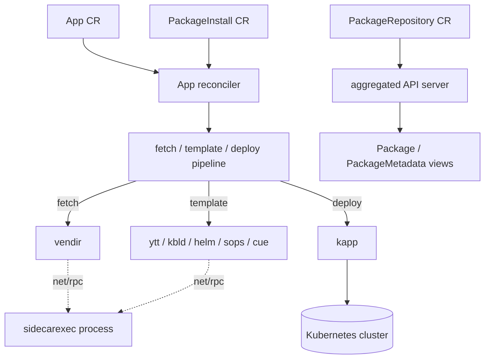

# アーキテクチャ

## 全体像

kapp-controller は、複数の調整器 (reconciler) を 1 プロセスで動かす controller-runtime のマネージャである。`main()` はフラグを解析して `Run` を呼び (`cmd/controller/run.go:61`)、`Run` がマネージャを構築し (`cmd/controller/run.go:82`)、カスタムリソースごとに調整器を 1 つずつ登録する。すなわち config・`App`・`PackageInstall`・`PackageRepository` だ。各 `App` についてコントローラは 3 段階のパイプライン (fetch・template・deploy) を実行し、各段は Carvel のコマンドラインツールを呼び出す。fetch と template のツールは別のサイドカープロセスで動き、`kapp` だけが本体プロセスで動く。

## コンポーネント

### コントローラのエントリポイント (`cmd/controller`)

`main()` はフラグ (concurrency・namespace・metrics bind address・start-api-server・sidecarexec) を定義して解析する (`cmd/controller/main.go:23`)。`--sidecarexec` フラグが立つと、バイナリは別の経路を取り、コントローラではなくサイドカープロセスとして動く (`cmd/controller/main.go:35`)。そうでなければ `Run` を呼ぶ (`cmd/controller/main.go:47`)。`Run` は Carvel の scheme でマネージャを構築し (`cmd/controller/run.go:72`)、各調整器を個別のブロックで登録する。

### App 調整器 (`pkg/app`)

`App` 調整器が中核のパイプラインを担う。これは `Run` 内で `app.NewReconciler` により登録され (`cmd/controller/run.go:218`)、最大並列数は `--concurrency` フラグから設定される (`cmd/controller/run.go:226`)。調整器は各 `App` を `CRDAppFactory` を介して具体的なオブジェクトに解決し (`cmd/controller/run.go:208`)、実際の処理をそれに委譲する。

### パッケージング調整器 (`pkg/packageinstall`、`pkg/pkgrepository`)

`PackageInstall` と `PackageRepository` はそれぞれ独自の調整器を持ち、`App` ブロックの後に登録される (`cmd/controller/run.go:242` と `cmd/controller/run.go:276`)。`PackageRepository` は imgpkg バンドルを fetch し、その中の `Package` と `PackageMetadata` リソースを公開する。`PackageInstall` はパッケージのバージョンを解決し、それをインストールするための `App` を生成する。

### 集約 API サーバ (`pkg/apiserver`)

`Package` と `PackageMetadata` は通常の CRD として保存されない。これらは Kubernetes API アグリゲータに自身を登録する集約 API サーバが提供する。`NewAPIServer` は `--start-api-server` が立っているとき `Run` 内で構築され (`cmd/controller/run.go:136`)、サーバは kube-aggregator クライアントを通じて `APIService` を登録する (`pkg/apiserver/apiserver.go:149`)。

### サイドカー実行器 (`pkg/sidecarexec`)

fetch と template が使う外部コマンドラインツールは、コントローラのプロセス内では動かない。別のサイドカープロセスがそれらを実行し、コントローラは `net/rpc` 経由で呼び出す。パッケージのドキュメントは、これをバイナリ exec 呼び出しを隔離コンテナへ移すセキュリティ境界として説明している (`pkg/sidecarexec/client.go:4`)。

## リクエストの流れ

`App` リソースへの変更は、エッジからエンジンまで 1 回の reconcile を駆動する。

1. controller-runtime が `Reconciler.Reconcile` を呼ぶ (`pkg/app/reconciler.go:74`)。古いコピーで動かないよう、最新の `App` を API から取り直し (`pkg/app/reconciler.go:79`)、factory で具体オブジェクトを構築し (`pkg/app/reconciler.go:90`)、参照追跡を更新し (`pkg/app/reconciler.go:91`)、`return crdApp.Reconcile(force)` で委譲する (`pkg/app/reconciler.go:100`)。
2. `App.Reconcile` は状態で分岐する (`pkg/app/app_reconcile.go:19`)。削除中、paused/canceled、またはデプロイ期限のいずれか。デプロイ分岐は `reconcileDeploy` を呼ぶ (`pkg/app/app_reconcile.go:50`)。
3. パイプライン本体は `reconcileFetchTemplateDeploy` である (`pkg/app/app_reconcile.go:105`)。一時ディレクトリを作り (`pkg/app/app_reconcile.go:113`)、fetch を実行し (`pkg/app/app_reconcile.go:128`)、結果を `Status.Fetch` に記録し (`pkg/app/app_reconcile.go:130`)、template を実行し (`pkg/app/app_reconcile.go:154`)、その出力を deploy にパイプする (`pkg/app/app_reconcile.go:177`)。いずれかの段がエラーになると関数は途中で return し、エラーが status に格納される。
4. fetch は各 `Spec.Fetch` エントリを 1 つの `vendir` ディレクトリ設定に変換し (`pkg/app/app_fetch.go:35`)、`vendir` を実行する (`pkg/app/app_fetch.go:48`)。
5. template は `Spec.Template` を順に走査して種別で分岐し (`pkg/app/app_template.go:34`)、各ツールの標準出力を次のツールの標準入力へ流す (`pkg/app/app_template.go:50`)。
6. deploy は deploy エントリがちょうど 1 件であることを要求し (`pkg/app/app_deploy.go:21`)、`kapp` を実行する (`pkg/app/app_deploy.go:38`)。

## 主要な設計判断

- **3 段階パイプラインを契約とする。** `App` リソースは fetch・template・deploy であり、その順序がコントローラの中心ループである (`pkg/app/app_reconcile.go:105`)。各段の標準出力・標準エラー・終了コードはリソースの status に書き戻されるため、失敗したデプロイは `kubectl get app` で見える。
- **サイドカーによる特権分離。** fetch と template のツールは `net/rpc` 経由で到達する別プロセスで動き、許可されたコマンド名の allowlist で制限される (`cmd/controller/sidecarexec.go:20`)。デプロイツール `kapp` は例外で、コントローラのプロセス内で動く (`pkg/sidecarexec/cmd_exec_client.go:38`)。allowlist の強制については [内部実装](./internals) を参照。
- **多数の CRD ではなく集約 API。** `Package` と `PackageMetadata` を集約 API サーバ経由で提供することで (`pkg/apiserver/apiserver.go:149`)、リポジトリの中身を仮想的で読み取り向きのリソースとして見せ、パッケージのバージョンごとに 1 つの CRD オブジェクトを etcd に量産しないで済む。
- **初回 config reconcile を同期で。** いずれかのツールが動く前に、proxy と認証局 (CA) の設定がサイドカーに届くよう、config 調整器を起動時に 1 回同期的に呼ぶ (`cmd/controller/run.go:184`)。

## 拡張ポイント

- **カスタムリソース。** `App`・`PackageInstall`・`PackageRepository` が、運用者が記述する主要なインターフェースである (`pkg/apis/kappctrl/v1alpha1/types.go:24`、`pkg/apis/packaging/v1alpha1/package_install.go:24`、`pkg/apis/packaging/v1alpha1/package_repository.go:20`)。
- **差し替え可能な template ツール。** template の分岐は `ytt`・`kbld`・`helm`・`sops`・`cue` をサポートし (`pkg/app/app_template.go:35`)、ソースに合うツールで構成をレンダリングできる。
- **差し替え可能な fetch ソース。** fetch のバックエンドは `vendir` であり、それがサポートする任意のソース (git・Helm チャート・HTTP アーカイブ・OCI imgpkg バンドル) を `App` から利用できる。
