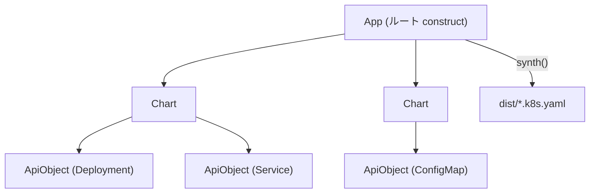

# アーキテクチャ

## 全体像

CDK8s はコントローラではなく合成フレームワークです。コードで construct のツリーを組み、`App.synth()` を呼ぶと Kubernetes YAML が出力ディレクトリに書き出されます。クラスタ接続も reconcile ループもありません。ツリーは 3 階層で、いずれも `constructs` ライブラリの `Construct` 基底クラスを継承します。ルートの `App`、1 つ以上の `Chart` ノード、そして各々が 1 つの Kubernetes リソースになる `ApiObject` リーフです。

## コンポーネント

### App (ルート construct)

`App` は `src/app.ts:87` で定義され、`Construct` を継承します。scope を持たない唯一の construct で、constructor は `super(undefined as any, '')` を呼びます (`src/app.ts:170`)。出力設定を保持し、`outdir` は環境変数 `CDK8S_OUTDIR` か `dist` を既定とし (`src/app.ts:171`)、ファイル拡張子は `.k8s.yaml` を既定とし (`src/app.ts:172`)、分割モードは `YamlOutputType.FILE_PER_CHART` を既定とします (`src/app.ts:173`)。`YamlOutputType` enum は `src/app.ts:12` で宣言されています。

### Chart (1 マニフェストファイル)

`Chart` は `src/chart.ts:36` で定義されます。chart は 1 出力ファイルに対応する単位です。既定の namespace と共通ラベルを持ち、含むオブジェクトのリソース名を `generateObjectName` で生成します (`src/chart.ts:126`)。`toJson()` は `App._synthChart(this)` へ直接委譲します (`src/chart.ts:148`)。

### ApiObject (1 つの Kubernetes リソース)

`ApiObject` は `src/api-object.ts:52` で定義されます。各インスタンスが 1 つの Kubernetes リソースになります。constructor は `kind` と `apiVersion` を記録し、API バージョンから `apiGroup` を導出し (`src/api-object.ts:148`)、`metadata.name` が無ければ chart の名前生成にフォールバックしてリソース名を割り当てます (`src/api-object.ts:150`)。`toJson()` (`src/api-object.ts:200`) がメモリ上のオブジェクトを最終的なリソース JSON に変換します。

### 補助モジュール

- `src/resolve.ts`: 合成中にトークン値を置換する resolver チェーン。
- `src/dependency.ts`: construct をトポロジカルソートする `DependencyGraph` と `DependencyVertex`。
- `src/yaml.ts`: オブジェクトを複数ドキュメント YAML に直列化する `Yaml` クラス。
- `src/names.ts`: 安定した DNS 互換名を生成する `Names` ユーティリティ。

## 合成の流れ

`App.synth()` (`src/app.ts:182`) がエントリポイントです。既定の `FILE_PER_CHART` モードでは次の経路をたどります。

1. `fs.mkdirSync(this.outdir, { recursive: true })` が出力ディレクトリを作成します (`src/app.ts:184`)。
2. `validate(this, cache)` が全 construct の `node.validate()` を集め、エラーがあれば throw します (`src/app.ts:190`、本体は `src/app.ts:298`)。
3. `resolveDependencies(this, cache)` が暗黙の construct 依存を chart 間・ApiObject 間の明示的依存へ変換し、`hasDependantCharts` を返します (`src/app.ts:194`、本体は `src/app.ts:325`)。
4. `charts` getter が `new DependencyGraph(this.node).topology()` で chart をトポロジカルソートします (`src/app.ts:158`)。
5. `FILE_PER_CHART` 分岐 (`src/app.ts:212`) で `ChartNamer` が各 chart に名前を付け、`chart.toJson()` が描画し、`Yaml.save` がファイルを書きます (`src/app.ts:216`)。
6. `Chart.toJson()` が `App._synthChart(this)` を呼びます (`src/chart.ts:148`)。
7. `App._synthChart` (`src/app.ts:101`) が再度 `resolveDependencies` (`src/app.ts:109`) と `validate` (`src/app.ts:114`) を実行し、`chartToKube(chart).map(obj => obj.toJson())` を返します (`src/app.ts:116`)。
8. `chartToKube` (`src/app.ts:372`) が chart のサブツリーをトポロジカルソートし、最も近い親 chart がこの chart である `ApiObject` だけを残して、入れ子 chart の二重出力を防ぎます (`src/app.ts:373`)。
9. `ApiObject.toJson()` (`src/api-object.ts:200`) が 1 リソースを描画します。データオブジェクトを組み、トークンを解決し、サニタイズしてキーをソートし、JSON パッチを適用し、トップレベルのキーを並べ替えます ([内部実装](./internals) で詳述)。

第 2 のエントリポイント `synthYaml()` (`src/app.ts:269`) は同じ依存解決と検証を実行しますが、ファイルを書かずに YAML 文字列を返します。

## 主要な設計判断

- **合成するが適用しない。** フレームワークは YAML を書いて終わります。apply もクラスタクライアントもドリフト検出もありません。これにより cdk8s は任意の適用機構 (`kubectl`、GitOps コントローラ) と組み合わせ可能で、クラスタ資格情報を持ちません。
- **2 段階の依存解決。** 依存はまずアプリ全体のレベルで推論され、chart 横断の関係が見えるようにし、その後 `_synthChart` の中で chart 単位に再解決されます。`src/app.ts:107` のコメントは、依存推論がアプリレベルで起きるため、単一 chart を合成する前にアプリ全体を準備する必要があると説明しています。
- **トポロジカルな出力順。** `DependencyVertex.topology()` (`src/dependency.ts:134`) は依存先を依存元より先に出力するため、リソースは依存するリソースの後にマニフェストへ現れます。
- **YAML 1.1 スキーマ。** 直列化処理は YAML スキーマを `1.1` に固定し (`src/yaml.ts:12`)、PyYAML などのパーサとの後方互換と、`0775` のような 8 進数の正しい解釈を担保します。

## 拡張ポイント

- **Resolver。** `AppProps.resolvers` は `IResolver` (`src/resolve.ts:49`) 実装の配列を受け取ります。各々が合成中にプロパティ値を書き換えられ、最初に `context.replaceValue` を呼んだ resolver が勝ちます (`src/resolve.ts:128`)。
- **JSON パッチ。** `ApiObject.addJsonPatch` (`src/api-object.ts:190`) が RFC-6902 (JSON Patch) 操作をキューに積み、描画後のマニフェストへ `src/api-object.ts:210` で適用します。
- **chart 名のカスタマイズ。** `Chart.generateObjectName` (`src/chart.ts:126`) を override すれば chart 単位でリソース名をカスタマイズできます。
- **マニフェストの取り込み。** `Yaml.load` (`src/yaml.ts:72`) は URL またはファイルから既存 YAML を読み、CRD や外部マニフェストを construct として取り込む基盤になります。
