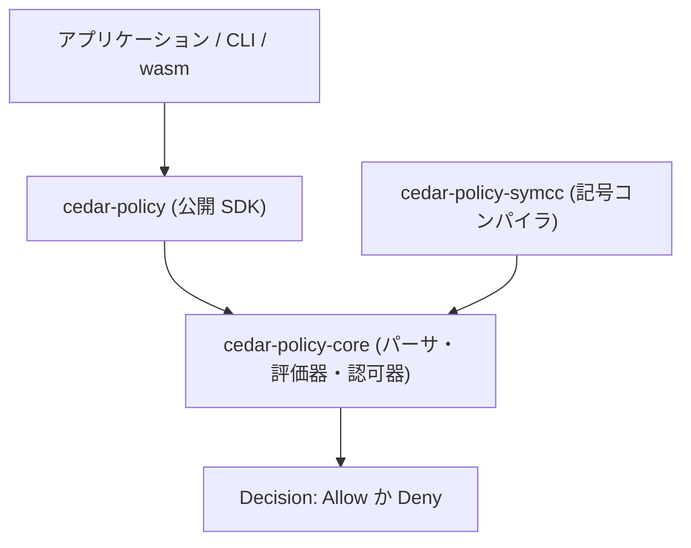

# アーキテクチャ

## 全体像

Cedar は Rust ワークスペースである。中核の認可エンジンは、パーサに加えて評価器 (evaluator、ポリシー条件をリクエストに対して解釈するコンポーネント) と認可器 (authorizer、ポリシーごとの結果を 1 つの決定にまとめるコンポーネント) からなる。アプリケーションは core を直接呼ばない。公開 `cedar-policy` SDK クレートを使い、それが `cedar-policy-core` の上の薄い層を被せる (README:42, README:47)。その core の周りに CLI、wasm バインディング、Language Server、フォーマッタ、記号コンパイラが並ぶ (README:42-49)。

## コンポーネント

### 公開 SDK: `cedar-policy`

アプリケーションが依存するクレートである (README:42)。`Authorizer::is_authorized` は `Request`、`PolicySet`、`Entities` 集合を受け取り `Response` を返す (`cedar-policy/src/api.rs:1116`)。本体は同名の core 認可器へそのまま委譲する (`api.rs:1117`)。

### 中核エンジン: `cedar-policy-core`

内部クレートがパーサ・評価器・型検査器を保持する (README:47)。認可器は `cedar-policy-core/src/authorizer.rs`、評価器は `cedar-policy-core/src/evaluator.rs`、抽象構文木 (AST) の型は `cedar-policy-core/src/ast/` 配下にある。

### 記号コンパイラ: `cedar-policy-symcc`

このクレートはポリシーを SMT ソルバ向けの論理にコンパイルし、テストではなく証明で性質を問えるようにする (README:43)。エントリポイントは [内部実装](./internals) で扱う。

### CLI、wasm、Language Server

`cedar-policy-cli` は `cedar` コマンドを提供し、`fn main` から `clap` でサブコマンドを解析する (`cedar-policy-cli/src/main.rs:28`)。`cedar-wasm` は JavaScript / TypeScript 向けの wasm インターフェースを公開する (README:46)。`cedar-language-server` はエディタ連携のための Language Server Protocol (LSP) を実装する (README:45)。

## リクエストの流れ

SDK の `is_authorized` 呼び出しを決定まで追う。

1. SDK エントリ `Authorizer::is_authorized` (`api.rs:1116`) がリクエストを clone し core 認可器を呼ぶ (`api.rs:1117`)。

2. core `Authorizer::is_authorized` (`authorizer.rs:76`) が `is_authorized_core(...).concretize()` を呼ぶ (`authorizer.rs:77`)。

3. `is_authorized_core` (`authorizer.rs:83`) が `Evaluator::new(...)` で評価器を作り (`authorizer.rs:89`)、`is_authorized_core_internal` へ渡す (`authorizer.rs:90`)。

4. `is_authorized_core_internal` (`authorizer.rs:95`) が `for p in pset.policies()` で全ポリシーを走査し (`authorizer.rs:109`)、各々に `eval.partial_evaluate(p)` を呼ぶ (`authorizer.rs:111`)。結果を effect (permit か forbid) と真偽でバケツに振り分ける。条件が評価エラーを起こしたポリシーは記録され、唯一のエラーモード `ErrorHandling::Skip` (`authorizer.rs:136`) のもとで不成立として扱われる。

5. `partial_evaluate` (`evaluator.rs:397`) がポリシー条件を解釈する。具体値に簡約されれば `get_as_bool` で真偽へ変換し、unknown が残れば残差式を返す (`evaluator.rs:398-401`)。

6. バケツは `PartialResponse::new(...)` で `PartialResponse` に詰められる (`authorizer.rs:152`)。

7. `concretize` (`partial_response.rs:115`) が `PartialResponse` を最終 `Response` に変え、決定は `decision` で計算される (`partial_response.rs:121`)。

## 主要な設計判断

結合規則は deny-trumps-allow であり、`decision` 内の 1 つの match で強制される (`partial_response.rs:122-138`)。成立した forbid が 1 つでもあれば `Deny` (`partial_response.rs:129`)。成立しうる permit が皆無なら既定で `Deny` (`partial_response.rs:131`)。成立した permit が少なくとも 1 つあり、成立または残差の forbid が無いときだけ allow になる (`partial_response.rs:137`)。帰結として、forbid は常に permit を上書きし、permit がゼロなら既定で拒否される。

決定型は意図的に 2 値である。`Decision` は `Allow` と `Deny` のみの enum で (`authorizer.rs:701`)、ポリシーのパース失敗のような十分に致命的なエラーも `Deny` に倒れる (`authorizer.rs:704-708`)。呼び出し側が誤って扱いうる第 3 の「エラー」結果は存在しない。

エンジンは partial-evaluation を前提に作られている。内部パスは真偽か残差を返す `partial_evaluate` (`evaluator.rs:397`) であり、`concretize` が `PartialResponse` を `Response` に畳む (`partial_response.rs:115`)。同じ機構が、完全なリクエストと、後で埋める unknown を残したリクエストの双方を扱う。

## 拡張ポイント

サポートされる統合面は、公開 SDK クレート (README:42)、JavaScript / TypeScript 向けの wasm バインディング (README:46)、CLI (README:44)、エディタ向け Language Server (README:45)、`is_authorized` や `is_authorized_json` のような Foreign Function Interface (FFI) JSON エントリ (`cedar-policy/src/ffi/is_authorized.rs:58`, `:88`) である。Cedar は IP アドレスや 10 進数などの値の拡張関数もサポートし、AST では `ExtensionFunctionApp` 式 variant として現れる。
