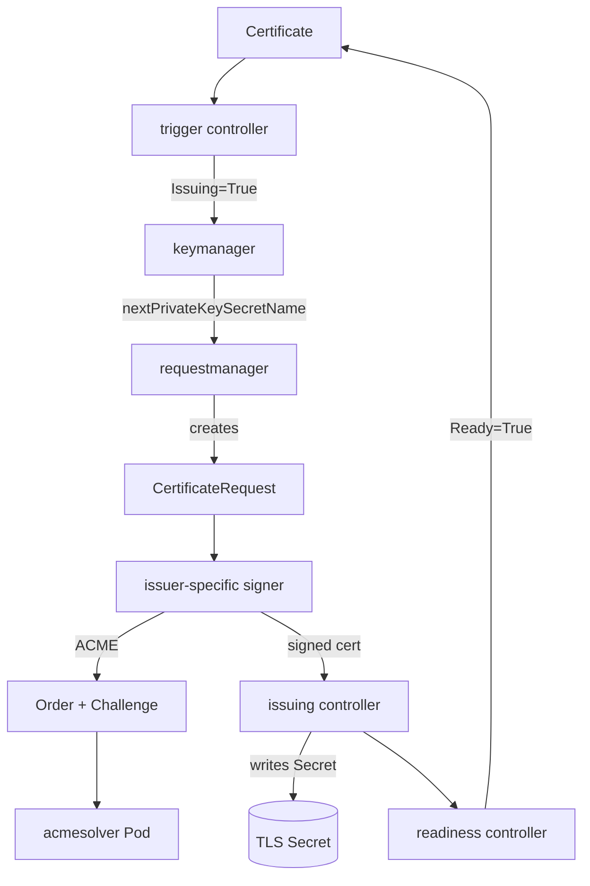

# アーキテクチャ

## 全体像

cert-manager は複数の常駐 Kubernetes コンポーネントと、いくつかの補助バイナリとして動く。`cmd/` ディレクトリに 5 つの入口がある: `controller`・`webhook`・`cainjector`・`acmesolver`・`startupapicheck`。controller には全リコンサイルループが入り、webhook は API 型の検証と変換を行い、cainjector は CA バンドルを同期し続ける。acmesolver は ACME HTTP-01 チャレンジに応答するために起動される短命の Pod である。

API は 2 つのグループからなる: `certmanager` (`Certificate`・`CertificateRequest`・`Issuer`・`ClusterIssuer`、`pkg/apis/certmanager/v1`) と `acme` (`Order`・`Challenge`、`pkg/apis/acme/v1`)。acme グループは ACME プロトコルの状態を CRD として永続化するので、再起動しても中断点から再開できる。

## コンポーネント

### controller

全リコンサイルループの集合。入口は `app.NewServerCommand(ctx)` (`cmd/controller/main.go:37`) で、別モジュール `controller-binary/app` から import される (`cmd/controller/main.go:26`)。各コントローラは `Register(name, fn)` (`pkg/controller/register.go:48`) でグローバル map に自己登録するので、バイナリは 1 つの巨大ループではなくプラグイン的なリコンサイラの集合になっている。

### webhook

validating / mutating admission webhook と、API 型の conversion webhook をホストする (`pkg/webhook`、検証ロジックは `pkg/apis/.../validation` 配下)。不正な `Certificate` や `Issuer` の spec をコントローラに届く前に弾く門である。

### cainjector

CA 証明書を webhook 設定や APIService オブジェクトの `caBundle` フィールドへ注入する。リコンサイラは `pkg/controller/cainjector/reconciler.go` にあり、補助コードは `internal/cainjector` 配下にある。これがないと API サーバは cert-manager 自身の webhook を信頼できない。

### acmesolver

ACME HTTP-01 チャレンジのトークンを配信する使い捨て Pod (`cmd/acmesolver`)。ACME コントローラが必要時に作成し、チャレンジ検証後に削除する。

## リクエストの流れ

1 つの `Certificate` の発行は単一ループではない。`pkg/controller/certificates/` 配下の複数の小コントローラ (`trigger`・`keymanager`・`requestmanager`・`issuing`・`readiness`・`revisionmanager`) に分割され、各々が 1 つの状態遷移だけを担い、status condition と Secret だけを介して協調する。

1. trigger: `ProcessItem` (`pkg/controller/certificates/trigger/trigger_controller.go:160`) が `CertificateOwnsSecret` (`:188`) で Secret の重複所有を確認し、失敗バックオフ (`:210`) を適用し、`shouldReissue` (`:225`) で再発行ポリシーを評価する。再発行が必要なら `Issuing` condition を True にして status を更新する (`:243`)。ここでは CertificateRequest を作らない。
2. keymanager: `Issuing=True` を見て次のリビジョン用の秘密鍵 Secret を生成し、`status.nextPrivateKeySecretName` を記録する (`pkg/controller/certificates/keymanager`)。
3. requestmanager: `ProcessItem` (`pkg/controller/certificates/requestmanager/requestmanager_controller.go:140`) が `Issuing=True` を確認し (`:156`)、next-private-key Secret から鍵をデコードし (`:180`)、合致する CertificateRequest がなければ `createNewCertificateRequest` (`:236`、定義は `:367`) を呼ぶ。CSR は鍵からエンコードされ (`:381`)、PEM 化され (`:387`)、`CertmanagerV1().CertificateRequests(...).Create(...)` (`:435`) で作成される。
4. signer: `IssuerRef` に合致する signer が CertificateRequest を処理する。ACME の場合 `Sign` (`pkg/controller/certificaterequests/acme/acme.go:118`) が CSR をデコードし (`:122`)、CommonName が SAN に含まれるか確認し (`:133`)、期待する `Order` を構築し (`:145`)、未存在なら作成する (`:160`)。
5. acmeorders / acmechallenges: `pkg/controller/acmeorders` と `pkg/controller/acmechallenges` が Order を ACME サーバへ発注し、Challenge (HTTP-01 / DNS-01) を解く。acmesolver Pod が HTTP-01 に応答する。署名済み証明書は CertificateRequest の status に書き戻される。
6. issuing: 署名済み証明書を本番 Secret に書き込み、`Issuing` condition を外す (`pkg/controller/certificates/issuing`)。続いて readiness コントローラが `Ready` condition を設定する。

## 主要な設計判断

決定的な選択はリコンサイルを micro-controller に分割したことだ。各コントローラは 1 ステップだけを進め、`Certificate` の status condition (`Issuing`・`Ready`) と命名規約 (`nextPrivateKeySecretName`、revision アノテーション) を介して疎結合に保たれる。1 つの巨大ループより観測・テストしやすい代わりに、状態がリソース間に散る。

`CertificateRequest` は意図的な中間契約である。すべての issuer 種別 (ACME・CA・SelfSigned・Vault・Venafi、`pkg/controller/certificaterequests/`) が同じ CertificateRequest を消費するので、外部プロセスがリクエストを out-of-band で署名できる。これがサードパーティ issuer をコアをフォークせずに成立させている。

ACME のエラー処理は再試行可能なものと致命的なものを分ける。ネットワーク障害は Pending + バックオフになり、デコード不能な CSR や SAN にない CommonName は無限リトライを避けるため hard fail にする (`pkg/controller/certificaterequests/acme/acme.go:122`-`:142`)。

## 拡張ポイント

- カスタムリソース: `Certificate`・`CertificateRequest`・`Issuer`・`ClusterIssuer`・`Order`・`Challenge` が公開 API。
- 外部 issuer: `CertificateRequest` を署名する任意のコントローラが、cert-manager 本体を変えずにフローに差し込める。approver と checks 層がそれらを守る (`pkg/controller/certificaterequests/approver`)。
- 型の検証とバージョニングのための admission / conversion webhook (`pkg/webhook`)。
- 追加リコンサイラを controller バイナリへ結線するコントローラプラグインレジストリ `Register` (`pkg/controller/register.go:48`)。
