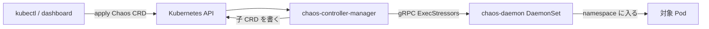

# アーキテクチャ

## 全体像

Chaos Mesh は 3 つの常駐コンポーネントと一群のカスタムリソースから構成される。controller-manager がカオス CRD を watch して何を注入するか決める。chaos-daemon は privileged な DaemonSet として全ノードに常駐し、対象コンテナの namespace の中で注入を行う。dashboard は Web UI と API を提供する。障害は CRD で表現され、リポジトリは `config/crd/bases/` 配下に 23 個の CRD 定義を同梱する。

## コンポーネント

### chaos-controller-manager

オペレータ本体。`main` は `cmd/chaos-controller-manager/main.go:60`。DI に Uber の `fx` を使う。`fx.New(...)` が `controllers.Module` / `selector.Module` / `types.ChaosObjects` を組み、`fx.Invoke(Run)` でマネージャを起動する (`cmd/chaos-controller-manager/main.go:77-92`)。すべてのカオス CRD を reconcile し、Pod 単位の注入意図を記録する子 CRD (`PodNetworkChaos` / `PodIOChaos` / `PodHttpChaos`) を書き出す。

### chaos-daemon

各ノード上の privileged DaemonSet。gRPC サービスを公開し、そのインターフェースは `pkg/chaosdaemon/pb/chaosdaemon.proto:7-34` で定義される (`ExecStressors` / `SetDNSServer` / `ApplyIOChaos` / `InstallJVMRules` などの呼び出し)。daemon は対象コンテナの namespace と cgroup に入って障害を適用するため、ホストを直接触る唯一のコンポーネントである。

### chaos-dashboard

Web UI と API。`main` は `cmd/chaos-dashboard/` 配下。実験の設計、状態の観測、Workflow と Schedule の駆動に使う。

`cmd/` 配下の補助バイナリには、`chaos-builder` (CRD ボイラープレート生成)、`chaos-daemon-helper`、`watchmaker` (TimeChaos が使用、Linux と Darwin で別ビルド)、`generate-makefile` がある。

## リクエストの流れ

一群の Pod に CPU 負荷をかける StressChaos を例にとる。

1. CRD を適用する。controller-manager は共通パイプラインで reconcile する。段の並びは `controllers/common/step.go:26-33` に列挙される: `finalizers.InitStep` / `desiredphase.Step` / `condition.Step` / `records.Step` / `finalizers.CleanStep`。
2. `records` 段がターゲットを選ぶ。`records == nil` のとき `Reconcile` が selector を走らせ (`controllers/common/records/controller.go:64`、選択は `:84`)、ターゲットごとに 1 つの `Record` を作る。
3. 各 record について、小さな状態機械が desired phase と現 phase を比べて `Apply` / `Recover` / `Nothing` を決める (`controllers/common/records/controller.go:128-149`)。`Apply` なら `r.Impl.Apply(...)` を呼びカウンタを更新する (`:151` 以降)。
4. StressChaos impl がコンテナを解決し gRPC で daemon を呼ぶ。`Apply` は対象コンテナをデコードして `PbClient` を得て (`controllers/chaosimpl/stresschaos/impl.go:43-52`)、`EnterNS: true` の `ExecStressRequest` を組み (`impl.go:77-87`)、`pbClient.ExecStressors` を呼ぶ。
5. daemon が対象の namespace と cgroup の中で `stress-ng` を起動する (`pkg/chaosdaemon/stress_server_linux.go:33` と `:112`)。

`desiredphase` 段は実験が終わるまで常に `RequeueAfter` を返すので、パイプラインは即時に re-enqueue しない (`controllers/common/pipeline/pipeline.go:80-92`)。

## 主要な設計判断

- 1 フィールド 1 コントローラ。メンテナが掲げる設計原則 (リポジトリの `controllers/README.md` に要約) は、各コントローラが単一の status フィールドを持ち、およそ 100 語で独立に説明できる状態を保つこと。リトライは手書きのループでなく controller-runtime の exponential backoff に委ねる。
- 親 CRD と子 CRD。ユーザー向けのカオスオブジェクトは選択結果を Pod 単位の子 CRD (`PodNetworkChaos` / `PodIOChaos` / `PodHttpChaos`) に書き、daemon はその子を見て動く。子が変化したとき親の reconcile を発火させる predicate がある (`controllers/common/fx.go:154-169`)。
- 泥仕事は daemon が担う。コントローラはホストを一切触らず、namespace と cgroup の操作はすべて privileged daemon に隔離され、単一の gRPC 契約の背後に置かれる。

## 拡張ポイント

- CRD: 各障害種別が CRD。23 個の定義が `config/crd/bases/` 配下にある。クラウド障害 (`awschaos` / `azurechaos` / `gcpchaos`) と `physical_machine_chaos` はクラスタ内 Pod を超えて拡張する。
- `ChaosImpl` インターフェース: 全障害種別が `Apply` と `Recover` を実装する (`controllers/chaosimpl/types/types.go:25-29`)。新しい障害種別が差し込まれる継ぎ目。
- Admission webhook: 共通の `InnerObject` インターフェースが `ValidateCreate` / `ValidateUpdate` / `ValidateDelete` / `Default` を含む (`api/v1alpha1/common_types.go:146-160`)。
- Workflow と Schedule の CRD が実験をオーケストレーション・反復する。

## 出典

1. chaos-mesh/chaos-mesh ソース (コミット `8c13a9f`): <https://github.com/chaos-mesh/chaos-mesh>
2. Chaos Mesh プロジェクトページ (3 コンポーネント概要): <https://www.cncf.io/projects/chaosmesh/>
