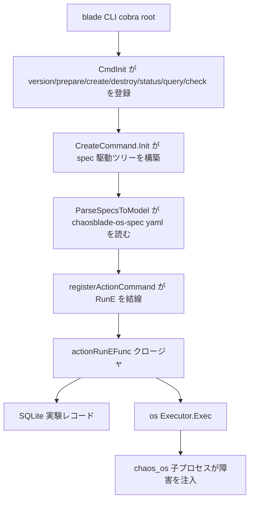

# アーキテクチャ

## 全体像

`blade` バイナリは cobra (Go の CLI フレームワーク) 上に構築された薄い dispatcher である。起動時に固定のトップレベルコマンド群を登録し、その後バージョン付きの YAML スペックファイルを解釈して障害シナリオのコマンドツリーを実行時に組み立てる。各 leaf コマンドは、1 つのドメインの障害注入方法を知る executor に対応する。CLI は障害ロジックを含まない。ホストの場合は別バイナリ `chaos_os` を子プロセス起動し、その YAML とバイナリは、ビルドが clone してパッケージする兄弟リポジトリから来る。

## コンポーネント

### CLI コア (`cli/`)

エントリポイントは `cli/main.go:26` である。`main` は `cmd.CmdInit()` (`cli/main.go:27`) を呼び、続いて cobra の `Execute()` (`cli/main.go:28`) を呼ぶ。`CmdInit` (`cli/cmd/cmd.go:23`) は静的なコマンド群 `version`・`prepare`・`revoke`・`create`・`destroy`・`status`・`query`・`check` を登録する。server コマンドモードは意図的に無効化されており、`cli/cmd/cmd.go:58` のコメントが記録している。

### spec 駆動のコマンドサービス (`cli/cmd/exp.go`)

`baseExpCommandService` (`cli/cmd/exp.go:91`) は 2 つのレジストリを保持する。`commands map[string]*modelCommand` と `executors map[string]spec.Executor` である。`newBaseExpCommandService` (`cli/cmd/exp.go:99`) は `registerSubCommands` (`cli/cmd/exp.go:119`) を呼び、各障害ドメインを順に登録する。OS ドメインでは `registerOsExpCommands` (`cli/cmd/exp.go:139`) がバージョン付きスペックファイルを読み、`specutil.ParseSpecsToModel(file, os.NewExecutor())` (`cli/cmd/exp.go:141`) を呼ぶ。同じパターンが middleware・cloud・jvm・cplus・docker・cri・kubernetes でも繰り返される。

### Executor 群 (`exec/`)

`exec/` 配下の各サブディレクトリは `spec.Executor` インターフェースを実装するアダプタである。`cloud`・`cplus`・`cri`・`docker`・`jvm`・`kubernetes`・`middleware`・`os` がある。OS executor の `Exec` は `exec/os/executor.go:42` にある。プロセス内で障害を注入せず、引数配列を組み立てて外部の `chaos_os` バイナリを実行する。

### ローカル状態ストア (`data/`)

実験レコードは `chaosblade.dat` という名前のローカル SQLite ファイルに永続化される (`data/source.go:34`)。ストア抽象は `SourceI` (`data/source.go:36`) で、その具象が `Source` (`data/source.go:41`) である。ドライバは pure-Go の `github.com/glebarez/sqlite` (`data/source.go:28`) で、`sql.Open("sqlite", ...)` (`data/source.go:113`) で開く。

## リクエストの流れ

`blade create cpu load --cpu-percent 60` を追う。

1. `main` が `CmdInit()` の後 `Execute()` を実行する (`cli/main.go:27` と `cli/main.go:28`)。
2. action leaf の `RunE` は `actionRunEFunc` (`cli/cmd/create.go:104`) が返すクロージャである。cobra は `cli/cmd/exp.go:394` でそれを結線する。
3. クロージャは `createExpModel(...)` (`cli/cmd/create.go:106`) を呼び、cobra フラグを `spec.ExpModel` に変換する。ビルダーは `cli/cmd/exp.go:435` にあり、`cmd.Flags().VisitAll` (`cli/cmd/exp.go:443`) で全フラグを走査する。
4. `actionCommand.recordExpModel(...)` (`cli/cmd/create.go:140`) が `data.ExperimentModel` を組み (`cli/cmd/command.go:96`)、`GetDS().InsertExperimentModel` (`cli/cmd/command.go:106`) で SQLite に挿入する。
5. 同期パスでは CLI が executor を取得し (`cli/cmd/create.go:180`)、channel を設定し (`cli/cmd/create.go:181`)、`executor.Exec(model.Uid, ctx, expModel)` (`cli/cmd/create.go:183`) を呼ぶ。
6. OS executor は `chaosOsBin` を組み (`exec/os/executor.go:66`)、`os_exec.CommandContext` (`exec/os/executor.go:67`) で起動する。常駐型 (hang) 障害は `command.Start()` (`exec/os/executor.go:71`) を使い、それ以外は `command.CombinedOutput()` (`exec/os/executor.go:78`) を使って結果を `spec.Decode` (`exec/os/executor.go:84`) でデコードする。
7. 成功時、CLI は `GetDS().UpdateExperimentModelByUid(model.Uid, Success, ...)` (`cli/cmd/create.go:222`) でレコードを更新する。

## 主要な設計判断

決定的な判断は、`blade` が障害注入器ではなく spec 駆動の dispatcher であることだ。シナリオは CLI にコンパイルされず、`chaosblade-os-spec-<ver>.yaml` 等のバージョン付き YAML から実行時にロードされ (`cli/cmd/exp.go:140`)、OS executor は `bin/chaos_os` へ shell out する (`exec/os/executor.go:66` と `exec/os/executor.go:67`)。executor バイナリとその YAML は兄弟リポジトリが生成する。`Makefile:341` の `os` target が `chaosblade-exec-os` を clone し、その `make` を実行して結果をパッケージへコピーする。executor は YAML 契約で CLI と疎結合に保たれる。

状態は外部 DB ではなくローカル SQLite ファイルに置かれ、単一ホストで完結する (`data/source.go:34`)。パスは `CHAOSBLADE_DATAFILE_PATH` 環境変数で上書きできる (`data/source.go:78`)。

create には同期パスと非同期パスがある。`--async` を付けると、コマンドは自分自身を `nohup` 下で再起動し、実験 uid を即座に返す (`cli/cmd/create.go:150`)。同期パスは executor をインラインで実行する (`cli/cmd/create.go:183`)。

## 拡張ポイント

新しい障害ドメインは、`spec.Executor` を満たす新規 executor とその YAML スペックを書き、`registerSubCommands` (`cli/cmd/exp.go:119`) に登録することで追加する。すべての action は `addTimeoutFlag` (`cli/cmd/exp.go:405`) によって自動的に `timeout` フラグを得る。設定されると `actionPostRunEFunc` (`cli/cmd/create.go:252`) が自動 `blade destroy` をスケジュールし、実験が自己回復する。Kubernetes では operator (`chaosblade-operator`) が Custom Resource Definition (CRD、Kubernetes API の拡張型) を宣言的インターフェースとして公開する。
