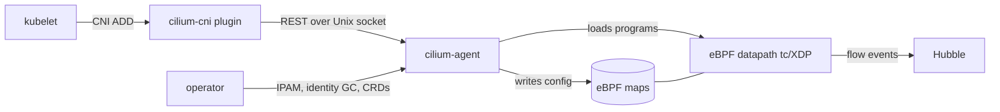

# アーキテクチャ

## 全体像

Cilium は 2 層からなる。ユーザ空間の Go エージェントが各ノードで動き (DaemonSet として 1 ノード 1 つ)、ネットワークが何をすべきかを決める。カーネル空間の eBPF datapath は `bpf/` の C からコンパイルされ tc / XDP フックにアタッチされ、実際のパケット処理を行う。エージェントは設定を計算して eBPF map に書き込み、カーネルがユーザ空間に戻らずに実トラフィックを処理する。クラスタスコープの operator は per-node ではなくグローバルな処理を担う。

## コンポーネント

### cilium-agent

エージェントは per-node の頭脳である。エントリポイントは `daemon/main.go` で、Cilium 自製の DI フレームワーク Hive でアプリケーションを組み立て、`cilium-agent` という cobra コマンドとして起動する (`daemon/main.go:13`, `daemon/cmd/root.go:24`)。モジュール (cell) は `daemon/cmd/` で組み立て・配線される。エージェントは endpoint のオーケストレーション、identity 割り当て、ポリシー解決、datapath ロードを担う。

### cilium-cni プラグイン

kubelet が pod ごとに呼ぶ別バイナリ。CNI の `Add` / `Del` 操作を `plugins/cilium-cni/cmd/cmd.go` に実装し、重い処理を自分でやらずにエージェントと Unix ソケットの REST API で会話する。

### operator

per-node であってはならない処理を担う単一のクラスタスコープ Deployment (`operator/`)。IPAM の CIDR 割り当て、identity のガベージコレクション、CRD 管理を行う。

### datapath と maps

`pkg/datapath/` は datapath 抽象、`pkg/datapath/loader/` は eBPF object のコンパイル・テンプレート化・ロードを行う。`pkg/maps/` は個々の eBPF map を Go でラップする。endpoint 用の `lxcmap`、解決済みポリシーの `policymap`、接続追跡の `ctmap` などだ。

### identity, policy, ipcache

`pkg/identity/` と `pkg/labels/` はラベル集合を数値の security identity にマッピングする。`pkg/policy/` はネットワークポリシーを per-endpoint の `MapState` (eBPF policy map の内容) に解決する。`pkg/ipcache/` はクラスタ全体の IP-to-identity 対応を保持し eBPF ipcache map に同期する。

### Hubble

`hubble/` と `hubble-relay/` が可観測性レイヤを構成し、eBPF 由来のフローイベントをクエリ可能な可視性に変える。

## リクエストの流れ

pod がスケジュールされてから eBPF datapath が稼働するまでを追う。

1. CNI ADD。kubelet が `cilium-cni` を呼ぶ。`Cmd.Add` (`plugins/cilium-cni/cmd/cmd.go:523`) が IPAM でアドレスを確保し、コンテナ netns 内に veth インターフェースを設定する。CNI 呼び出しは datapath が準備できるまで返してはならないため、`ep.SyncBuildEndpoint = true` をセットし (`plugins/cilium-cni/cmd/cmd.go:838`、GH-4409 を参照するコメント付き)、`c.EndpointCreate(ep)` で endpoint をエージェントに送る (`plugins/cilium-cni/cmd/cmd.go:842`)。
1. API ハンドラ。エージェントは `PUT /endpoint/{id}` を `EndpointPutEndpointIDHandler.Handle` (`pkg/endpoint/api/endpoint_api_handler.go:195`) で処理し、`endpointAPIManager.CreateEndpoint` (`pkg/endpoint/api/endpoint_api_manager.go:88`) に至る。
1. Endpoint 構築。`createEndpoint` (`pkg/endpoint/endpoint.go:597`) が Endpoint 構造体を生成し、`endpointManager.AddEndpoint` がノード内一意の ID を割り当てる (`pkg/endpoint/api/endpoint_api_manager.go:293`)。ラベルがまだ無ければ、endpoint には暫定の `reserved:init` identity が付与される (`pkg/endpoint/api/endpoint_api_manager.go:284`)。
1. identity 解決と再生成。Kubernetes pod なら `ep.RunMetadataResolver` が pod ラベルを取得して identity を確定し再生成を起動する (`pkg/endpoint/api/endpoint_api_manager.go:303`)。そうでなければ manager が `RegenerateWithDatapath` レベルで `ep.Regenerate` を明示的に呼ぶ (`pkg/endpoint/api/endpoint_api_manager.go:324`)。
1. 再生成パイプライン。`Endpoint.Regenerate` (`pkg/endpoint/policy.go:867`) がビルドをキューに積み、`regenerate` と `regeneratePolicy` がポリシーを `MapState` に解決し、`regenerateBPF` (`pkg/endpoint/bpf.go:360`) が引き継ぐ。これはまず `<-e.orchestrator.DatapathInitialized()` を待ってからコンパイル read ロックを取り、endpoint ビルドがベースプログラムのコンパイルと競合しないようにする (`pkg/endpoint/bpf.go:375`)。
1. ヘッダ・コンパイル・ロード。`writeHeaderfile` が endpoint 固有の定数を `lxc_config.h` に書き出し (`pkg/endpoint/bpf.go:139`)、`realizeBPFState` (`pkg/endpoint/bpf.go:568`) が走り、`orchestrator.ReloadDatapath` (`pkg/endpoint/bpf.go:587`) が eBPF object をロードして tc/XDP にアタッチする。内部では `pkg/datapath/loader/cache.go` の ELF テンプレートキャッシュを使う。
1. 同期完了。`SyncBuildEndpoint` が立っているため、エージェントは最初の datapath ビルド完了まで `ep.WaitForFirstRegeneration(ctx)` (`pkg/endpoint/api/endpoint_api_manager.go:337`) でブロックしてから REST 応答を返す。CNI ADD が返った時点で pod の eBPF datapath は稼働済みである。

## 主要な設計判断

- identity ベースのポリシー。ポリシーは IP ではなく、ラベル集合から導かれる数値 identity を鍵にする。pod のスケールは IP のメンバーシップを変えるが identity は変えないため、ルール数が pod 数に比例しない。`Identity`、`IPCache`、`MapState` の 3 つでこのモデルが成立する。
- テンプレートと差し替えの datapath。Cilium は endpoint ごとに eBPF を再コンパイルしない。設定ハッシュごとに 1 つの ELF をコンパイルしてクローンし、ロード直前に endpoint 固有値を差し替える (`pkg/datapath/loader/cache.go`)。これで pod ごとの clang 起動を避ける。
- カーネルへの push。エージェントは解決済み状態を eBPF map に push し、カーネルがインラインで適用する。パケットをユーザ空間で処理しない。
- Hive による宣言的ライフサイクル。エージェントは `hive.New(cmd.Agent)` (`daemon/main.go:13`) で cell から組み立てられ、起動順序とシャットダウンが宣言的になる。

## 拡張ポイント

Cilium はポリシーと設定のための Kubernetes CRD (CiliumNetworkPolicy と関連型)、kubelet が駆動する CNI プラグイン契約、そして CNI プラグインや `cilium-cli` が利用するエージェント REST API を公開する。Hubble はフローデータを外部コンシューマに公開する。IPAM や CRD 処理といったクラスタスコープの挙動は operator (`operator/`) が担う。
