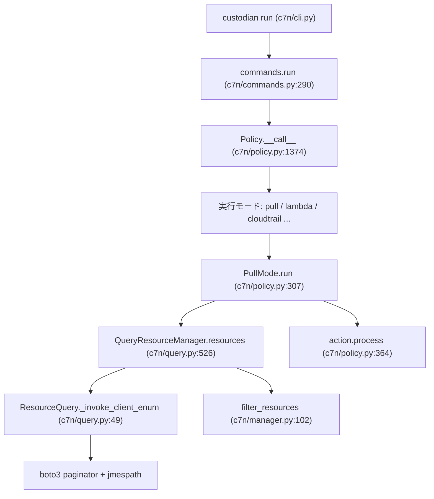

# アーキテクチャ

## 全体像

Cloud Custodian のポリシーは 4 つの部分を持つ YAML ブロックである: `resource` 型、`filters` の集合、`actions` の集合、任意の `mode`。`c7n/` のコアがそのブロックを読み、各文字列キー (リソース型・各フィルタ名・各アクション名) を登録済みの Python クラスに解決し、プロバイダにリソースを照会し、フィルタを順に適用し、残ったものにアクションを実行する。すべては文字列キーのプラグインレジストリで束ねられる。これが、実行ループに手を入れずに同じエンジンを約 120 の AWS リソース型と複数プロバイダへ拡張できる理由である。

## コンポーネント

### CLI と commands

`c7n/cli.py` が argparse パーサを組み立て、`run`・`report`・`schema`・`validate` などのサブコマンドへ振り分ける。実装は `c7n/commands.py` にある。`commands.run` はロード済みポリシーをループし、各ポリシーを呼び、例外を捕捉して 1 つの失敗で全体が止まらないようにし、いずれかがエラーになれば終了コード 2 で終わる (`c7n/commands.py:290`, `c7n/commands.py:306-320`)。

### Policy と実行モード

`c7n/policy.py` が `Policy` クラス (`c7n/policy.py:1168`) と実行モードの `execution` レジストリ (`c7n/policy.py:303`) を定義する。`pull` が既定である: ポリシーが `mode` を宣言しなければ `execution_mode` は `pull` に解決される (`c7n/policy.py:1230`)。`cloudtrail`・`periodic`・`config-rule` などのサーバレスモードは `ServerlessExecutionMode` を継承し、インライン実行の代わりにポリシーを Lambda 関数としてデプロイする。

### リソースマネージャとクエリ

`c7n/query.py` に `QueryResourceManager` (`c7n/query.py:452`)、`TypeInfo` (`c7n/query.py:796`)、`ResourceQuery` (`c7n/query.py:38`) がある。リソースマネージャがライフサイクル (取得・補完・フィルタ・上限チェック) を持ち、`ResourceQuery` が実際のプロバイダ API 呼び出しを行う。`c7n/manager.py` がフィルタを順に適用する `filter_resources` を持つ `ResourceManager` 基底を定義する (`c7n/manager.py:102`)。

### フィルタとアクション

`c7n/filters/core.py` が `Filter` 基底とその `process(resources, event)` 契約 (`c7n/filters/core.py:198`, `c7n/filters/core.py:206`)、および汎用の `ValueFilter` (`c7n/filters/core.py:589`) を定義する。`c7n/actions/core.py` が `Action` 基底を定義する (`c7n/actions/core.py:46`)。AWS リソース実装は `c7n/resources/` にある。

### レジストリ

`c7n/registry.py` が文字列→クラスのマップである `PluginRegistry` (`c7n/registry.py:5`) を定義する。リソース・フィルタ・アクション・実行モード・ソースはすべてこれを通じて登録される。

## リクエストの流れ

既定の `pull` モードでの `custodian run policy.yml` は次のように流れる。

1. `c7n.cli:main` が引数を解析し `run` サブコマンドを解決する。
2. `commands.run` がポリシーを反復し、各 `Policy` オブジェクトを呼ぶ (`c7n/commands.py:290`)。
3. `Policy.__call__` が実行モードを選び、非サーバレスモードなら `mode.run()` を呼ぶ (`c7n/policy.py:1374`, `c7n/policy.py:1388`)。`run` は `__call__` の別名である (`c7n/policy.py:1392`)。
4. `PullMode.run` がポリシーの実行可否を確認し、リソースを取得し、`resources.json` を書き、ドライランならアクションを省略し、各アクションを実行する (`c7n/policy.py:307`, `c7n/policy.py:330`, `c7n/policy.py:351`, `c7n/policy.py:357`, `c7n/policy.py:364`)。
5. `QueryResourceManager.resources` がキャッシュを確認し、ソース経由で取得し、タグで補完し、フィルタし、リソース上限を適用する (`c7n/query.py:526`)。
6. `ResourceManager.filter_resources` が各フィルタを順に適用し、集合が空になれば早期打ち切りする (`c7n/manager.py:102`)。
7. `ResourceQuery._invoke_client_enum` が boto3 paginator で describe 呼び出しを行い、jmespath で配列を抽出する (`c7n/query.py:49`)。

## 主要な設計判断

ポリシー検証スキーマは手書きではなく実行時に生成される。`schema.generate()` が登録済みの全リソース・フィルタ・アクションを走査して Draft 7 の JSON Schema を組み立て (`c7n/schema.py:359`)、`schema.validate()` が `jsonschema.Draft7Validator` でポリシーを検証する (`c7n/schema.py:56`)。プラグインを足すと DSL とそれを検証するスキーマの両方が拡張される。

リソース列挙は宣言的である。リソースは `(describe_op, jmespath_path, extra_args)` の `enum_spec` タプルでプロバイダ API に束ねられ、1 つの汎用ルーチンが全型に対してページングと抽出を行う。EC2 は `enum_spec = ('describe_instances', 'Reservations[]', None)` を宣言する (`c7n/resources/ec2.py:128`)。新しいリソース型が新規のクエリコードではなく薄い宣言で済むのはこのためである。

## 拡張ポイント

- 新しいリソース型: `QueryResourceManager` を継承し `resource_type` (`TypeInfo`) を持たせて登録する (`c7n/query.py:452`, `c7n/query.py:796`)。
- 新しいフィルタ・アクション: `Filter` または `Action` を継承し、リソースのフィルタ/アクションレジストリに登録する (`c7n/filters/core.py:198`, `c7n/actions/core.py:46`)。
- 新しい実行モード: `execution` レジストリに登録する (`c7n/policy.py:303`)。
- 新しいプロバイダ: `tools/c7n_*` パッケージ (Azure・GCP・OCI・Tencent・Kubernetes) が Python の entry point でロードされる。
