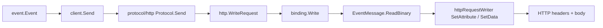

# アーキテクチャ

## 全体像

Go SDK は、イベントモデル・トランスポート非依存のワイヤ処理・各具体トランスポートが分離するよう構成されている。アプリケーションは正準型 `event.Event` を扱う。`binding` 層がそのイベントを、抽象 `Message` に対するトランスポート非依存の読み書き操作へ変換する。各 `protocol` パッケージ (HTTP・Kafka・MQTT ほか) が、1 つのワイヤ形式についてその操作を実装する。高レベルの `client` が `Send`・`Request`・`StartReceiver` でこれらを結ぶ。アンブレラパッケージ `github.com/cloudevents/sdk-go/v2` が共通エントリポイントを `v2/alias.go:91` で再エクスポートする。

## コンポーネント

### event

`v2/event/` が正準データモデルを保持する。`event.Event` (`v2/event/event.go:15`) は CloudEvent のメモリ内表現で、`Context` とエンコード済みデータペイロードからなる。仕様のコンテキスト属性は `EventContextV1` (`v2/event/eventcontext_v1.go:37`) のようなバージョン別構造体にある。このパッケージは仕様のデータモデルに対する SDK の視点だ。

### binding

`v2/binding/` がトランスポート非依存のコアだ。`Message` と `MessageReader` の抽象 (`v2/binding/message.go:89`、`v2/binding/message.go:23`) と、`write.go` / `to_event.go` のエンコーディングアルゴリズムを定める。`binding/spec/` が spec バージョンのレジストリを、`binding/format/` が JSON 等のペイロードフォーマットを保持する。ここには特定トランスポートの知識はない。

### protocol

`v2/protocol/` がトランスポート実装を持つ。in-tree の `http/` がデフォルトだ。Kafka (sarama と confluent)・MQTT・AMQP・NATS・NATS JetStream・GCP Pub/Sub・STAN・プロセス内 gochan トランスポートは `protocol/` 配下の別モジュールにある。各々が自分のワイヤ形式について binding の writer と reader インターフェースを実装する。

### client

`v2/client/` が高レベル API だ。`Client` インターフェースが `Send`・`Request`・`StartReceiver` を公開する (`v2/client/client.go:116`、`v2/client/client.go:198`)。送信時に defaulting と validation を適用し、受信イベントをリフレクションでユーザーハンドラへ振り分ける。

## イベントの流れ

HTTP の binary モードでの送信を端から端まで追う。

1. `ceClient.Send` (`v2/client/client.go:116`) が outbound context decorator を実行し、登録された defaulter 関数を適用し、`e.Validate()` を呼び、イベントを `binding.EventMessage` としてゼロコピーの型変換で sender に渡す: `c.sender.Send(ctx, (*binding.EventMessage)(&e))` (`v2/client/client.go:138`)。
2. `Protocol.Send` (`v2/protocol/http/protocol.go:168`) は `Request` に委譲し、レスポンスメッセージを finish し、非 ACK エラー時はボディを読んで `Result` にラップする。
3. `WriteRequest` (`v2/protocol/http/write_request.go:23`) は `*http.Request` を structured/binary 両方の writer を兼ねる `httpRequestWriter` にキャストし、`binding.Write` を呼ぶ。
4. `binding.Write` (`v2/binding/write.go:65`) はメッセージのエンコーディングを読む。`EventMessage` は `EncodingEvent` を返す (`v2/binding/event_message.go:37`) ため direct path をスキップし、`ToEvent` は同じイベントを返し、既定の `preferredEventEncoding` が binary なので `writeBinary` を呼び、それが `message.ReadBinary` を呼ぶ (`v2/binding/write.go:91`)。
5. `EventMessage.ReadBinary` (`v2/binding/event_message.go:50`) は `eventContextToBinaryWriter` を呼び、これがイベントの spec バージョンの属性集合を引き、各属性に `b.SetAttribute`、各拡張に `b.SetExtension` を呼び、最後に `b.SetData` でデータを設定する (`v2/binding/event_message.go:80`)。
6. `httpRequestWriter.SetAttribute` (`v2/protocol/http/write_request.go:109`) は各属性名を `attributeHeadersMapping` で HTTP ヘッダへ写像し、値を `types.Format` で文字列化してヘッダに追加する。`SetData` (`v2/protocol/http/write_request.go:52`) がリクエストボディを設定する。

ヘッダ写像表は起動時の `init()` で一度だけ構築される (`v2/protocol/http/headers.go:27`)。これは全 spec バージョンの全属性を走査し、`datacontenttype` を `Content-Type` に、他すべてを `CanonicalMIMEHeaderKey` を通した `ce-` prefix に写す。

## 主要な設計判断

最も重要なのは direct transcoding だ。何かを decode する前に `binding.Write` は `DirectWrite` (`v2/binding/write.go:32`) を試み、structured-to-structured または binary-to-binary のメッセージを、ペイロードを decode せずヘッダ/ボディのコピーで通す。`ToEvent` 経由の完全な decode と再エンコードは、直接経路が使えない場合のフォールバックにすぎない (`v2/binding/write.go:83`)。これによりイベントルータはデータを解析せずトランスポート間でイベントを転送でき、ブリッジが安価になる。context キー (`skipDirectStructuredEncoding`・`skipDirectBinaryEncoding`・`preferredEventEncoding`、`v2/binding/write.go:16`) でこの挙動を調整する。

2 つめは spec バージョンレジストリだ。`binding/spec` は属性をバージョン横断の `Kind` 列挙で表現するため、同じコードが v0.3 と v1.0 の両方を `AttributeFromKind`・`Get`・`Set` で読み書きする (`v2/binding/spec/spec.go:106`)。`WithPrefix` (`v2/binding/spec/spec.go:137`) が prefix 付きの属性集合を生成し、これが HTTP や Kafka が属性リストを重複させずに `ce-` 名を得る仕組みだ。

## 拡張ポイント

- `binding.Message`・`BinaryWriter`・`StructuredWriter` インターフェース (`v2/binding/message.go:89`、`v2/binding/binary_writer.go:39`) が、新しいトランスポートが実装するコントラクトだ。兄弟の `protocol/` モジュールはすべてこれらの実装だ。
- `binding/format` は新しい structured ペイロード形式を JSON と並べて登録できる。
- クライアントの `Option` 値、outbound context decorator、event defaulter 関数 (`v2/client/client.go:127`) により、ID やタイムスタンプの defaulting などの振る舞いを SDK を変えずに注入できる。
