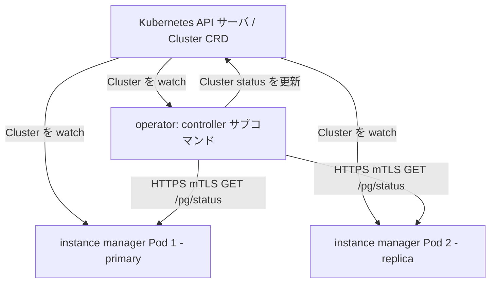

# アーキテクチャ

## 全体像

CloudNativePG は単一の Go バイナリとして出荷され、呼び出すサブコマンドによって挙動を変える。`controller` として起動すると operator になる。`Cluster` カスタムリソースを watch し、desired state に向けて収束させる controller-runtime マネージャだ。`instance` として起動すると、同じバイナリが各 DB Pod 内で PostgreSQL を起動・監督する Pod 内エージェント (instance manager) になる。サブコマンドは単一の cobra ルートに登録される (`cmd/manager/main.go:60`-`68` の `controller`, `instance`, `backup`, `bootstrap`, `walarchive`, `walrestore`, `pgbouncer`, `show`, `versions`)。

結果として 2 階層の reconcile モデルになる。両階層が Kubernetes API を通じて同じ `Cluster` リソースを watch し、外部 DCS (Distributed Configuration Store、分散構成ストア) の代わりにそれが共有された真実の源として機能する。

## コンポーネント

### operator (controller)

operator は Deployment として通常 `cnpg-system` namespace で動く。reconciler 群は `internal/controller` にあり、リソース種別ごとに 1 つ (`Cluster`, `Backup`, `ScheduledBackup`, `Pooler`, `Database` など)。`Cluster` reconciler が中核だ。エントリポイントは `internal/controller/cluster_controller.go:169` の `ClusterReconciler.Reconcile`。reconciler 構造体は controller-runtime の `client.Client` を埋め込み、Pod と通信する `InstanceClient`、プラグインリポジトリ、operator の TLS クライアント証明書を持つ (`internal/controller/cluster_controller.go:95`)。

### instance manager

各 PostgreSQL Pod は同じバイナリを `instance run` サブコマンドのエントリポイントとして動かす。instance manager は自前の controller-runtime マネージャを立ち上げ、`For(&apiv1.Cluster{})` で `Cluster` リソースを watch する (`internal/cmd/manager/instance/run/cmd.go:277`-`280`)。実際に PostgreSQL を起動し、設定を反映し、ローカルインスタンスを昇格・降格させるのはこれだ。HTTP サーバも公開する。operator が問い合わせる remote web server と local web server だ (`internal/cmd/manager/instance/run/cmd.go:397`, `:407`)。

### インスタンス状態エンドポイント

instance manager はクラスタ状態を HTTP で提供する。パス `/pg/status` は `pkg/management/url/url.go:55` に、ポート `8000` は `pkg/management/url/url.go:79` に定義される。operator の HTTP クライアントは Pod IP・このパス・このポートからリクエスト URL を組み立てる (`pkg/management/postgres/webserver/client/remote/instance.go:320`)。

### プラグインインターフェース (CNPG-i)

CNPG-i (CloudNativePG Plugin Interface) は gRPC ベースの拡張機構だ。operator はクラスタが必要とするプラグイン名を集め、各 reconcile の冒頭でロードする (`internal/controller/cluster_controller.go:227`, `:232`)。instance manager は Unix ドメインソケット越しに到達できるサイドカープラグインを `RegisterUnixSocketPluginsInPath` で登録する (`internal/cmd/manager/instance/run/cmd.go:259`)。

## リクエストの流れ

operator 側の `Cluster` reconcile 1 周:

1. `Reconcile` が `getCluster` で `Cluster` を取得し、admission guard `EnsureResourceIsAdmitted` を実行、クラスタが必要とする CNPG-i プラグインをロードし (`internal/controller/cluster_controller.go:169`, `:213`, `:232`)、inner `reconcile` を呼ぶ (`:267`)。
2. inner `reconcile` は `setDefaults` でデフォルト補正、`reconcileImage` でコンテナイメージ解決、`createPostgresClusterObjects` で補助オブジェクト (Service・Secret・ConfigMap) を生成する (`internal/controller/cluster_controller.go:310`, `:333`, `:345`, `:372`)。
3. `certs.NewTLSConfigForContext` で mTLS (mutual Transport Layer Security、相互 TLS) コンテキストを構築し、`GetStatusFromInstances` で各 Pod にレプリケーション状態を問い合わせる (`internal/controller/cluster_controller.go:446`, `:456`)。
4. HTTP クライアントは active Pod に絞り込み、各 Pod の `https://<podIP>:8000/pg/status` を叩いて `PostgresqlStatusList` を組み立てる (`pkg/management/postgres/webserver/client/remote/instance.go:183`, `:194`, `:320`)。
5. スイッチオーバーまたはフェイルオーバーが進行中なら (current primary と target primary が不一致)、旧 primary を unhealthy とマークし 1 秒後に requeue する (`internal/controller/cluster_controller.go:409`-`429`)。複数の Pod が自身を primary と報告したら、old-primary 検知をログし 5 秒後に requeue して auto-healing の収束を待つ (`:477`-`486`)。
6. 健全なら `handleSwitchover` でスイッチオーバーを判定し、`reconcileResources` でリソースを調停し、`finalizeReconciliation` で最終フェーズを記録する (`internal/controller/cluster_controller.go:589`, `:598`, `:605`)。

その間、各 instance manager も同じ `Cluster` リソースに対して自前のループを回すので、Pod は operator からの指示を待たずにトポロジ変更 (例: 昇格) に直接反応できる。

## 主要な設計判断

中心的な判断は、Kubernetes API サーバを高可用の合意ストアとして使い、etcd・Consul・ZooKeeper のような外部 DCS や Patroni・repmgr・Stolon のようなツールを避けることだ。operator と Pod 内の instance manager の両方が同じ `Cluster` リソースを watch するので、権威ある状態は 1 つになる。これにより Patroni 系スタックが必要とする可動部の一群が消える。

第 2 の判断は 2 階層 reconcile だ。instance manager を operator に命令される受動的プロセスではなく、それ自体を Kubernetes コントローラにした (`internal/cmd/manager/instance/run/cmd.go:277`-`280`)。各 Pod が自力で desired state に反応するので、挙動は level-triggered に保たれる。

第 3 はイミュータブルインフラだ。DB Pod は使い捨てでイメージは digest 固定なので、アップグレードはインプレース変更ではなくローリング置換で行う。

## 拡張ポイント

- **CRD**: API group `postgresql.cnpg.io/v1` が `Cluster`・`Backup`・`ScheduledBackup`・`Pooler`・`Database`・`Publication`・`Subscription`・`ImageCatalog`・`ClusterImageCatalog`・`FailoverQuorum` を定義する。これらがユーザーが構築する宣言的な面だ。
- **CNPG-i プラグイン**: サードパーティが gRPC サイドカープラグイン (例: バックアッププロバイダ) を実装し、operator と instance manager が実行時にロードする。
- **Pooler**: `Pooler` CRD がクラスタの前段に PgBouncer のコネクションプーリングをプロビジョニングする。
