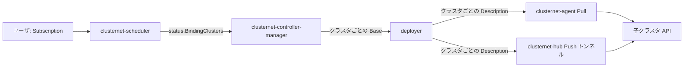

# アーキテクチャ

## 全体像

Clusternet はすべての API と状態を保持する親クラスタと、各子クラスタ内のひとつの agent からなる。親は 4 つのコンポーネントを動かし、それぞれ `src/cmd` 配下の独立したバイナリである。`clusternet-hub`、`clusternet-scheduler`、`clusternet-controller-manager`、`clusternet-agent` (agent は子で動く)。README と公式ドキュメントも同じ 4 コンポーネント構成を説明する ([Introduction](https://clusternet.io/docs/introduction/))。配布は CRD (Custom Resource Definition) の連鎖を流れる。ユーザが書いた Subscription をクラスタ群へスケジュールし、クラスタごとに Base へ展開し、クラスタごとに Description へレンダリングし、最終的に各子へ apply する。

## コンポーネント

### clusternet-hub

hub は aggregated API server である。shadow API を提供し、子クラスタへの `kubectl` トラフィックを proxy し、クラスタ登録要求を承認する。パッケージツリーは `src/pkg/hub` で、バイナリのエントリポイントは `src/cmd/clusternet-hub/hub.go:31` の `main()`、`app.NewClusternetHubCmd` 経由でコマンドを組み立てる。

### clusternet-scheduler

scheduler は Subscription をどのクラスタへ送るかを決める。ノードではなくクラスタをスケジュールするよう移植した Kubernetes scheduler framework で、`src/pkg/scheduler` 配下にある。1 件ごとのループは `src/pkg/scheduler/scheduler.go:287` の `scheduleOne`。

### clusternet-controller-manager

controller manager はスケジュール済みの Subscription を、各子の dedicated namespace 内のクラスタごとの Base と Description へ変換する。deployer ロジックは `src/pkg/controllermanager/deployer/deployer.go` にあり、`src/pkg/controllermanager/deployer/deployer.go:273` の `handleSubscription` から始まる。

### clusternet-agent

agent は子クラスタで動く唯一の Clusternet プロセスである。ClusterRegistrationRequest と CSR (CertificateSigningRequest) で子を親に登録し、heartbeat と health を報告し、Pull モードでは親が生成した Description を apply する。generic deployer のエントリは `src/pkg/agent/deployer/generic/generic.go:123` の `handleDescription`。

## リクエストの流れ

ひとつの Subscription を作成から子で動く pod まで追う。

1. ユーザが親に Subscription を作成する。subscription controller が `handle` (`src/pkg/controllers/apps/subscription/subscription.go:176`) で拾い、finalizer を注入し (`src/pkg/controllers/apps/subscription/subscription.go:203`)、注入されたハンドラへ委譲する (`src/pkg/controllers/apps/subscription/subscription.go:230`)。
2. `clusternet-scheduler` が `scheduleOne` (`src/pkg/scheduler/scheduler.go:287`) でキューから Subscription を pop し (pop は `src/pkg/scheduler/scheduler.go:288`)、スケジュールアルゴリズムを呼び (`src/pkg/scheduler/scheduler.go:346`)、非同期に bind する (`src/pkg/scheduler/scheduler.go:415`)。
3. default binder は Base を作らず、選んだクラスタを Subscription の status へ書き戻す。これにより scheduler と deployer が疎結合に保たれる。`DefaultBinder.Bind` は `src/pkg/scheduler/framework/plugins/defaultbinder/default_binder.go:57`、status 代入は `src/pkg/scheduler/framework/plugins/defaultbinder/default_binder.go:65`。
4. `clusternet-controller-manager` が status の変化を観測し、binding クラスタごとに 1 つの Base を `populateBasesAndLocalizations` (`src/pkg/controllermanager/deployer/deployer.go:322`) で作成し、各 Base を `populateDescriptions` (`src/pkg/controllermanager/deployer/deployer.go:755`) で Description へレンダリングする。
5. Pull モードでは子の `clusternet-agent` が自分の namespace の Description を watch し、`src/pkg/agent/deployer/generic/generic.go:131` で apply する。Push モードでは hub が同じオブジェクトを WebSocket トンネル越しに apply する。

これらの hop は [内部実装](./internals) ページでコード引用付きに追う。

## 主要な設計判断

scheduler は Base オブジェクトを生成しない。Subscription に `Status.BindingClusters` を記録するだけである (`src/pkg/scheduler/framework/plugins/defaultbinder/default_binder.go:65`)。controller manager がその status に反応する。この status 経由のハンドオフがスケジューリングとデプロイを疎結合にし、各々を単独で推論しスケールできるようにする。

子は sync モードを選ぶ。モードは `src/pkg/apis/clusters/v1beta1/types.go:39` で定義される型付き文字列で、値は 3 つ。`Push` (`src/pkg/apis/clusters/v1beta1/types.go:44`) は hub が子へ変更を push する。`Pull` (`src/pkg/apis/clusters/v1beta1/types.go:48`) は子の agent が親を watch して自分で適用する。`Dual` (`src/pkg/apis/clusters/v1beta1/types.go:51`) は両方。Pull モードでは親から子へのインバウンド到達性が一切不要になる。

Subscription はスケジューリング戦略を選び、既定は `Replication`、もう一方が `Dividing` である (`src/pkg/apis/apps/v1alpha1/subscription.go:65`)。Replication は一致した各クラスタへ完全コピーを置き、Dividing は予測容量に応じてレプリカをクラスタ間で分割する。

## 拡張ポイント

- CRD が主要な公開面である。Subscription、Base、Description、ManagedCluster、FeedInventory、Localization、Globalization、Manifest、HelmChart、HelmRelease がすべて `src/pkg/apis` 配下にある。
- scheduler は filter / score / predict / bind の拡張ポイントを持つプラグインフレームワークで、`src/pkg/scheduler/framework/plugins` 配下にあり、Kubernetes scheduler framework を踏襲する。
- `src/pkg/hub/registry/shadow` の shadow API は、`kubectl` で投入した普通の Kubernetes オブジェクトを、新リソース型なしで配布素材にする。
- CRD と clientset はサードパーティ統合用に `github.com/clusternet/apis` として別途公開されている ([README](https://github.com/clusternet/clusternet))。
