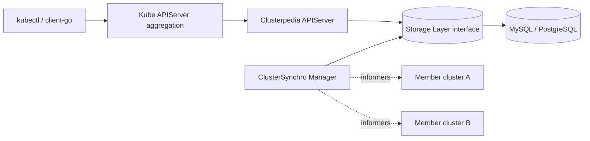

# アーキテクチャ

## 全体像

README はシステムを 4 部構成で説明する (`README.md:95` 以降): Clusterpedia APIServer、ClusterSynchro Manager、Storage Layer インターフェース、そして MySQL や PostgreSQL のような具体的な Storage Component。APIServer は read パスで、Kubernetes Aggregated API として登録され横断クエリに答える。ClusterSynchro Manager は write パスで、登録された各クラスタを watch し観測した資源をストレージへ押し込む。Storage Layer は両者が話すインターフェースで、裏の DB をプラガブルにする。

クラスタは API グループ `cluster.clusterpedia.io/v1alpha2` の `PediaCluster` CRD (Custom Resource Definition、カスタム資源定義) で登録する。このオブジェクトがメンバークラスタへの認証情報と、同期対象資源の宣言の両方を持つ。

## コンポーネント

### Clusterpedia APIServer

aggregation を介してホスト Kubernetes APIServer に登録し、統一クエリ入口を提供する (`README.md:95` 以降)。runtime scheme は `init` ブロック内で `install.Install(Scheme)` (`pkg/apiserver/apiserver.go:44`) によりインストールされ、API グループは `genericServer.InstallAPIGroup(&apiGroupInfo)` (`pkg/apiserver/apiserver.go:156`) で generic server に組み込まれ、サーバは `server.GenericAPIServer.PrepareRun().RunWithContext(ctx)` (`pkg/apiserver/apiserver.go:173`) で起動する。バイナリは `cmd/apiserver` からビルドする。

### ClusterSynchro Manager

資源をストレージへコピーするクラスタごとの synchro を管理する (`README.md:95` 以降)。各 synchro は `New` (`pkg/synchromanager/clustersynchro/cluster_synchro.go:84`) で生成され、クラスタ用の dynamic discovery manager を構築し、informer を始める前にストレージから既存の resource version を読む。バイナリは `cmd/clustersynchro-manager` からビルドする。

### Storage Layer

read パスと write パスの両方が使うインターフェースで、`pkg/storage/storage.go` に宣言されている。`StorageFactory` (`pkg/storage/storage.go:20`) は資源ごとのストレージを作りクラスタライフサイクルを管理し、`ResourceStorage` (`pkg/storage/storage.go:39`) が `Get`・`List`・`Watch`・`Create`・`Update`・`Delete` を定義する。デフォルト実装は `pkg/storage/internalstorage` 配下にある。

### Storage Component

具体的な DB。デフォルトのストレージ層は MySQL か PostgreSQL に接続する (`README.md:95` 以降)。ストレージ層は名前で自己登録する。`internalstorage` は `init` から `storage.RegisterStorageFactoryFunc(StorageName, NewStorageFactory)` (`pkg/storage/internalstorage/register.go:28`) を呼び、レジストリ関数の本体は `RegisterStorageFactoryFunc` (`pkg/storage/register.go:9`) にある。

5 つ目のバイナリ `binding-apiserver` は APIServer と synchro manager を 1 プロセスで動かす。`synchromanager.NewManager(...)` で manager を組み、`go synchromanager.Run(1, ctx.Done())` (`cmd/binding-apiserver/app/binding_apiserver.go:73`) で起動する。

## リクエストの流れ

`kubectl get deployments -A` をクラスタ横断で叩くケースを、aggregated HTTP request からデータベースの `SELECT` まで追う。

1. `ResourceHandler.ServeHTTP` (`pkg/kubeapiserver/resource_handler.go:42`) が入口。`requestInfo.Verb` で分岐し (`pkg/kubeapiserver/resource_handler.go:53`)、`list` と `watch` のときは label selector を見て forward すべきか判定する (`pkg/kubeapiserver/resource_handler.go:54`)。
2. クラスタ名が指定されていれば PediaCluster lister で存在チェックする (`pkg/kubeapiserver/resource_handler.go:91`)。資源が discovery で有効でなければリクエストは delegate に渡す (`pkg/kubeapiserver/resource_handler.go:107`)。
3. GroupVersionResource (GVR) と subresource から `r.rest.GetResourceREST(...)` (`pkg/kubeapiserver/resource_handler.go:117`) で REST storage を引く。
4. `verb == list` なら上流ハンドラ `handlers.ListResource(storage, nil, reqScope, false, r.minRequestTimeout)` (`pkg/kubeapiserver/resource_handler.go:154`) に委譲する。標準ハンドラの再利用が応答を `kubectl` 互換にしている。
5. 上流ハンドラは `RESTStorage.List` (`pkg/kubeapiserver/resourcerest/storage.go:110`) を呼ぶ。まず `resolveListOptions` (`pkg/kubeapiserver/resourcerest/storage.go:77`) が URL query を `internal.ListOptions` に decode し (`pkg/kubeapiserver/resourcerest/storage.go:80`)、owner 検索はクラスタが 1 つだけ指定されている場合に限り許す (`pkg/kubeapiserver/resourcerest/storage.go:92`)。
6. 続いて `s.Storage.List(ctx, objs, options)` (`pkg/kubeapiserver/resourcerest/storage.go:145`) を呼び、ストレージ層インターフェースに入る。
7. internalstorage 実装 `ResourceStorage.List` (`pkg/storage/internalstorage/resource_storage.go:222`) が `genListObjectsQuery` (`pkg/storage/internalstorage/resource_storage.go:203`) でクエリを組み、`result.From(query)` (`pkg/storage/internalstorage/resource_storage.go:234`) で行を読み、各行の保存 JSON を runtime object に decode し直す。

write パスは鏡像で、informer イベントが `ResourceStorage.Create` (`pkg/storage/internalstorage/resource_storage.go:67`) または `ResourceStorage.Update` (`pkg/storage/internalstorage/resource_storage.go:110`) になり、同じ `Resource` 行を書く。

## 主要な設計判断

決定的な選択は、資源を正規化した種別ごとのスキーマではなく JSON カラム 1 本に保存し、label / field selector を実行時にデータベースの JSON path 述語へ変換することだ。オブジェクト全体は `Object datatypes.JSON` (`pkg/storage/internalstorage/types.go:105`) に保持され、selector は `JSONQuery` ビルダ (`pkg/storage/internalstorage/json_builder.go:54`) で述語に変換される。1 枚のテーブルが全資源種別を収め、任意フィールド検索も同じ機構を再利用する。代償は DB 方言ごとの JSON 関数依存とインデックスの効きにくさで、[内部実装](./internals) で扱う。

Clusterpedia はクラスタ間ネットワーク接続性を意図的にスコープ外に置く。README はマルチクラスタネットワークを解かないと明言し、Submariner・Skupper・tower のようなツールの併用を前提にする。スコープは状態を中央に集約し横断 read を提供することだ。

より小さな判断: 性能上の理由でデフォルトの `ORDER BY` を付けず、コメントが pull request #44 を指す (`pkg/storage/internalstorage/util.go:324`)。

## 拡張ポイント

- `PediaCluster` CRD (`staging/src/github.com/clusterpedia-io/api/cluster/v1alpha2/types.go:59`): クラスタと同期資源の宣言方法。
- ストレージ層プラグイン: `StorageFactory` (`pkg/storage/storage.go:20`) を実装し名前を登録する (`pkg/storage/register.go:9`)。共有オブジェクトプラグインは `LoadPlugins` (`pkg/storage/plugin.go:9`) 内の `plugin.Open` で実行時ロードもできる。
- 生 SQL / parameterized SQL (Structured Query Language) 検索。`applyListOptionsToQuery` (`pkg/storage/internalstorage/util.go:217`) で読む feature gate 制。
