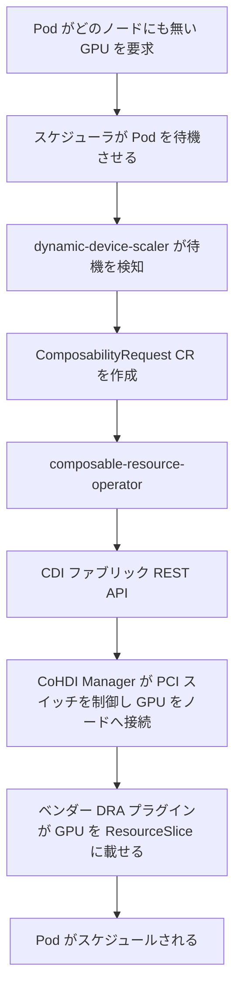

# アーキテクチャ

## 全体像

`composable-resource-operator` は kubebuilder と controller-runtime ベースのオペレーターである。`main` (`cmd/main.go:61`) は 1 つの controller-runtime Manager を構築し、その上に 3 つの reconciler と 1 つの validating webhook を登録する。`ComposabilityRequestReconciler` (`cmd/main.go:167`)、`ComposableResourceReconciler` (`cmd/main.go:176`)、`UpstreamSyncerReconciler` (`cmd/main.go:186`)、そして `ENABLE_WEBHOOKS` が `false` でない限り (`cmd/main.go:196`) `SetupWebhookWithManager` 経由の webhook (`cmd/main.go:197`) である。オペレーターは上位のトリガー (スケーラまたはユーザー) と、デバイスを物理的に切り替えるベンダー CDI ファブリックマネージャの間に位置する。

より広いデータプレーンは、org の [profile README](https://github.com/CoHDI/.github/blob/main/profile/README.md) によれば次のように動く。

## コンポーネント

### ComposabilityRequest reconciler

ユーザー向けの制御ループ。`Reconcile` (`internal/controller/composabilityrequest_controller.go:72`) は `ComposabilityRequest` (希望台数 / model / 割り当てポリシー) を読み、ライブな集合が要求に一致するよう内部の `ComposableResource` を生成・削除する。状態機械 (`None` から `NodeAllocating`、`Updating`、`Running`) を回し、子 `ComposableResource` の status 変化を watch する。

### ComposableResource reconciler

デバイス 1 台ぶんの制御ループ。`Reconcile` (`internal/controller/composableresource_controller.go:82`) は 1 台のデバイスを `Attaching`、`Online`、`Detaching` と駆動する。これが CDI プロバイダを呼んで実ハードウェアを着脱し、その後 GPU スタックに認識を促すループだ。

### Upstream syncer

ドリフト検知器。`UpstreamSyncerReconciler` (`internal/controller/upstreamsyncer_controller.go:40`) は 1 分間隔の ticker (`internal/controller/upstreamsyncer_controller.go:61`) でバックグラウンド goroutine として動き、CDI ファブリックの報告とクラスタの `ComposableResource` を照合する。

### Validating webhook

`ComposabilityRequestCustomValidator` (`internal/webhook/v1alpha1/composabilityrequest_webhook.go:60`) は、admit 前に矛盾する要求を弾く。

### CDI プロバイダ層

`internal/cdi` がベンダー抽象を持つ。`CdiProvider` interface (`internal/cdi/client.go:34`) は Fujitsu FTI_CDI (`internal/cdi/fti` 配下の Composition Manager と Fabric Manager)、SNIA Sunfish (`internal/cdi/sunfish`)、NEC (`internal/cdi/nec`) によって実装される。

## リクエストの流れ

GPU 2 台ぶんの `ComposabilityRequest` を作成すると、次のように流れる。

1. Admission: webhook の `validateRequest` (`internal/webhook/v1alpha1/composabilityrequest_webhook.go:100`) が、重複する type / model や、`differentnode` ポリシーと併用された `target_node` を弾く。
2. `ComposabilityRequestReconciler.Reconcile` (`internal/controller/composabilityrequest_controller.go:72`) は空の状態を見て、`handleNoneState` (`internal/controller/composabilityrequest_controller.go:197`) が finalizer を付け状態を `NodeAllocating` にする (`internal/controller/composabilityrequest_controller.go:207`)。
3. `handleNodeAllocatingState` (`internal/controller/composabilityrequest_controller.go:213`) が割り当てポリシーに従って割り当て先ノードを決め、状態を `Updating` にする (`internal/controller/composabilityrequest_controller.go:481`)。
4. `handleUpdatingState` (`internal/controller/composabilityrequest_controller.go:487`) が希望デバイス台数ぶんの `ComposableResource` を作成し、全 CR が `Online` になるまで requeue したのち `Running` にする (`internal/controller/composabilityrequest_controller.go:552`)。
5. 各 `ComposableResource` について、`handleAttachingState` (`internal/controller/composableresource_controller.go:209`) が `adapter.CDIProvider.AddResource(resource)` を呼ぶ (`internal/controller/composableresource_controller.go:231`)。
6. 子の status 変化は、`resourceStatusUpdatePredicate` (`internal/controller/composabilityrequest_controller.go:658`) でフィルタした watch (`internal/controller/composabilityrequest_controller.go:684`) によって親が拾う。

[内部実装](./internals) のページでは、この attach パスを Fabric Manager の HTTP 呼び出しまで掘り下げる。

## 主要な設計判断

- 二段 reconcile。要求は「台数 + ポリシー」を持ち、オペレーターはそれを N 個の単一デバイスオブジェクト (各々が独立の状態機械) に分解する。これによりデバイス単位の障害とリトライを、集約された要求から切り離す。
- ベンダー抽象。`CdiProvider` interface (`internal/cdi/client.go:34`) がベンダーごとの管理 API を隠す。`NewComposableResourceAdapter` (`internal/controller/composableresource_adapter.go:40`) が `CDI_PROVIDER_TYPE` から実装を選び、FTI_CDI はさらに `FTI_CDI_API_TYPE` で Composition Manager と Fabric Manager に分岐する (`internal/controller/composableresource_adapter.go:63`)。
- 信頼より検知。クラスタとファブリックが一致しているとは仮定せず、upstream syncer が毎分ファブリックを読み直して照合し、孤児デバイスを猶予期間付きで追跡してから detach する。

## 拡張ポイント

- API group `cro.hpsys.ibm.ie.com` (`api/v1alpha1/groupversion_info.go:29`) の 2 つの CRD: `ComposabilityRequest` (ユーザー向け) と `ComposableResource` (オペレーター管理)。
- `CdiProvider` interface (`internal/cdi/client.go:34`) が新しいハードウェアバックエンドを追加する継ぎ目。
- `ComposabilityRequest` の validating admission webhook。
- 実行時の挙動は環境変数 (`CDI_PROVIDER_TYPE`、`FTI_CDI_API_TYPE`、`DEVICE_RESOURCE_TYPE`、`ENABLE_WEBHOOKS`、各プロバイダのエンドポイント) で駆動され、adapter と `main` で読まれる。
