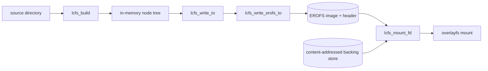

# アーキテクチャ

## 全体像

composefs は 2 つの半分からなる。ディレクトリツリーを EROFS メタデータイメージに変換する writer と、そのイメージを実行時に overlayfs の下に重ねる mount ヘルパだ。writer は `liblcfs` (`libcomposefs/` ディレクトリ) にあり、`mkcomposefs` ツールから駆動される。mount のパスも同じライブラリにあり、`mount.composefs` から駆動される。両者は EROFS イメージの前に付く小さな composefs 固有ヘッダで合意している (`src/libcomposefs/lcfs-erofs.h:18`)。

## コンポーネント

### liblcfs writer コア (`libcomposefs/lcfs-writer.c`)

インメモリツリーを構築して走査する。`lcfs_build` はディレクトリを再帰的に読み込み、`lcfs_node_s` ノードのツリーにする (`src/libcomposefs/lcfs-writer.c:1507`)。`lcfs_write_to` は公開エントリポイントで、オプションを検証し、書き込みコンテキストを確保し、EROFS シリアライザにディスパッチする (`src/libcomposefs/lcfs-writer.c:389`)。`lcfs_compute_tree` は幅優先の走査で、inode 番号を割り当て、ディレクトリのリンク数を修正し、拡張属性を正規順にソートし、最小 mtime を追跡する (`src/libcomposefs/lcfs-writer.c:176`)。

### EROFS シリアライザ (`libcomposefs/lcfs-writer-erofs.c`)

最大のファイル。`lcfs_write_erofs_to` は入力ツリーを clone し、overlayfs 向けに書き換え、inode レイアウトを計算し、ヘッダ・EROFS スーパーブロック・inode・共有 xattr・データブロックを書き出す (`src/libcomposefs/lcfs-writer-erofs.c:1385`)。inode サイジングと NID (node ID、EROFS の inode ロケータ) の割り当ては `compute_erofs_inodes` で行われる (`src/libcomposefs/lcfs-writer-erofs.c:635`)。

### mount ヘルパ (`libcomposefs/lcfs-mount.c`)

`lcfs_mount` はイメージヘッダを読み、magic を確認し、EROFS-over-overlay のパスにディスパッチする (`src/libcomposefs/lcfs-mount.c:635`)。`lcfs_mount_erofs_ovl` は EROFS イメージをマウントし、必要ならループデバイスにフォールバックしてから、その上に overlayfs を重ねる (`src/libcomposefs/lcfs-mount.c:573`)。

### オンディスク形式ヘッダ (`libcomposefs/lcfs-erofs.h`, `libcomposefs/erofs_fs.h`)

`lcfs_erofs_header_s` は EROFS スーパーブロックの前に書かれる composefs 固有ヘッダ (`src/libcomposefs/lcfs-erofs.h:18`)。`erofs_fs.h` はカーネルの EROFS オンディスク構造を持つ。

### ツール (`tools/`)

`mkcomposefs` はディレクトリまたは dump ファイルからイメージを作る (`src/tools/mkcomposefs.c:1476`)。`mount.composefs` は `mount -t composefs` から呼ばれる mount ヘルパ (`src/tools/mountcomposefs.c:100`)。`composefs-info` と `composefs-dump` はイメージを検査する。`cfs-fuse` は任意の FUSE (Filesystem in Userspace) マウントを提供する。

## リクエストの流れ

`mkcomposefs <dir> <out.cfs>` でイメージを作る場合:

1. `mkcomposefs` は `lcfs_build` でツリーを構築する。このとき digest と inline のフラグを意図的にクリアし、`LCFS_BUILD_NO_INLINE` を設定して、後で digest 計算と inline 化を並列化できるようにする (`src/tools/mkcomposefs.c:1687`, 呼び出しは `src/tools/mkcomposefs.c:1692`)。

2. `lcfs_build` は `readdir` でディレクトリを読み、サブディレクトリに再帰し、各エントリをノードに読み込み、`lcfs_node_add_child` で親にリンクする (ループは `src/libcomposefs/lcfs-writer.c:1542`、再帰は `src/libcomposefs/lcfs-writer.c:1575`、接続は `src/libcomposefs/lcfs-writer.c:1596`)。

3. ツールは digest を計算し、`--digest-store` が指定されていればコンテンツアドレスストアを埋める (`src/tools/mkcomposefs.c:1699`, `src/tools/mkcomposefs.c:1702`)。

4. `options.format = LCFS_FORMAT_EROFS` を設定し `lcfs_write_to` を呼ぶ (`src/tools/mkcomposefs.c:1714`, `src/tools/mkcomposefs.c:1718`)。

5. `lcfs_write_to` はオプションを検証し、コンテキストを作り、EROFS 形式のため `lcfs_write_erofs_to` を呼ぶ (`src/libcomposefs/lcfs-writer.c:419`)。

6. `lcfs_write_erofs_to` はツリーを clone し、overlayfs 向けに書き換え、`lcfs_compute_tree` を実行し、共有 xattr と inode レイアウトを計算し、ヘッダ・スーパーブロック・inode・データを書き出す (`src/libcomposefs/lcfs-writer-erofs.c:1403` 以降)。

対となる操作 `mount.composefs <image> -o basedir=<store> <mnt>` はイメージを開いて `lcfs_mount_fd` を呼び (`src/tools/mountcomposefs.c:255`)、そこから `lcfs_mount` に至り、ヘッダの magic を `LCFS_EROFS_MAGIC` と照合し、`lcfs_mount_erofs_ovl` に引き渡す (`src/libcomposefs/lcfs-mount.c:653`)。

## 主要な設計判断

中心となる判断は、composefs が自身のデータを一切保存しないことだ。EROFS イメージはメタデータのみで、ファイル内容は `trusted.overlay.redirect` を通じて参照される外部のコンテンツアドレスストアに存在する (`src/README.md:14-49`, `src/libcomposefs/lcfs-internal.h:50`)。これが、無関係なイメージ同士がディスクとページキャッシュで内容を共有できる理由だ (`src/README.md:70-77`)。

2 つ目は再現性。writer は EROFS 用に変異させる前に必ず入力ツリーを clone するので、呼び出し側のツリーは決して変更されない (`src/libcomposefs/lcfs-writer-erofs.c:1403`)。ツリー全体の最小 mtime を集約して EROFS の `build_time` に使うので、同じ入力からは同じバイト列が生まれる (`src/libcomposefs/lcfs-writer.c:225`, 使用箇所 `src/libcomposefs/lcfs-writer-erofs.c:1444`)。

3 つ目は検証。内容ファイルの fs-verity ダイジェストは `trusted.overlay.metacopy` に保存されるので overlayfs が使用時に内容を検証し、イメージ自身も mount オプションとして渡した自らの fs-verity ダイジェストで封印できる (`src/README.md:78-95`)。

## 拡張ポイント

composefs はプラグインホストではなく、ライブラリ + ツールだ。統合面は `libcomposefs/lcfs-writer.h` の C API (ノードツリーを構築し `lcfs_write_to` を呼ぶ) と `mount.composefs` ヘルパ。言語バインディングはこの上に載る。Rust クレート (`composefs-rs`) と、`mkcomposefs` を呼び出す containers/storage の Go ラッパーだ (`src/README.md:174-185`)。
