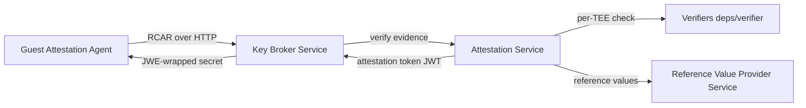

# アーキテクチャ

## 全体像

trustee は Confidential Containers の relying-party 側である。guest からハードウェア evidence を受け取り、その guest が本物の Trusted Execution Environment (TEE) かを判断し、合格した guest にだけシークレットを渡す。Cargo workspace であり、メンバは `src/Cargo.toml:2` に列挙されている。Key Broker Service (`kbs`)、Attestation Service (`attestation-service`)、Reference Value Provider Service (`rvps`)、`deps/verifier` 配下の TEE 別 verifier、`tools` 配下のクライアントツールである。

信頼モデルは混同しやすい 2 つの仕事を分ける。1 つはハードウェア evidence の評価 (Remote ATtestation procedureS, RATS アーキテクチャでの verifier 役)。もう 1 つはシークレットの配布 (relying-party 役)。KBS が relying party で、ハードウェア署名を自分では検証しない。evidence 評価は Attestation Service に委譲し、AS は署名付きの attestation token を返す。KBS は何かを配布する前にその token を再検証する。

## コンポーネント

### Key Broker Service (KBS)

KBS は `src/kbs` にあり、HTTP のフロントエンドである。RCAR ハンドシェイクのエンドポイント、シークレット配布の plugin、Rego ポリシーのゲートを公開する。バイナリのエントリポイントは `src/kbs/src/bin/kbs.rs:22` の `main` で、`KbsConfig::try_from` (`src/kbs/src/bin/kbs.rs:64`) で設定を読み、`ApiServer::new` (`src/kbs/src/bin/kbs.rs:68`) で `ApiServer` を組み立て、`serve` (`src/kbs/src/bin/kbs.rs:70`) で実行する。実際の HTTP サーバは `ApiServer::server` (`src/kbs/src/api_server.rs:147`) で構築される。

### Attestation Service (AS)

AS はハードウェア evidence を検証し、attestation token (JSON Web Token, JWT) を発行する。`src/attestation-service` に実装され、TEE 別の verifier は `deps/verifier` にある。KBS は `Attest` トレイト (`src/kbs/src/attestation/backend.rs:89`) 経由でアクセスするので、AS はビルトイン crate、リモート gRPC サービス、Intel Trust Authority のいずれにも差し替えられる。`AttestationService::new` は match でバックエンドを選ぶ (`src/kbs/src/attestation/backend.rs:151`)。

### Reference Value Provider Service (RVPS)

RVPS は `src/rvps` にある。AS がハードウェア evidence と突き合わせる期待測定値 (reference values) を保持する。AS は検証時にこの値を RVPS に問い合わせる。

### クライアントツール

`src/tools` には `kbs-client` と `trustee-cli` があり、KBS の管理 (ポリシー設定、リソースのアップロード) と認証フローのテストに使う。guest 側の counterpart (Attestation Agent と Confidential Data Hub) は別リポジトリ [guest-components](https://github.com/confidential-containers/guest-components) にある。

## リクエストの流れ

シークレットを取得する guest は、RCAR ハンドシェイクの後にリソース取得を行う。すべてのリクエストは単一の catch-all actix-web ルートに当たる。`ApiServer::server` は `web::resource([kbs_path!("{path:.*}")])` (`src/kbs/src/api_server.rs:172`) を登録し、GET/POST/PUT/DELETE を 1 つの `api` ハンドラに束ねる。ルート prefix は `const KBS_PREFIX: &str = "/kbs/v0";` (`src/kbs/src/api_server.rs:33`)。`api` ハンドラ (`src/kbs/src/api_server.rs:211`) はパスを `/` で split し、先頭セグメントを plugin 名として扱い (`let plugin = path_parts[0];`、`src/kbs/src/api_server.rs:230`)、それで match する (`src/kbs/src/api_server.rs:247`)。

1. **POST `/kbs/v0/auth`**: `auth` の match arm (`src/kbs/src/api_server.rs:249`) が `AttestationService::auth` (`src/kbs/src/attestation/backend.rs:233`) を呼び、`__auth` (`src/kbs/src/attestation/backend.rs:239`) に委譲する。body を `kbs_types::Request` にデシリアライズし、クライアントのプロトコルバージョンを `VERSION_REQ` と照合し (`src/kbs/src/attestation/backend.rs:248`)、`generate_challenge` (`src/kbs/src/attestation/backend.rs:257`) で 32 byte の nonce を生成し、`Authed` セッションを作り、`kbs-session-id` cookie をセットし、`session_map.insert` (`src/kbs/src/attestation/backend.rs:272`) で永続化する。
2. **POST `/kbs/v0/attest`**: `attest` の match arm (`src/kbs/src/api_server.rs:255`) が `AttestationService::attest` (`src/kbs/src/attestation/backend.rs:277`) を呼び、`__attest` (`src/kbs/src/attestation/backend.rs:283`) に委譲する。cookie からセッションを読み、body を `kbs_types::Attestation` にデシリアライズし、nonce 突合 (`src/kbs/src/attestation/backend.rs:344`) で replay を拒否する。evidence を組み立て `self.inner.verify(evidence_to_verify)` (`src/kbs/src/attestation/backend.rs:404`) を呼んで AS に委譲する。成功すると `session.attest(token)` (`src/kbs/src/attestation/backend.rs:425`) でセッションを `Attested` に遷移させ token を返す。
3. **GET `/kbs/v0/resource/...`**: ビルトイン名でないパスは fallback の plugin arm (`src/kbs/src/api_server.rs:378`) に落ちる。token ゲートの plugin では、`get_attestation_token` (`src/kbs/src/api_server.rs:403`) で token を取り、`token_verifier.verify` (`src/kbs/src/api_server.rs:407`) で JWT を検証し、`evaluate_rego` (`src/kbs/src/api_server.rs:415`) で Rego ルール `data.policy.allow` を評価する。false なら `Error::PolicyDeny` (`src/kbs/src/api_server.rs:441`)。許可なら plugin が走り、plugin が応答を encrypted と印すと、ハンドラは guest の公開鍵を取り出し `jwe` (`src/kbs/src/api_server.rs:455`) でシークレットを暗号化し、対象 CVM だけが復号できるようにする。

## 主要な設計判断

KBS はハードウェア evidence を自分で検証しない。検証は `AttestationService::new` (`src/kbs/src/attestation/backend.rs:151`) で選ばれる差し替え可能な `Attest` バックエンドに委譲され、信頼のヒンジは AS が発行する attestation token (JWT) になる。KBS は後段で `token_verifier` を使ってその JWT を再検証するだけである。これが RATS の background-check / passport の分離を具体化したもので、シークレット配布 (relying party) と evidence 評価 (verifier) を切り離す。

すべてのエンドポイントは単一の catch-all ルートと先頭パスセグメントによるディスパッチを通る (`src/kbs/src/api_server.rs:172`、`src/kbs/src/api_server.rs:230`)。`auth`/`attest`/`attestation-policy`/`reference-value`/`resource-policy` はビルトインで、それ以外は `PluginManager` 経由になる。リソース取得もシークレット配布も、attestation token と Rego ポリシーという同じ 1 つのゲートを通す。

セッションは key-value storage 抽象に `serde_json` で永続化される (`src/kbs/src/attestation/session.rs:120`) ため、バックエンドはメモリでも外部でもよい。`AttestationService::new` で spawn されるバックグラウンドタスクが 60 秒ごとに `cleanup_expired` を走らせる (`src/kbs/src/attestation/backend.rs:187`)。

## 拡張ポイント

- **Attestation バックエンド**: `Attest` トレイト (`src/kbs/src/attestation/backend.rs:89`) を実装すると、ビルトイン・gRPC・Intel Trust Authority の verifier を差し込める。
- **TEE 別 verifier**: `Verifier` トレイト (`src/deps/verifier/src/lib.rs:218`) を実装する。その `evaluate` メソッド (`src/deps/verifier/src/lib.rs:248`) が 1 つの TEE 種別のハードウェア evidence を検証する。
- **リソース/シークレット plugin**: `ClientPlugin` トレイト (`src/kbs/src/plugins/plugin_manager.rs:26`) を実装すると、同じ attestation とポリシーのゲートの背後にシークレット配布エンドポイントを追加できる。
