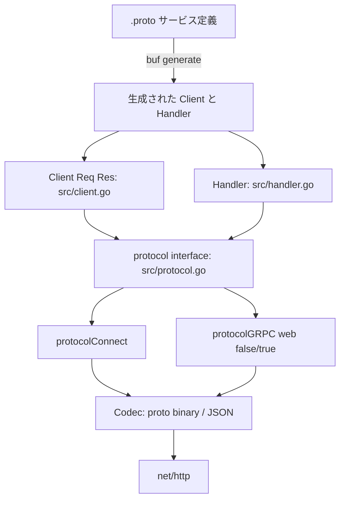

# Architecture

## 全体像

Connect はサーババイナリではなくライブラリだ。`func main` を持たず、入口はサーバ側の生成された `http.Handler` と呼び出し側の生成クライアントだ。その周りを、あらゆる RPC を運ぶ少数の型が支える。両端に `Client` と `Handler` が座り、`protocol` 抽象がワイヤ形式を隠し、`Codec` がペイロードを marshal し、`Interceptor` チェーンが呼び出しを包む。設計はトランスポートをすべて `net/http` に載せるので、Go サービスがすでに使っている `http.Server` と `http.Client` がそのまま RPC を運ぶ。

## コンポーネント

### Client (`src/client.go`)

`Client[Req, Res]` (`src/client.go:34`) は 1 procedure 用の、再利用可能で並行安全なクライアントだ。4 種類の RPC 形に対応する 4 メソッドを公開する: `CallUnary`・`CallClientStream`・`CallServerStream`・`CallBidiStream`。`NewClient` がオプションから `clientConfig` を構築し (`src/client.go:42`)、protocol client を生成する (`src/client.go:50`)。

### Handler (`src/handler.go`)

`Handler` (`src/handler.go:28`) は 1 RPC のサーバ側実装だ。`ServeHTTP` を実装するので (`src/handler.go:259`)、任意の mux に挿せる素の `http.Handler` になる。`NewUnaryHandler` のようなコンストラクタがユーザ関数を包む。

### プロトコル抽象 (`src/protocol.go`)

`protocol` インターフェース (`src/protocol.go:66`) には 3 実装がある: `protocolConnect` (`src/protocol_connect.go`)、`protocolGRPC{web:false}`、`protocolGRPC{web:true}` (`src/protocol_grpc.go`)。それぞれが自分のワイヤ形式の handler とクライアント機構を生む。これが 1 サーバに 3 プロトコルを喋らせる継ぎ目だ。

### Codec (`src/codec.go`)

`Codec` インターフェース (`src/codec.go:35`) がメッセージ本体を marshal / unmarshal する。2 つの codec を同梱する: Protobuf バイナリ用の `protoBinaryCodec` (`src/codec.go:94`) と JSON 用の `protoJSONCodec` (`src/codec.go:146`)。JSON があることで、ブラウザや `curl` が Connect handler と喋れる。

### Envelope・Interceptor・Error

`envelope` (`src/envelope.go:45`) は streaming と gRPC のワイヤ単位だ。5 byte の prefix (1 byte の flags + 4 byte の length) の後に body が続く (`src/envelope.go:41-44`)。`Interceptor` (`src/interceptor.go`) は unary と streaming を包む middleware チェーンだ。`Error` (`src/error.go:124`) と `Code` (`src/code.go:32`) が gRPC 互換のステータスコード体系を担う。

## リクエストの流れ

unary クライアント呼び出しを end-to-end で追う。

1. `NewClient` がオプションから `clientConfig` を構築する (`src/client.go:42`)。デフォルトは Connect protocol・Protobuf バイナリ codec・gzip 受理の要求だ (`src/client.go:333-339`)。続いて protocol client を生成する (`src/client.go:50`)。
2. hot path での作業を避けるため、interceptor は毎回ではなくクライアント生成時に 1 度だけ適用される (`src/client.go:75-110`)。本体は `unaryFunc` だ: `protocolClient.NewConn` で接続を開き (`src/client.go:79`)、`conn.Send(request.Any())` で送信し (`src/client.go:91`)、`conn.CloseRequest()` を呼び (`src/client.go:96`)、`receiveUnaryResponse[Res]` で応答を読む (`src/client.go:100`)。
3. `CallUnary` は `c.callUnary` に委譲するだけだ (`src/client.go:149-154`)。`callUnary` が spec・peer・header を埋め (`src/client.go:115-117`)、interceptor に包まれた `unaryFunc` を呼ぶ (`src/client.go:135`)。
4. `receiveUnaryResponse` はメッセージをちょうど 1 通読み、さらに読んで EOF でなければ "unary response has multiple messages" の `CodeUnimplemented` エラーを返す。これで unary の cardinality 規則を強制する (`src/connect.go:433-499`)。
5. サーバ側では `Handler.ServeHTTP` が protocol handler 群を HTTP メソッドで引き (`src/handler.go:274`)、`Content-Type` に対して `CanHandlePayload` が一致する handler を選ぶ (`src/handler.go:285-290`)。GET の場合は body が無いことを確認する (`src/handler.go:297-312`)。`protocolHandler.NewConn` で stream を確立し (`src/handler.go:324`)、`h.implementation(ctx, connCloser)` を実行し、接続を閉じる (`src/handler.go:337`)。
6. unary handler では、`implementation` クロージャが `receiveUnaryRequest` で 1 メッセージを受信し (`src/handler.go:69`)、`handlerCallInfo` を context に積み (`src/handler.go:75-81`)、interceptor に包まれた `untyped` 関数を呼び (`src/handler.go:82`)、`conn.Send(response.Any())` で応答を返す (`src/handler.go:101`)。

## 主要な設計判断

定義的な判断は、`net/http` の内側に完全に住むことだ。Connect は独自 HTTP 実装・名前解決・独自ロードバランシング API を一切持たない。クライアント側で必要な依存は、`Do` 1 メソッドの `HTTPClient` インターフェースだけだ (`src/connect.go:325-327`)。これで標準的な Go のサーバ・クライアント・middleware がそのまま動く。代わりにロードバランシングとサービスディスカバリは周辺インフラに委ねる。

第 2 の判断は、1 サーバ 3 プロトコルだ。handler 構築時に Connect・gRPC・gRPC-Web の handler を必ず前もって 3 つ作り (`src/handler.go:385-389`)、リクエストごとにメソッド + `Content-Type` で 1 つを選ぶ (`src/handler.go:274-290`)。クライアントは `WithGRPC` または `WithGRPCWeb` の 1 オプションでプロトコルを切り替える。

第 3 は、コード内に記された hot-path 最適化だ: "Rather than applying unary interceptors along the hot path, we can do it once at client creation" (`src/client.go:75-76`)。

## 拡張ポイント

- `Interceptor` (`src/interceptor.go`): unary と streaming への横断的な振る舞いのための middleware チェーン。
- `Codec` (`src/codec.go:35`): 組み込みの Protobuf バイナリと JSON 以外の content sub-type 用に codec を登録する。
- `Compressor` / `Decompressor` オプション: 圧縮アルゴリズムをネゴシエートする (gzip はデフォルトの要求、`src/client.go:333-339`)。
- `WithGRPC`・`WithGRPCWeb`・`WithHTTPGet` のようなオプションが、クライアント/handler ごとにプロトコルとトランスポートの挙動を選ぶ。
