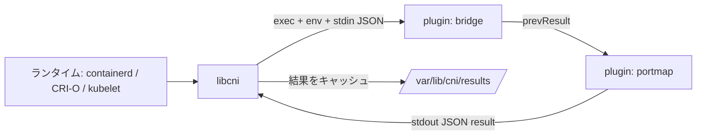

# アーキテクチャ

## 全体像

CNI は 2 つのロールに分かれ、コードもそれを厳密に分離している。一方はランタイム (consumer)。`libcni` を組み込み、ネットワーク設定を読み、プラグインのチェーンを駆動する。もう一方はプラグイン (provider)。意図を受け取り結果を返す独立した実行ファイルだ。両者の間にアドレス空間の共有はない。ライブラリはバイナリを exec し、`CNI_*` 環境変数を設定し、ネットワーク設定を JSON でプラグインの stdin に書き、結果 JSON を stdout から読む。

## コンポーネント

### libcni (ランタイム側)

`libcni` は CNI 仕様の実装本体であり、containerd や CRI-O が runc / hcsshim を呼ぶ前にバンドルして使う (`libcni/api.go:17-21`)。ディスク上の設定をパースし、プラグインバイナリを解決・実行し、結果をキャッシュし、仕様バージョンの差異を吸収する。設定は `NetworkConfFromBytes` から入り、conflist をアンマーシャルして `Plugins` チェーンを構築する (`libcni/conf.go:92`)。

### pkg/skel (プラグイン側)

`pkg/skel` はプラグインバイナリがリンクする骨組みだ。`pluginMain` が環境変数からコマンドを読み、検証し、ADD / DEL / CHECK / GC / STATUS のコールバックにディスパッチする (`pkg/skel/skel.go:232`, `pkg/skel/skel.go:245`)。空のネットワーク名を持つ設定を弾くなど、基本的な不変条件も強制する (`pkg/skel/skel.go:216-229`)。

### pkg/invoke (ワイヤ)

`pkg/invoke` は両者間のトランスポートだ。`Args.AsEnv` が 1 回の呼び出しを `CNI_COMMAND` / `CNI_CONTAINERID` / `CNI_NETNS` / `CNI_IFNAME` / `CNI_ARGS` / `CNI_PATH` 変数に変換する (`pkg/invoke/args.go:56-73`)。`RawExec.ExecPlugin` が設定を stdin に渡してバイナリを実行し (`pkg/invoke/raw_exec.go:34-41`)、`ExecPluginWithResult` が stdout を読んで型付き結果に変換する (`pkg/invoke/exec.go:121-137`)。

## リクエストの流れ

conflist チェーンに対する ADD は次のように流れる。

1. `AddNetworkList` が `list.Plugins` を順に回し、各プラグインの結果を次のプラグインの `prevResult` として渡す (`libcni/api.go:515`)。
2. 各プラグインで `addNetwork` が `FindInPath` でバイナリを解決し、コンテナ ID・ネットワーク名・インターフェース名を検証する (`libcni/api.go:490-504`)。
3. `buildOneConfig` が `name` / `cniVersion` / `prevResult` を設定に注入し、`injectRuntimeConfig` がプラグインが実際に宣言した capability 引数だけを追加する (`libcni/api.go:155-191`)。
4. `ExecPluginWithResult` がバイナリを実行する。`RawExec.ExecPlugin` が `CommandContext` で、stdin に設定、env に `CNI_*` を渡して起動する (`libcni/api.go:511`, `pkg/invoke/raw_exec.go:34-41`)。
5. プラグイン側は `pluginMain` で受け、`CNI_COMMAND` で switch して登録済みの `Add` 関数を呼ぶ (`pkg/skel/skel.go:245`)。
6. チェーン全体が成功すると、`cacheAdd` が結果を `/var/lib/cni/results/<net>-<container>-<if>` に書き、後の CHECK / DEL / GC で使う (`libcni/api.go:519-527`, `libcni/api.go:252-257`)。

DEL は同じチェーンを逆順に回る (`libcni/api.go:603`)。GC と STATUS は設定の CNI バージョンが 1.1.0 以上のときだけ発火する (`libcni/api.go:818`, `libcni/api.go:857`)。

## 主要な設計判断

契約は Go のインターフェースではなくプロセス境界である。だからプラグインは任意の言語で書け、ランタイムとは独立に配布できる。代償は、毎回の呼び出しが JSON シリアライズ付きの `exec` になることだ。

バージョン折衝は意図的に寛容だ。プラグインが空の `cniVersion` を持つ結果を返したとき、仕様上は 0.1.0 を意味するが、`fixupResultVersion` は代わりに結果が config のバージョンに一致するとみなし、issue #895 を指すコメントを残している (`pkg/invoke/exec.go:39-78`)。result パッケージは `init` で 0.1.0 から 1.1.0 までの全バージョンの up / down コンバータを登録しているので、チェーンの `prevResult` は常に config バージョンに正規化できる (`pkg/types/100/types.go:34-53`)。

## 拡張ポイント

主要な拡張ポイントはプラグイン実行ファイルだ。誰でも `pkg/skel` に対して ADD / DEL / CHECK / GC / STATUS を実装し、`CNI_PATH` 上のディレクトリにバイナリを置ける。設定も capability で拡張できる。ランタイムは `CapabilityArgs` を渡し、ライブラリはプラグインがサポートを宣言したキーだけを転送する (`libcni/api.go:191`)。よく使うプラグイン (bridge, host-local, macvlan, portmap) の参照実装は [containernetworking/plugins](https://github.com/containernetworking/plugins) にある。
