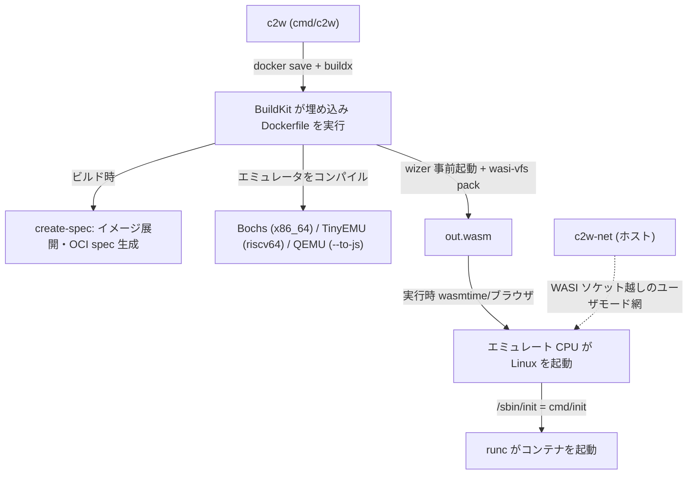

# アーキテクチャ

## 全体像

container2wasm には 2 つの側面がある。ビルド時には薄い Go CLI (`c2w`) が、埋め込まれた大きな Dockerfile を BuildKit で回す。その Dockerfile は CPU エミュレータを WebAssembly にコンパイルし、元のコンテナイメージをルートファイルシステムに展開し、OCI ランタイム spec を生成し、すべてを 1 つの `.wasm` ファイルに梱包する。実行時にはその `.wasm` がエミュレータそのものだ。WASI ランタイムやブラウザがそれを実行し、エミュレートされた CPU が Linux を起動し、ゲスト内の init が runc でコンテナを立ち上げる。Go のホストコードは小さい。実体の変換器はバイナリに埋め込まれた Dockerfile である (`embed.go:5-6`)。

## コンポーネント

### 変換 CLI: `cmd/c2w`

ユーザ向けのバイナリ。`main()` は `cmd/c2w/main.go:23`、本処理は `rootAction` (`cmd/c2w/main.go:94`)。`--builder` (既定 `docker`) を `exec.LookPath` で探し (`cmd/c2w/main.go:119`)、`docker buildx` の有無を確認して無ければ legacy build にフォールバックする (`cmd/c2w/main.go:124`)。埋め込み Dockerfile を一時ファイルに書き出し、`docker buildx build` を実行する。CLI は翻訳器で、フラグを buildx の引数へ変換するだけだ。

### ビルド時の spec 生成: `cmd/create-spec`

ビルド中にゲスト内で動き、runc が必要とするものを用意する。`main` は `cmd/create-spec/main.go:34`。OCI イメージをルートファイルシステムに展開し (`cmd/create-spec/main.go:85`)、`createSpec` (`cmd/create-spec/main.go:278`) で `spec.json`・`image.json`・`initconfig.json` を書き出す。これらは `/pack` に集約される。

### 実行時 init: `cmd/init`

エミュレートされた Linux の中で PID 1 として動く。`doInit` は `cmd/init/main.go:39`。`/oci/initconfig.json` を読み (`cmd/init/main.go:44`)、rootfs と pack を 9p でマウントし (`cmd/init/main.go:88`)、ホストが `info` ファイルで渡す実行時フラグを解析し (`cmd/init/main.go:422`)、OCI spec にパッチを当て (`cmd/init/main.go:490`)、最後に runc を `exec` する。終了時には `poweroff -f` を呼ぶ (`cmd/init/main.go:313`)。

### ホスト側ネットワークスタック: `cmd/c2w-net`

WASI にはソケットが無いので、ネットワークはホストから橋渡しする。`c2w-net` は `gvisor-tap-vsock` を使ってユーザモード仮想ネットワークを提供し (`cmd/c2w-net/main.go:15-17`)、ゲートウェイは `192.168.127.1`、VM は `192.168.127.3` である (`cmd/c2w-net/main.go:21-23`)。ブラウザでは代わりに Wasm 内プロキシ (`extras/c2w-net-proxy`) が Fetch と WebSocket を使う。

### 埋め込み Dockerfile: `embed.go`

`//go:embed Dockerfile` が 1064 行の Dockerfile をバイナリに取り込む (`embed.go:5-6`)。これが実体の変換器だ。最終ステージ `FROM wasi-$TARGETARCH` (`Dockerfile:1064`) がエミュレータ経路を選ぶ。`wasi-amd64` は Bochs 経路 (`Dockerfile:1037`)、`wasi-riscv64` は TinyEMU 経路 (`Dockerfile:342`) である。

## リクエストの流れ

`c2w ubuntu:22.04 out.wasm` を端から端まで追う。

1. `rootAction` (`cmd/c2w/main.go:94`) が出力先とアーキテクチャを整理し、builder を探し (`cmd/c2w/main.go:119`)、buildx の有無を確認する (`cmd/c2w/main.go:124`)。
2. `prepareSourceImg` (`cmd/c2w/main.go:172`、本体 `cmd/c2w/main.go:319`) が `docker save` を起動し (`cmd/c2w/main.go:364`)、その tar を `archive.Apply` で一時ディレクトリに展開し (`cmd/c2w/main.go:376`)、BuildKit がキャッシュより優先するよう全ファイルの mtime を更新する (`cmd/c2w/main.go:385`)。
3. `build` (`cmd/c2w/main.go:181`) が埋め込み Dockerfile を書き出し (`cmd/c2w/main.go:200`)、`docker buildx build ... --output type=local,dest=<dir>` を実行する (`cmd/c2w/main.go:249`)。`--target` 未指定なので Dockerfile 末尾のステージが対象になる。
4. 最終ステージ `FROM wasi-$TARGETARCH` (`Dockerfile:1064`) はアーキテクチャで解決する。CLI 既定の `target-arch=amd64` は `wasi-amd64` (Bochs, `Dockerfile:1037`)、`riscv64` は `wasi-riscv64` (TinyEMU, `Dockerfile:342`) を選ぶ。
5. ビルド中、`bundle-dev` ステージ (`Dockerfile:93`) が `create-spec` をコンパイル・実行し (`Dockerfile:104`, `Dockerfile:121`)、イメージを展開して OCI spec とブート設定を `/pack` に書き出す。
6. エミュレータを wasi-sdk の clang でコンパイルする。TinyEMU は `Dockerfile:302`、Bochs は `Dockerfile:1019`。
7. wizer がエミュレータを事前起動する。`Dockerfile:313` (TinyEMU) と `Dockerfile:1029` (Bochs) が `wizer ... -r _start=wizer.resume --mapdir /pack::/pack` を実行し、起動済み状態をスナップショットする。
8. `wasi-vfs pack` が `/pack` を wasm に単一ファイルとして埋め込み (`Dockerfile:317`, `Dockerfile:1033`)、`OUTPUT_NAME` (既定 `out.wasm`) にリネームする (`Dockerfile:319`)。
9. 実行時 (`wasmtime out.wasm uname -a`) には wasm がエミュレータだ。エミュレート CPU が Linux を起動し、`/sbin/init` (`cmd/init`) が動き、rootfs と pack を 9p でマウントし (`cmd/init/main.go:88`)、ホストの実行時フラグを反映し (`cmd/init/main.go:490`)、runc を `exec` してコンテナを起動する。

## 主要な設計判断

- **アプリではなく CPU をエミュレートする。** ワークロードを Wasm ターゲットへ移植する代わりに、システムエミュレータを Wasm にコンパイルし、その中で本物の Linux と runc を動かす。OCI イメージを無改変に保つ代償がエミュレーション速度だ。x86_64・riscv64 以外のイメージはゲスト内でさらに binfmt + QEMU の層を通るため、いっそう遅くなる。
- **wizer で事前起動する。** 実行のたびに Linux カーネルをコールドブートすると遅い。ビルド時に Bytecode Alliance の wizer でエミュレータを一度起動し、線形メモリ全体をモジュールにスナップショットしておくことで、実行時は起動済み状態から再開する。既定は `OPTIMIZATION_MODE=wizer` (`Dockerfile:29`)、`native` を選ぶと毎回ブートする。これに必要なハンドシェイクは[内部実装](./internals)で扱う。
- **変換器が Dockerfile である。** パイプラインを埋め込み Dockerfile に置くこと (`embed.go:5-6`) で、キャッシュ・マルチステージビルド・複数言語のツールチェイン (clang・Emscripten・wasi-sdk) を BuildKit から無償で得られる。Go CLI は薄いフロントエンドのままだ。
- **ネットワークを Wasm の外で橋渡しする。** WASI にはソケットが無いので、`c2w-net` がホストで動き gvisor-tap-vsock でユーザモード網を提供する (`cmd/c2w-net/main.go:15-17`)。ブラウザ版は代わりに Wasm 内の Fetch/WebSocket プロキシを使う。

## 拡張ポイント

- **WASI ランタイム。** 出力は wasmtime・WasmEdge・wamr・wasmer・wazero で動く。
- **ディレクトリマッピング。** `--mapdir` で渡したホストディレクトリは WASI ファイルシステム API で見せ、ゲストに virtio-9p でマウントする。
- **外部バンドル。** `extras/imagemounter` (`imagemounter.wasm`) が実行時に外部 OCI バンドルを 9p でゲストに供給する。
- **ブラウザ用ネットワークプロキシ。** `extras/c2w-net-proxy` (`c2w-net-proxy.wasm`) がブラウザ内で動き、Fetch と WebSocket でネットワークを橋渡しする。

## 出典

1. container2wasm ソース (コミット [`74662a2`](https://github.com/container2wasm/container2wasm/commit/74662a2160241e31bbc3b74c7a4f7cf6ea9cfedd)), 参照 2026-06-26。
2. [container2wasm README](https://github.com/container2wasm/container2wasm/blob/main/README.md), 参照 2026-06-26。
3. [Kohei Tokunaga, "container2wasm Converter" (nttlabs/Medium)](https://medium.com/nttlabs/container2wasm-2dd90a18cc9a), 参照 2026-06-26。
