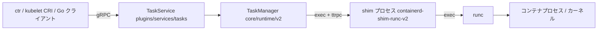

# アーキテクチャ

## 全体像

containerd は単一のデーモンとして動き、サービスを gRPC で公開する。既定では UNIX ソケット `/run/containerd/containerd.sock` で待ち受ける。デーモンはプラグインの集合である。ドメインロジックは `core/` 以下にある (content ストア、images、snapshots、diff、containers、runtime、metadata、remotes、sandbox、leases、mount、transfer)。そのロジックを gRPC サービスや Kubernetes CRI として公開するコードは `plugins/` 以下にある。クライアントは `client/` の Go SDK で接続するか、Kubernetes なら kubelet が CRI ソケット経由で話す。

設計を決定づける選択は、containerd が自プロセス内でコンテナを実行しないことである。コンテナ (または pod sandbox) ごとに別の shim プロセスを起動し、shim が OCI ランタイム (既定は runc) を駆動する。デーモンと shim は、より軽量な gRPC 亜種である ttrpc で会話する。

## コンポーネント

### containerd デーモン (`cmd/containerd`)

デーモンのエントリポイントは `cmd/containerd/main.go:28`。CLI アプリを構築して実行するだけである。どのプラグインを組み込むかは `cmd/containerd/main.go:24` の `cmd/containerd/builtins` の副作用 import で決まる。この import 集合が CRI プラグイン、各 snapshotter、起動時に登録されるその他サービスを選ぶ。

### core ドメインロジック (`core/`)

`core/` はランタイム非依存のロジックを持つ。コンテンツアドレス指定のブロブストア (`content`)、イメージ・レイヤ処理 (`images`、`snapshots`、`diff`)、コンテナメタデータ (`containers`)、レジストリの pull/push (`remotes`)、bolt による永続化 (`metadata`)、タスク/shim ランタイム抽象 (`runtime`) などである。

### gRPC・CRI プラグイン (`plugins/`)

`plugins/services/*` は core パッケージを gRPC サービスに配線する。`plugins/services/tasks` はコンテナ実行を扱うタスクサービスである。`plugins/cri` は同じ core の上に Kubernetes CRI を実装する。snapshotter・content プラグインもここにある。

### shim (`cmd/containerd-shim-runc-v2`)

shim は別バイナリで、デーモンがコンテナまたは sandbox ごとに 1 回 exec する。常駐し、コンテナの runc プロセスを所有し、デーモンに ttrpc API を返す。runtime-v2 の契約は [runtime-v2 README](https://github.com/containerd/containerd/blob/main/core/runtime/v2/README.md) に記載されている。

## リクエストの流れ

タスク作成 (`ctr run` または kubelet の CRI 呼び出し) を端から端まで追う。

1. gRPC タスクサービスが `plugins/services/tasks/local.go:171` で受け取る。コンテナメタデータを読み、`plugins/services/tasks/local.go:239` で `runtime.CreateOpts` を組み立て、`plugins/services/tasks/local.go:277` で v2 ランタイムを呼ぶ。
2. TaskManager が `core/runtime/v2/task_manager.go:159` で処理する。`core/runtime/v2/task_manager.go:160` の `NewBundle` で OCI bundle をディスクに書き、`core/runtime/v2/task_manager.go:189` で rootfs マウントを活性化する。
3. `core/runtime/v2/task_manager.go:213` で shim を起動し、`core/runtime/v2/shim_manager.go:299` に入る。shim manager は `core/runtime/v2/shim_manager.go:311` で runtime 名をバイナリパスに解決し、`core/runtime/v2/shim_manager.go:316` で shim バイナリのハンドルを構築する。
4. shim バイナリは `core/runtime/v2/binary.go:66` で `Action: "start"` (`core/runtime/v2/binary.go:80`) を付けて exec される。containerd は shim が印字したアドレスを解析し、`core/runtime/v2/binary.go:138` で ttrpc 接続を張り、`core/runtime/v2/binary.go:144` で復元用に `bootstrap.json` を書く。
5. TaskManager に戻り、接続済み shim を `core/runtime/v2/task_manager.go:220` でラップし、`core/runtime/v2/task_manager.go:232` で実際の create RPC を ttrpc 越しに送る。ここで shim が runc にコンテナを作らせる。

## 主要な設計判断

shim-per-container モデルが中心的なトレードオフである。各コンテナの shim と runc プロセスをデーモンの外に置くことで、稼働中コンテナを殺さずに containerd を再起動・アップグレードできる。再接続時は `restoreBootstrapParams` (`core/runtime/v2/shim_manager.go:343`) で `bootstrap.json` から shim 状態を復元する。shim が死ぬと、on-close コールバックとして `core/runtime/v2/shim_manager.go:326` に登録された `cleanupAfterDeadShim` が後始末をし、task-exit イベントを発行する。デーモン-shim 間に gRPC でなく ttrpc を使うことで、shim あたりのメモリを抑える。

プラグインモデルがもう一つである。各サブシステムは `Requires []Type` の依存リストを持つ `plugin.Registration` (`vendor/github.com/containerd/plugin/plugin.go:61`) であり、デーモンは依存順を解決して、最小の核と差し替え可能な周辺を配線する。

## 拡張ポイント

- runtime-v2 shim 契約による OCI ランタイム: runc、crun、gVisor、Kata、Firecracker、runwasi が shim の実装または設定で接続する。
- snapshotter: overlayfs、devmapper、zfs、btrfs、および stargz・SOCI といった遅延 pull の snapshotter。
- Kubernetes 向けの CRI プラグインと、デーモン上に直接構築するための Go クライアント SDK。
- カスタムサービスを組み込むための `plugin.Registration` インターフェースそのもの。
