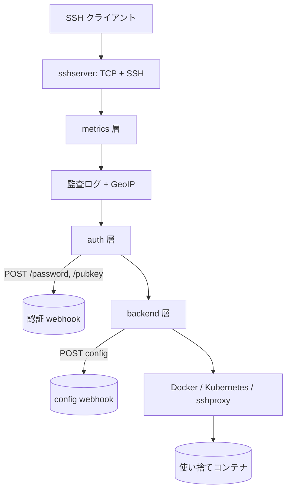

# アーキテクチャ

## 全体像

ContainerSSH は単一の Go バイナリだ。エントリポイント `cmd/containerssh/main.go` は `containerssh.Main()` を呼ぶだけで、実体はリポジトリルートの `Main()` (`main.go:26`) にある。面白いのは 1 本の SSH 接続をどう処理するかだ。サーバはハンドラを互いにラップした、入れ子人形のような層構造で組まれる。`New()` (`factory.go:22`) がそれを内側から外側へ組み立て、各層は同じ `sshserver.Handler` 契約を実装しつつ内側の層をラップする。

組み立て順は固定で (`factory.go:54-78`)、最内層から:

1. `createBackend` (`factory.go:54`, `backend.New`): コンテナバックエンド (docker, kubernetes, sshproxy) を選ぶ最内層。
2. `createAuthHandler` (`factory.go:59`, `authintegration.New`): 認証 webhook を呼ぶ層。
3. `createAuditLogHandler` (`factory.go:64`, `auditlogintegration.New`): 監査ログと GeoIP。
4. `createMetricsBackend` (`factory.go:69`, `metricsintegration.NewHandler`): Prometheus メトリクス。
5. `createSSHServer` (`factory.go:74`, `sshserver.New`): 実際に TCP を待ち受け SSH を話す最外層。

リクエストは外側 (SSH) から内側 (backend) へ降りる。SSH サーバが接続を受けると `Handler.OnNetworkConnection` (`internal/sshserver/handler.go:30`) が発火し、各層が `NetworkConnectionHandler` (`internal/sshserver/handler.go:97`) を返して次へチェーンする。

## コンポーネント

### SSH サーバ層

`sshserver` (`internal/sshserver/`) が最外層だ。TCP リスナと SSH プロトコルを持ち、他の全層が実装するハンドラインターフェース `Handler`, `NetworkConnectionHandler`, セッションチャンネルハンドラを定義する (`internal/sshserver/handler.go:19`, `:97`)。その下のすべては、これらインターフェースの実装として表現される。

### 認証層

認証 integration 層 (`internal/auth/`) は SSH サーバと backend の間に位置する。ログイン試行のたびに外部 webhook へ POST し、応答を 3 値の判定に翻訳する (後述)。OAuth2 / OIDC と Kerberos の組み込み実装もここにある (`internal/auth/oauth2_oidc.go`, `internal/auth/kerberos.go`)。

### backend 層

backend 層 (`internal/backend/`) が最内層のハンドラだ。接続を保持し、選ばれた実バックエンドへ委譲する。`backend.networkHandler` (`internal/backend/handler.go:52`) は接続と選択されたバックエンド (`backend sshserver.NetworkConnectionHandler`) を握り、`OnDisconnect` と `OnShutdown` を一元化する。実バックエンドは `internal/docker/`, `internal/kubernetes/`, `internal/sshproxy/` だ。

### 設定

`config.AppConfig` (`config/appconfig.go:11`) が全設定のルートだ。`SSH`, `ConfigServer`, `Auth`, `Audit`, `Security`, `Backend`, `Docker`, `Kubernetes`, `SSHProxy` をまとめる。この一部を、接続ごとの config webhook が実行時に差し替える。

## リクエストの流れ

Docker コンテナへの 1 接続を追う。

1. SSH ハンドシェイクが完了し、制御は backend 層の `OnHandshakeSuccess` (`internal/backend/handler.go:96`) に届く。接続の実際の設定はここで決まる。
2. `loadConnectionSpecificConfig` (`internal/backend/handler.go:179`) が config webhook を呼び、その応答をベース設定にマージする。HTTP 呼び出し自体は `httpLoader.LoadConnection` (`internal/config/loader_http.go:37`) で、`client.Get` を行い返ってきた `AppConfig` を `structutils.Merge` で重ねる (`internal/config/loader_http.go:42-49`)。
3. `getConfiguredBackend` (`internal/backend/handler.go:139`) が結果の `appConfig.Backend` 文字列 (`docker`, `kubernetes`, `sshproxy`) を読み、対応するバックエンドを生成する。
4. `security.New` (`internal/backend/handler.go:130`) が、返す前に必ず security overlay をそのバックエンドに一枚かぶせる。
5. Docker backend では `OnHandshakeSuccess` (`internal/docker/handler_network.go:52`) が Docker client を用意し、image を pull し、(connection モードでは) 接続用のコンテナを 1 つ作って起動する (`internal/docker/handler_network.go:88-95`)。
6. クライアントが session channel を開くと Docker backend は channel ハンドラを返し (`internal/docker/handler_ssh.go:33`)、`shell`/`exec` 要求がコンテナ内でプログラムを実行する ([内部実装](./internals) 参照)。
7. 切断時、`networkHandler.OnDisconnect` (`internal/docker/handler_network.go:164`) がコンテナを削除する。これが「ログアウトで全部消える」の仕組みだ。

## 主要な設計判断

- **認証と接続ごとの設定は設定ファイルでなく HTTP webhook。** サーバはユーザデータベースもユーザごとの設定ファイルも持たない。認証 webhook と config webhook の両方へ POST するので、1 つのデプロイで異なるユーザを異なるバックエンドや image へ振り分けられ、そのロジックはすべて自分のサービス側にある。設定マージは `loader_http.go:42-49` で起きる。
- **3 値の認証判定。** `sshserver.AuthResponse` (`internal/sshserver/handler.go:35`) は `Success`, `Failure`, `Unavailable`。`Unavailable` は認証バックエンドが落ちていることを表し、資格情報が違うのとは区別される。認証サービス障害がパスワード拒否に見えないようにするためだ。
- **security overlay を必ず適用。** `security.New` は全バックエンドをラップし (`internal/backend/handler.go:130`)、ハードニングを任意にしない。
- **config server 利用時は設定検証を意図的にスキップ。** `AppConfig.Validate(dynamic bool)` (`config/appconfig.go:92`) は `ConfigServer.URL != "" && !dynamic` のときバックエンド検証をスキップする (`config/appconfig.go:103`)。バックエンド設定は静的ファイルではなく接続時に config server から来る前提だからだ。

## 拡張ポイント

- **認証 webhook**: `/password`, `/pubkey`, `/authz` に答える HTTP サービスを実装する ([内部実装](./internals) 参照)。auth 層がログインごとに呼ぶ。
- **設定 webhook**: 接続ごとに部分的な `AppConfig` を返す HTTP サービスを実装する。ベース設定にマージされる (`internal/config/loader_http.go:37`)。
- **コンテナバックエンド**: `docker`, `kubernetes`, `sshproxy` を `Backend` 文字列で選ぶ。各々 `internal/` 下のパッケージ。
- **監査ログの保存先**: 監査層はバイナリログを S3 互換ストレージにアップロードでき、メトリクスは Prometheus 向けに公開される。
