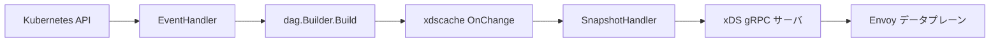

# アーキテクチャ

## 全体像

Contour は Envoy の xDS 制御プレーンである。Kubernetes API を監視し、ルーティングオブジェクトを内部の DAG (Listener -> VirtualHost -> Route -> Cluster) に変換し、それを Envoy リソースへ変換して gRPC で配信する。実際のプロキシは Envoy が行う。メインエントリは `cmd/contour/contour.go:30` で、kingpin のサブコマンド (`serve`・`bootstrap`・`certgen`・`cli`・`gateway-provisioner`) を持つ。コントローラ本体は `serve` 配下で動き、`doServe()` (`cmd/contour/serve.go:384`) に至る。

## コンポーネント

### internal/contour: EventHandler

Kubernetes イベントを受けて DAG 再構築をドライブする。`EventHandler` は `internal/contour/handler.go:45` で定義される。holdoff タイマでイベントのバーストをバッチしてから再構築するシングルスレッドのイベントループである。

### internal/dag: DAG への変換

変換ロジックの中核。Kubernetes オブジェクトを有向非循環グラフに変換する。`Builder.Build` は `internal/dag/builder.go:59` にある。実作業は Processor 群が担う: `httpproxy_processor.go`・`ingress_processor.go`・`gatewayapi_processor.go`・`listener_processor.go`。

### internal/xdscache (および v3): xDS リソースキャッシュ

DAG を Envoy の xDS リソース (CDS/EDS/LDS/RDS/SDS/RTDS) に変換しキャッシュする。`RouteCache.OnChange` (`internal/xdscache/v3/route.go:62`) が DAG から Envoy `RouteConfiguration` を構築する。`SnapshotHandler` (`internal/xdscache/v3/snapshot.go:35`) が go-control-plane の Snapshot を生成する。

### internal/xds (および v3): gRPC サーバ

Envoy へリソースを配信する gRPC サーバ。`RegisterServer` は `internal/xds/v3/server.go:38` にある。`ConstantHash` (`internal/xds/v3/hash.go:23`) がノード ID hasher である。

### internal/k8s と internal/provisioner

`internal/k8s` は informer・status updater・クライアントを持つ。`internal/provisioner` は Gateway オブジェクトから Deployment と Service を生成する Gateway API provisioner である。CRD の型定義は `apis/projectcontour` 配下にある。

## リクエストの流れ

1 つの変更、`HTTPProxy` の編集を、Envoy の RDS 更新まで端から端まで追う:

1. Kubernetes informer が発火。`EventHandler.OnAdd/OnUpdate/OnDelete` (`internal/contour/handler.go:103-116`) が操作を `update` チャネルへ送る。ハンドラは informer のイベントハンドラとして登録され、`cmd/contour/serve.go:599` で生成される。
2. `EventHandler.Start` のメインループ (`internal/contour/handler.go:134-244`) が変更を `KubernetesCache` に適用し、イベントのバーストをデバウンスする holdoff タイマを張る。
3. タイマ発火かつ informer キャッシュが同期済みのとき、ループは新しい DAG を構築して observer に渡す: `latestDAG := e.builder.Build()` のあと `e.observer.OnChange(latestDAG)` (`internal/contour/handler.go:224-226`)。続いて status 更新を送出する (`internal/contour/handler.go:228-231`)。
4. `Builder.Build` (`internal/dag/builder.go:59-127`) が登録済み Processor を順に実行し (`internal/dag/builder.go:79-81`)、無効な VirtualHost と空の Listener を剪定する (`internal/dag/builder.go:87-124`)。Processor 列は `getDAGBuilder` (`cmd/contour/serve.go:1087-1167`) で構築される: 最初に `ListenerProcessor`、次に `IngressProcessor`、続いて `HTTPProxyProcessor` (`internal/dag/httpproxy_processor.go:127`)、Gateway API 有効時のみ `GatewayAPIProcessor` を追加。
5. `observer.OnChange` は `ComposeObservers` (`internal/dag/dag.go:52-58`) を通じて各 `ResourceCache` と `SnapshotHandler` へファンアウトする。例として `RouteCache.OnChange` (`internal/xdscache/v3/route.go:62-142`) が DAG の Listener と VirtualHost を辿り Envoy `RouteConfiguration` proto を構築する。
6. `SnapshotHandler.OnChange` (`internal/xdscache/v3/snapshot.go:137-163`) が各キャッシュの `Contents()` を集約し、新しい UUID バージョンで go-control-plane の Snapshot を生成し (`internal/xdscache/v3/snapshot.go:153`)、`ConstantHash` のノード ID キーで `SetSnapshot` する (`internal/xdscache/v3/snapshot.go:159`)。
7. xDS gRPC サーバ (`cmd/contour/serve.go:905-906` で `RegisterServer` (`internal/xds/v3/server.go:38-40`) により登録) が、接続中の全 Envoy へ ADS 経由で新しい RDS を配信する。

## 主要な設計判断

- **フリート全体で 1 個のスナップショット**。`ConstantHash.ID` は常に同じ文字列を返す (`internal/xds/v3/hash.go:23-36`)。接続してくる Envoy は service-node フラグに関係なく 1 個のスナップショットを共有する。Contour はノード単位の状態ではなくクラスタ全体で 1 個のスナップショットだけを管理する。
- **EDS は別扱い**。`SnapshotHandler` はエンドポイント用に専用の `LinearCache` を持ち (`internal/xdscache/v3/snapshot.go:50-52`)、`MuxCache` が `TypeUrl` で振り分ける (`internal/xdscache/v3/snapshot.go:54-71`)。理由はコメントにある (`internal/xdscache/v3/snapshot.go:46-49`): SnapshotCache だと全 EDS ストリームが無関係なエンドポイント変更でも通知されてしまうため、LinearCache で明示的に要求されたリソースのみ更新する。
- **informer 同期を条件にしたデバウンス再構築**。DAG 再構築は holdoff タイマでデバウンスされ、ループは informer キャッシュが同期されるまで再構築をスキップして再試行する (`internal/contour/handler.go:212-220`)。

## 拡張ポイント

- 設定 API は 3 系統: 標準 `Ingress`、`HTTPProxy` CRD (`apis/projectcontour`)、Gateway API。
- Gateway provisioner (`internal/provisioner`) が Gateway API オブジェクトから Contour と Envoy のワークロードを生成する。
- Envoy `ext_authz` による外部認可、およびグローバル/ローカルのレートリミットを `HTTPProxy` で設定できる。
