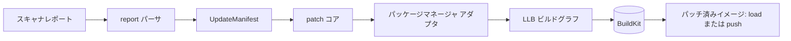

# アーキテクチャ

## 全体像

Copacetic はスキャナのレポートを BuildKit のビルドへと変換する CLI である。流れはこうだ。レポートをスキャナ非依存の更新リストへ解析し、対象がパッケージマネージャを持つ通常イメージか持たないイメージかを判定し、修正済みパッケージだけをインストールする LLB (Low-Level Build) グラフを構築し、そのグラフを BuildKit で解き、できたイメージをロードまたはプッシュする。実際のファイルシステム操作は BuildKit が行い、Copa の役割は正しいグラフを組み立てて結果を検証することである。

## コンポーネント

### CLI とオプション (`pkg/cmd/`)

Cobra のコマンド層がフラグと検証から `types.Options` を構築する (`src/pkg/cmd/cmd.go:86-113`)。`newRootCmd` が `patch` と `generate` を登録する (`src/main.go:42-43`)。`patch` の RunE は `--config` フラグで分岐し、config があればバッチパッチ用の `bulk.PatchFromConfig` を、なければ単一対象用の `patch.Patch` を呼ぶ (`src/pkg/cmd/cmd.go:120-133`)。更新が 0 件になるレポートはエラーではなく exit 0 で終える (`src/main.go:58-61`)。

### レポート解析 (`pkg/report/`)

`TryParseScanReport` はスキャナのレポートをスキャナ非依存の `unversioned.UpdateManifest` へ変換する。`scanner` の値が `trivy` なら内蔵の `TrivyParser` を使い、それ以外の値なら PATH 上の `copa-<scanner>` プラグインバイナリを exec する。これにより Grype などは Copa を変更せずに連携できる (`src/pkg/report/report.go:33-37`, `src/pkg/report/report.go:52-55`)。

### パッチ オーケストレーション (`pkg/patch/`)

`Patch` は処理をタイムアウト (既定 5 分) で包み、`patchWithContext` を goroutine で回して、タイムアウトやキャンセルを select で監視する (`src/pkg/patch/patch.go:41-79`)。単一アーキのレポートファイルなら `patchSingleArchImage` へ、レポートがディレクトリの場合やレポート無しでマルチプラットフォームイメージを検出した場合は `patchMultiPlatformImage` へルーティングする (`src/pkg/patch/patch.go:194-204`)。`ExecutePatchCore` はパッチ後の state を組む共通コアである (`src/pkg/patch/core.go:91`)。

### パッケージマネージャ アダプタ (`pkg/pkgmgr/`)

`GetPackageManager` はレポートの OS メタデータから apk・dpkg・rpm・pacman のアダプタを選ぶ (`src/pkg/pkgmgr/pkgmgr.go:37-74`)。各アダプタは 1 つのインターフェース `InstallUpdates(ctx, *UpdateManifest, bool) (*llb.State, []string, error)` を実装し、修正をインストールする BuildKit state を返す (`src/pkg/pkgmgr/pkgmgr.go:32-35`)。

### 言語パッチ (`pkg/langmgr/`)、実験的

言語ライブラリとツールチェーンのパッチはここにあり、`COPA_EXPERIMENTAL` の背後にゲートされている。言語更新がある場合に OS パッケージの後で適用される (`src/pkg/patch/core.go:136-172`)。実験的なものとして扱うべきで、安定した経路は OS パッケージのパッチである。

### BuildKit とイメージロード (`pkg/buildkit/`, `pkg/imageloader/`, `pkg/frontend/`)

`pkg/buildkit/` は BuildKit クライアント・ドライバ選択・プラットフォーム探索を担う。`pkg/imageloader/` は解いたイメージを Docker か Podman へロードする。`pkg/frontend/` は `cmd/frontend/` とともに BuildKit フロントエンドの入口を提供する (`src/cmd/frontend/main.go:22`)。`pkg/vex/` は OpenVEX 文書を出力し、`pkg/bulk/` は設定ファイルによるバッチパッチを駆動する。

## リクエストの流れ

単一アーキのイメージに対する `copa patch -i IMAGE -r report.json -t TAG` を追う。

1. `patch` の RunE が `types.Options` を埋め、SIGINT/SIGTERM でキャンセルされる context を作り、レポートファイルと単一イメージが与えられているため `patch.Patch` を呼ぶ (`src/pkg/cmd/cmd.go:71-72`, `src/pkg/cmd/cmd.go:133`)。
2. `Patch` はタイムアウトを適用し `patchWithContext` に引き渡す。これが単一アーキのケースを検出し `patchSingleArchImage` を呼ぶ (`src/pkg/patch/patch.go:194-204`)。
3. `patchSingleArchImage` は `TryParseScanReport` でレポートを解析し、パッケージ種別でフィルタし、OS と言語の更新がともに空なら `ErrNoUpdatesFound` を返す (`src/pkg/patch/single.go:121`, `src/pkg/patch/single.go:149-153`)。
4. BuildKit クライアントを作り、エクスポートのメディアタイプ (OCI か Docker か) を決める。パッチ後のタグが元のタグを再利用する際の mutable-tag レースを避けるため、パッチ前に元マニフェストの annotation を読む (`src/pkg/patch/single.go:173`, `src/pkg/patch/single.go:186-194`)。
5. `executePatchBuild` が `bkClient.Build` を実行し、そのコールバック内で `ExecutePatchCore` が対象イメージの LLB state を初期化し、パッケージマネージャをセットアップし、`InstallUpdates` を呼ぶ (`src/pkg/patch/single.go:520-541`, `src/pkg/patch/core.go:99-127`)。
6. 最終 state を marshal して `c.Solve` で解き、設定を対象プラットフォーム向けに正規化する (`src/pkg/patch/core.go:209-231`)。Copa はパッチに成功したパッケージからマニフェストを組み、VEX 文書を書き出す (`src/pkg/patch/single.go:553-587`)。
7. `--push` なしなら `loadImageToRuntime` がイメージを Docker か Podman へパイプ経由で流し込み、`--push` ありならレジストリへ送る (`src/pkg/patch/single.go:257-259`, `src/pkg/patch/single.go:392-415`)。

## 主要な設計判断

再ビルドではなく追加レイヤーとしてのパッチ。Copa は修正済みパッケージだけを既存イメージの上にインストールするので、下位レイヤーとそのキャッシュは手つかずのままである。これは「常に最新ベースで再ビルドする」モデル (例えば Chainguard/Wolfi) とは逆の発想であり、Copa は利用者が所有しないイメージの寿命を延ばす (`src/README.md:29-54`)。

スキャナ非依存のコア。`TryParseScanReport` より下流はすべて `unversioned.UpdateManifest` を扱うので、パッケージマネージャ層と BuildKit 層はスキャナ固有の形式を一切見ない。新しいスキャナは `copa-<scanner>` バイナリとして差し込む (`src/pkg/report/report.go:52-55`)。

パッケージマネージャを持たないイメージへの対応。distroless や scratch ベースのイメージにはイメージ内で実行できる `apt`/`apk` が無い。Copa は一致するツールイメージを解決し、そこで修正済みパッケージをダウンロード・展開し、その成果物だけを対象ファイルシステムにマージする。`unpackAndMergeUpdates` と `probeDPKGStatus` の経路は [内部実装](./internals) を参照。

## 拡張ポイント

- **スキャナプラグイン**: 期待するレポート形状を出力する、PATH 上の任意の `copa-<scanner>` バイナリ (`src/pkg/report/report.go:52-55`)。
- **パッケージマネージャ**: `PackageManager` インターフェース。apk/dpkg/rpm/pacman アダプタを同梱 (`src/pkg/pkgmgr/pkgmgr.go:32-35`)。
- **BuildKit フロントエンド**: `pkg/frontend/` と `cmd/frontend/main.go:22` により Copa を BuildKit フロントエンドとして動かせる。
- **言語マネージャ**: ライブラリ/ツールチェーンのパッチ用 `langmgr` インターフェース。`COPA_EXPERIMENTAL` の背後にゲートされ実験的 (`src/pkg/patch/core.go:136-172`)。
