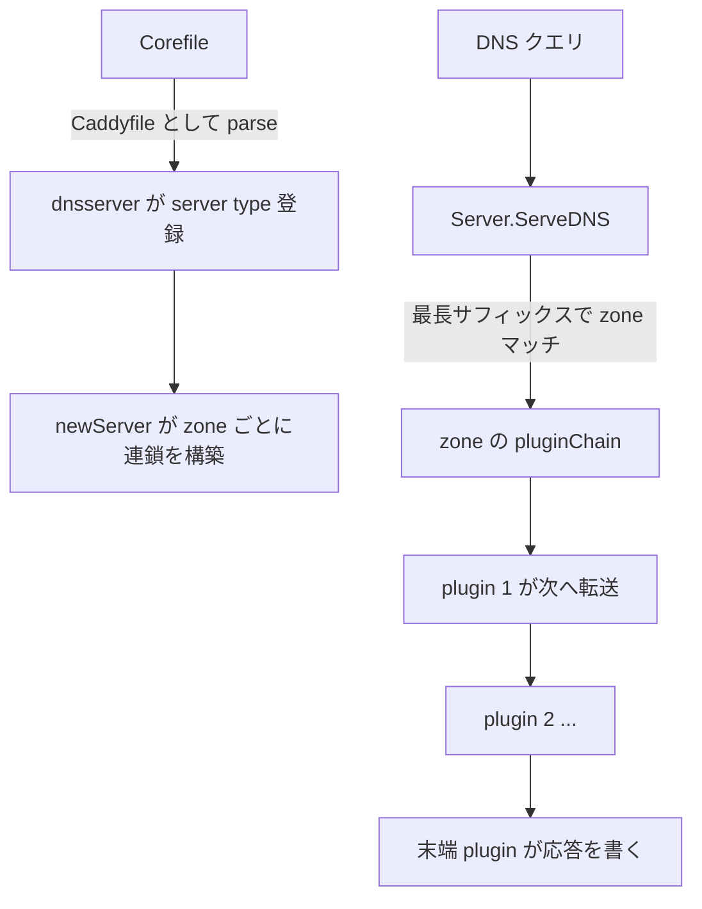

# アーキテクチャ

## 全体像

CoreDNS は単一バイナリ。起動時に自身を Caddy の server type として登録し、Corefile を server block 群に parse し、各 block についてプラグインハンドラの連鎖を組み立てる。リクエスト時には、ポートを listen するサーバが multiplexer として振る舞う。クエリ名を zone にマッチさせ、その zone のプラグイン連鎖にリクエストを渡す。連鎖はどれかのプラグインが応答を書くまでプラグインを 1 つずつ実行する。

## コンポーネント

### エントリポイントと起動: `coredns.go` と `coremain/`

`main()` は `coremain.Run()` を呼ぶだけで、ほかには何もしない (`src/coredns.go:11-13`)。このファイルは `github.com/coredns/coredns/core/plugin` を blank import し、全 in-tree プラグインを引き込むので、各プラグインの `init()` が走って登録される (`src/coredns.go:7`)。

### サーバ本体: `core/dnsserver/`

このパッケージがサーバを担う。`register.go` は `init()` で `caddy.RegisterServerType("dns", ...)` を呼び、Caddy に `Directives` リストとデフォルト Corefile を渡す (`src/core/dnsserver/register.go:18-30`)。`server.go` は zone ごとのプラグイン連鎖を組み立て、ディスパッチのエントリ `ServeDNS` を実装する。`config.go` は 1 つの server block の設定を保持する `Config` 構造体を定義する。

### プラグイン: `plugin/`

各プラグインは `plugin/` 配下の独自ディレクトリにある (`forward`、`cache`、`kubernetes`、`file`、`etcd`、`metrics`、`errors`、`log`、`rewrite`、`dnssec` など)。プラグインは `plugin.Register(name, setup)` で自分を登録する。これは server type `dns` で `caddy.RegisterPlugin` を呼ぶ薄いラッパ (`src/plugin/register.go:6-9`)。プラグイン横断のヘルパ (上流 proxy、DNS ユーティリティ) は `plugin/pkg/` にある。

### リクエストラッパ: `request/`

`request.Request` は `*dns.Msg` と `dns.ResponseWriter` をラップし、導出値 (バッファサイズ、DNSSEC OK ビット、クライアント IP とポート、アドレスファミリ) を遅延キャッシュして、プラグインが再計算しないで済むようにする (`src/request/request.go:14-33`)。

### 生成された配線: `core/plugin/zplugin.go` と `core/dnsserver/zdirectives.go`

この 2 ファイルは `go generate` が `plugin.cfg` から生成する。`zplugin.go` は blank import のリスト、`zdirectives.go` はプラグイン順を固定する `Directives` slice を持つ。`make` ターゲットは `plugin.cfg` が変わると両者を再生成する (`src/Makefile:27-28`)。

## リクエストの流れ

1. 起動時、`newServer` が各 zone の連鎖を組む。プラグイン factory をリスト末尾から先頭へ畳み込む。`for i := len(site.Plugin) - 1; i >= 0; i--` で `stack = site.Plugin[i](stack)` (`src/core/dnsserver/server.go:106-108`)。結果は `site.pluginChain` に格納される (`src/core/dnsserver/server.go:130`)。
2. クエリは `Server.ServeDNS(ctx, w, r)` に届く (`src/core/dnsserver/server.go:259`)。質問が空なら SERVFAIL を返す (`src/core/dnsserver/server.go:262-265`)。CHAOS でない非 INET class なら REFUSED (`src/core/dnsserver/server.go:283-286`)。EDNS version 不一致なら即返す (`src/core/dnsserver/server.go:288-291`)。
3. ResponseWriter を `ScrubWriter` で包み、応答をクライアントのバッファに収まるよう切り詰める (`src/core/dnsserver/server.go:294`)。
4. クエリ名を小文字化し (`src/core/dnsserver/server.go:296`)、`dns.NextLabel` でラベルを辿りながら `s.zones[q[off:]]` を引いて最長一致 zone を探す (`src/core/dnsserver/server.go:303-338`)。一致したら その Config の `pluginChain.ServeDNS` を呼ぶ (`src/core/dnsserver/server.go:323`)。`plugin.ClientWrite(rcode)` が false なら error パスが走る (`src/core/dnsserver/server.go:324-326`)。
5. どの zone にも当たらなければ、最後の砦として root zone `"."` を試す (`src/core/dnsserver/server.go:354-378`)。それも無ければ REFUSED を返す (`src/core/dnsserver/server.go:381`)。

## 主要な設計判断

連鎖は逆順に組み立てられる。各プラグインの `Next` フィールドが「自分の後に走るプラグイン」を指すように、`for i := len(site.Plugin) - 1; i >= 0; i--` で末尾から畳み込む (`src/core/dnsserver/server.go:106-108`)。実行順 (`plugin.cfg` の上から下) と組み立て順 (下から上) は意図的に逆で、ここは誤読しやすい。

プラグイン順はコンパイル時に固定される。`plugin.cfg` には順序が「VERY important」で、各プラグインは後ろのプラグインの影響を受けるが、前のプラグインが何をしているかを気にしてはいけない、と書かれている (`src/plugin.cfg:1-5`)。順序は生成された `Directives` に焼き込まれるため、ユーザは Corefile を編集してもプラグインの順序を変えられない。`plugin.cfg` を変えて再ビルドして変える。

DS クエリは特別扱いされる。質問の type が DS のとき、一致したハンドラは保持しつつ探索を続ける。親 zone が delegation signer レコードを返す必要があるかもしれないからだ (`src/core/dnsserver/server.go:329-351`)。

## 拡張ポイント

主な拡張ポイントはプラグイン。`plugin.Handler` を実装する型と、`plugin.Register` で登録する `setup` 関数の組だ (`src/plugin/register.go:6-9`)。`Handler` インターフェースは `ServeDNS(ctx, w, r) (int, error)` と `Name()` (`src/plugin/plugin.go:50-53`)。rcode を返せることが、応答を書いたかどうかをプラグインが伝える仕組みになっている。in-tree プラグインは `plugin.cfg` に並ぶ。out-of-tree プラグインは そこに記載して再ビルドするか、`COREDNS_PLUGINS` ビルド変数で追加する。
