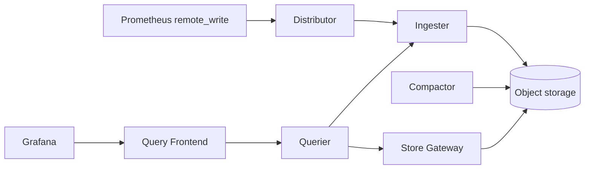

# アーキテクチャ

## 全体像

Cortex は名前付きモジュール群を公開する単一の Go バイナリ。`-target` フラグでプロセスが動かすモジュールを選び、alias `all` で single-binary モードになる (`pkg/cortex/cortex.go:147`)。モジュール名は `pkg/cortex/modules.go:74-106` で宣言され、`api`・`ring`・`distributor`・`ingester`・`querier`・`query-frontend`・`query-scheduler`・`store-gateway`・`compactor`・`ruler`・`alertmanager` などを含む。同じコンポーネント群を、テスト用に 1 プロセスとして動かすことも、本番で個別にスケールするサービスとして動かすこともできる。

コンポーネントは write path・read path・storage/compaction path に分かれ、ハッシュリングとテナント隔離がそのすべてを横断する。

## コンポーネント

### Distributor (write path)

ステートレス。remote write リクエストを受信し、検証し、HA レプリカペアをデデュープし、series ごとに consistent-hash トークンを算出し、所有する ingester へ分配する。定義は `pkg/distributor/distributor.go:85` で、ingester リング参照・レートリミッタ・HA tracker・Prometheus メトリクスを保持する。

### Ingester (write path)

セミステートフル。直近のサンプルをテナントごとのメモリ上 TSDB head に保持し、完成した TSDB block を定期的に flush してオブジェクトストレージへ ship する。テナントごとのラッパは `userTSDB` (`pkg/ingester/ingester.go:376`)。

### Querier と Query Frontend / Scheduler (read path)

querier はステートレスで、ingester と長期ストレージを横断して PromQL を実行する。オプションの query-frontend はクエリのキャッシュ・分割・キューイングを行い、オプションの query-scheduler はそのキューを切り離して独立にスケールさせる。どちらもモジュールセットに含まれる (`pkg/cortex/modules.go:74-106`)。

### Compactor と Store Gateway (storage path)

compactor (ステートレス) はオブジェクトストレージ内の TSDB block を compaction する。store-gateway (セミステートフル) はそれらの block に対するクエリを処理する。どちらもモジュールセットに含まれる (`pkg/cortex/modules.go:74-106`)。

## リクエストの流れ

remote write リクエストが代表的な操作。HTTP ルートは `pkg/api/api.go:296` で登録され、`POST /api/v1/push` を `push.Handler(...)` に紐付ける。`pkg/util/push/push.go:49` のハンドラが remote-write protobuf を `maxRecvMsgSize` で制限しつつ decompress/decode し、distributor の `Push` を呼ぶ。

`(*Distributor).Push` (`pkg/distributor/distributor.go:747`) はテナント ID を解決し、inflight とレートの上限をチェックし (`pkg/distributor/distributor.go:858`)、HA レプリカをデデュープする。series ごとに `tokenForLabels` (`pkg/distributor/distributor.go:583`) でリングトークンを算出する。`ShardByAllLabels` が有効なら user と全 label name/value をハッシュし (`shardByAllLabels`, `pkg/distributor/distributor.go:618`)、無効なら metric 名のみをハッシュする (`shardByMetricName`, `pkg/distributor/distributor.go:605`)。

分配は `doBatch` (`pkg/distributor/distributor.go:980`) を経由し、これが `ring.DoBatch` (`pkg/ring/batch.go:74`) を呼ぶ。各 key で `r.Get` が ingester のレプリケーションセットを解決し (`pkg/ring/batch.go:93`)、`record` (`pkg/ring/batch.go:151`) が instance 単位の結果を 2xx/4xx/5xx のファミリに集計して quorum を判定する。成功した key は各 ingester への gRPC 送信を発火し、ingester の `(*Ingester).Push` (`pkg/ingester/ingester.go:1324`) がテナントごとの TSDB head に append する。

## 主要な設計判断

- **pull ではなく push (remote write)。** Cortex はスクレイプではなくサンプルを中央で受信する。これが中央集約のマルチテナントストレージと write path の独立スケールを可能にする。
- **ingester 分配での background context。** `doBatch` はクライアントの context ではなく `RemoteTimeout` 付きの新しい background context で ingester へ送る (`pkg/distributor/distributor.go:984`)。クライアントが早期に切断してもレプリケーション quorum を壊さない。インラインコメントが明示する: "Use a background context to make sure all ingesters get samples even if we return early"。
- **シャーディングとレプリケーションのためのハッシュリング。** メンバシップとトークン所有はリングにあり、Consul・Etcd・memberlist gossip が裏付ける (`pkg/ring/`)。
- **ヘッダによるテナント隔離。** テナントは `X-Scope-OrgID` をキーとし、auth はデフォルトで有効 (`pkg/cortex/cortex.go:151`)。

## 拡張ポイント

- **リング KV バックエンド**: Consul・Etcd・memberlist gossip を設定で選択 (`pkg/ring/`)。
- **オブジェクトストレージバックエンド**: blocks storage 向けに S3・GCS・Azure・Swift。
- **モジュール**: `-target` フラグでバイナリを single-binary または per-service デプロイに構成する (`pkg/cortex/cortex.go:147`, `pkg/cortex/modules.go:74-106`)。
