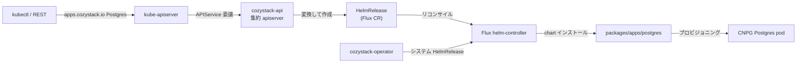

# アーキテクチャ

## 全体像

Cozystack は 1 つのバイナリではない。少数の Go コントローラと大量の Helm chart カタログの集合体で、既存の Kubernetes クラスタの上に載る。Go コードは `cmd/` 以下、カタログは `packages/` 以下にある。テナントが実際に話しかけるコントローラは `cozystack-api` で、`apps.cozystack.io` と `core.cozystack.io` の API グループを提供する集約 apiserver だ。テナントがこの API で作ったものはすべて Flux の `HelmRelease` になり、実作業 (chart のインストール) は Flux の helm-controller が行う。

## コンポーネント

### cozystack-api

集約 apiserver。`kube-apiserver` が `APIService` 経由で `apps.cozystack.io` グループをこれに委譲し、`Postgres`・`Kubernetes`・`VMInstance` などのテナント向け kind を提供する。エントリポイントは `cmd/cozystack-api/main.go:27` で、options を組んで generic apiserver を起動するだけだ。起動時にクラスタから `ApplicationDefinition` リソースを読み、kind ごとに REST storage を 1 つ登録する ([内部実装](./internals) 参照)。

### cozystack-operator と cozystack-controller

`cozystack-operator` はプラットフォーム自身のパッケージをリコンサイルする。`platform` パッケージを受け取り、システムコンポーネントの `HelmRelease` を生成する。`cozystack-controller` はプラットフォーム横断のコントローラを動かす。どちらも `cmd/` 以下にあり、補助バイナリの `backup-controller`・`backupstrategy-controller`・`flux-shard-operator` (Flux の負荷を shard 分割する)・`flux-plunger`・`kubeovn-plunger`・`lineage-controller-webhook`・`check-readiness`、そして chart パッケージング CLI の `cozypkg` が並ぶ。

### パッケージカタログ

`packages/` は Helm chart を保持し、3 つに分かれる。`packages/apps/` はテナント向けカタログで、`kubernetes`・`postgres`・`mariadb`・`mongodb`・`redis`・`clickhouse`・`kafka`・`rabbitmq`・`nats`・`opensearch`・`qdrant`・`foundationdb`・`harbor`・`vm-instance`・`vm-disk`・`vpc`・`vpn`・`tenant`・`http-cache`・`tcp-balancer`・`bucket`・`openbao` を含む。`packages/system/` はプラットフォームを構成する CSI・CNI・operator の chart (130 以上) を持つ。`-rd` 接尾辞の chart はテナント向け kind を記述する `ApplicationDefinition` リソースを配る。`packages/core/` は `installer`・`platform`・`talos`・`flux-aio` を持つ。

### 同梱スタック

システム chart は Cozystack が土台にするプロジェクトを同梱する。Flux (リコンサイルのバックエンド)、KubeVirt + CDI (VM)、Cluster API + Kamaji (テナントのコントロールプレーン)、CloudNativePG (Postgres)、LINSTOR / Piraeus + SeaweedFS (ストレージ)、Cilium + Kube-OVN (ネットワーク)、MetalLB (ロードバランサ)、Talos Linux (OS)、Keycloak (OIDC)、VictoriaMetrics + Grafana (可観測性) だ (README, 出典 2)。

## リクエストの流れ

テナントが `Postgres` を作る流れを追う。

1. テナントは `apps.cozystack.io/v1alpha1` の `Postgres` オブジェクトを自分の namespace に `kubectl` で適用する。
2. `kube-apiserver` は `apps.cozystack.io` グループが `cozystack-api` に委譲されているのを見て、create を転送する。
3. `cozystack-api` は `REST.Create` (`pkg/registry/apps/application/rest.go:166`) で受ける。名前の形式と長さを検証し、`_` 始まりの予約キーを弾き、検証 admission チェーンを明示的に実行する (`pkg/registry/apps/application/rest.go:210`)。
4. `ConvertApplicationToHelmRelease` (`pkg/registry/apps/application/rest.go:216`) で変換する。生成される `HelmRelease` は `<prefix><app-name>` という名前で、固定の `ChartRef` で `packages/apps/postgres` chart を指し、必ず `Secret/cozystack-values` を mount し、`Values: app.Spec` を設定する。つまりテナントの spec がそのまま chart の Helm values になる (`pkg/registry/apps/application/rest.go:1605`)。
5. `HelmRelease` をテナント namespace に作成する (`pkg/registry/apps/application/rest.go:238`)。Cozystack の別 store は存在せず、`HelmRelease` が永続化された状態そのものだ。
6. Flux の helm-controller が `HelmRelease` をリコンサイルし chart をインストールして、実際の CloudNativePG クラスタを立ち上げる。
7. 読み取り時、`cozystack-api` は `HelmRelease` を `Application` に逆変換し status を合成するので、テナントには裏の `HelmRelease` ではなく `Postgres` オブジェクトが見える。

## 主要な設計判断

API は翻訳層であってデータストアではない。Cozystack はテナントリソースを自前の etcd テーブルに持たず、各 Application を Flux の `HelmRelease` に射影し、リコンサイル・履歴・リトライを Flux に委ねる (`pkg/registry/apps/application/rest.go:1605`)。この選択によって、1 つの汎用 REST 実装で全 kind を支えられる。

kind はコードでなくデータだ。新しいマネージドサービスは `packages/apps/` の Helm chart と (`-rd` chart が配る) `ApplicationDefinition` で成り立つ。`cozystack-api` は起動時にそれらの定義を読み、各 kind を動的に登録する (`pkg/apiserver/apiserver.go:229`)。そのためサービスの追加に Go バイナリの再ビルドは要らない。詳細は [内部実装](./internals) を参照。

Flux への負荷は shard 分割される。あらゆるテナントリソースが `HelmRelease` になるため、賑わうプラットフォームでは大量に生まれる。`flux-shard-operator` はそのリコンサイル負荷を複数の helm-controller shard に分散するために存在する。

## 拡張ポイント

- `ApplicationDefinition` リソースはコード変更なしで新しいテナント向け kind を定義する。`-rd` chart が配送手段だ。
- `packages/apps/` カタログは Helm chart なので、事業者は chart を fork/追加して kind がプロビジョニングする内容を変えられる。
- kind ごとの挙動 (install/upgrade のタイムアウト、リトライ、wait 無効化) は `ApplicationDefinition` のアノテーションで設定し、変換時に読まれる (`pkg/registry/apps/application/rest.go:1553`)。
- プラットフォームは標準の Kubernetes と Flux の拡張面を再利用する。admission webhook・CRD・Flux `HelmRelease` の values だ。
