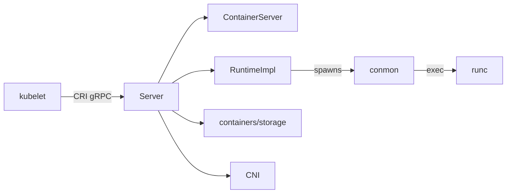

# アーキテクチャ

## 全体像

CRI-O は 1 本のデーモン `crio` として動く。エントリポイントは `cmd/crio/main.go` で、urfave/cli v2 のアプリを組み立て、cmux で多重化した gRPC サーバを立てる (`cmd/crio/main.go:1-60`)。kubelet は Unix ソケットで接続し、CRI 呼び出しを発行する。呼び出しは両 CRI サービスを実装する `Server` 型に着地し、実行を OCI ランタイムに、ストレージを containers/storage に、ネットワークを CNI に委譲する。

## コンポーネント

### デーモンと CRI サーバ (`cmd/crio`, `server/`)

`cmd/crio/main.go` がプロセスのエントリポイント。CRI 面は `server/` にあり、1 つの `Server` 構造体が `RuntimeService` と `ImageService` の両方を実装する (`server/server.go:68-104`)。RPC ごとのハンドラは `container_*.go` / `sandbox_*.go` / `image_*.go` などに分かれる。`Server` は `*lib.ContainerServer` を embed し、ランタイム・ストア・ストレージランタイムサーバへアクセスする (`server/server.go:69-70`)。

### OCI ランタイム抽象 (`internal/oci/`)

`internal/oci/` は、実際にどのランタイムがコンテナを動かすかを `RuntimeImpl` インターフェースの裏に隠す。このインターフェースは create / start / exec / stop / checkpoint などコンテナライフサイクル全体を宣言する (`internal/oci/oci.go:60-86`)。実装は 3 つ。`runtime_oci.go` が conmon + runc/crun、`runtime_pod.go` が conmonrs、`runtime_vm.go` が Kata などの VM ランタイム。`Runtime` は handler 名から実装への `runtimeImplMap` を持ち (`internal/oci/oci.go:95-98`)、Pod の runtime handler が実装を選ぶ。

### コアライブラリとストレージ (`internal/lib/`, `internal/storage/`)

`internal/lib/` に `ContainerServer` と、Pod 1 個分の `Sandbox` 型を持つ `sandbox` パッケージがある。`internal/storage/` は containers/storage をラップし、イメージ pull・レイヤ・コンテナ rootfs を扱う。ネットワークは `server/sandbox_network_linux.go` から CNI 経由で、ホストポートマッピングは `internal/hostport/` で扱う。

## リクエストの流れ

`RunPodSandbox` は kubelet が Pod を起こすときに呼ぶ。トレース:

1. `RunPodSandbox` (`server/sandbox_run.go:68`) がプラットフォーム実装 `runPodSandbox` (`server/sandbox_run_linux.go:409`) に委譲する。
2. sandbox を組み立て、`GenerateNameAndID()` が OCI 名 `<ns>-<name>-<attempt>` と ID を採番する (`server/sandbox_run_linux.go:413-438`)。
3. Pod 名を予約し (既存があれば冪等に return)、失敗時の cleanup を `resourceCleaner` に積む (`server/sandbox_run_linux.go:440-468`)。
4. ホストネットワークでなければ、CNI プラグインの準備完了を待つ (`server/sandbox_run_linux.go:472-476`)。
5. pause (infra) イメージを `StorageRuntimeServer().CreatePodSandbox(...)` でストレージに作成する。`ErrDuplicateName` は明示処理する (`server/sandbox_run_linux.go:535-547`)。
6. infra コンテナを `oci.NewContainer(...)` で生成、VM/pod runtime type なら `NewSpoofedContainer` を使う (`server/sandbox_run_linux.go:1294-1310`)。
7. `createAndStartInfraContainer` が PreStart hooks を走らせ、`CONTAINER_CREATED` イベントを出し、`Runtime().StartContainer` を呼んで状態を disk に永続化する (`server/sandbox_run_linux.go:1350-1372`)。
8. `s.networkStart(ctx, sb)` でネットワークを確立し、IP と CNI result を得る (`server/sandbox_run_linux.go:1489`)。
9. `StorageRuntimeServer().StartContainer(sboxID)` で rootfs をマウントする (`server/sandbox_run_linux.go:1587`)。

途中で失敗すると、defer された `resourceCleaner` が直前までの手順を LIFO で巻き戻す (`server/sandbox_run_linux.go:444-453`)。

## 主要な設計判断

CRI-O はコンテナを自分で fork しない。OCI create パスは runc を直接 exec せず、監視デーモン `conmon` を起動し、`-r <runtime path>` と `--runtime-arg root=<root>` を渡して conmon に runc を代理起動させる (`internal/oci/runtime_oci.go:145-160,217`)。`crio` ではなく conmon がコンテナの親なので、CRI-O デーモンを再起動しても動作中のコンテナは死なない。conmon が stdio・log・exit code・端末割当・OOM 処理を担う。

2 つ目は抽象そのものだ。すべてのライフサイクル呼び出しを `RuntimeImpl` 経由にし (`internal/oci/oci.go:60-86`)、handler ごとの `RuntimeType` で実装を選ぶ (`internal/oci/oci.go:184`)。これで同じ CRI パスが、サーバ層で分岐せずに conmon+runc・conmonrs・Kata VM を扱える。

3 つ目は並列 pull の一本化。`Server` は image と認証情報をキーに `pullOperationsInProgress` を持ち、`pullOperationsLock` で守る。同一イメージの並列 pull は競合せず 1 つの操作に block する (`server/server.go:84-126`)。

## 拡張ポイント

- **Runtime handler**: 各 `config.RuntimeHandler` が `RuntimePath`・`MonitorPath`・`RuntimeType` を指定し、runc・crun・conmonrs・VM ランタイムを登録して Pod ごとに選べる (`internal/oci/oci.go:108-124`)。
- **NRI**: Node Resource Interface のプラグイン面は `internal/nri/` にあり、`Server` の `nri *nriAPI` として露出する (`server/server.go:99`)。
- **Hooks**: OCI ランタイム hooks は sandbox ごとに `hooksRetriever` で解決する (`server/server.go:101`)。
- **CNI**: ネットワークは任意の CNI プラグイン。`server/sandbox_network_linux.go` から呼ぶ。
