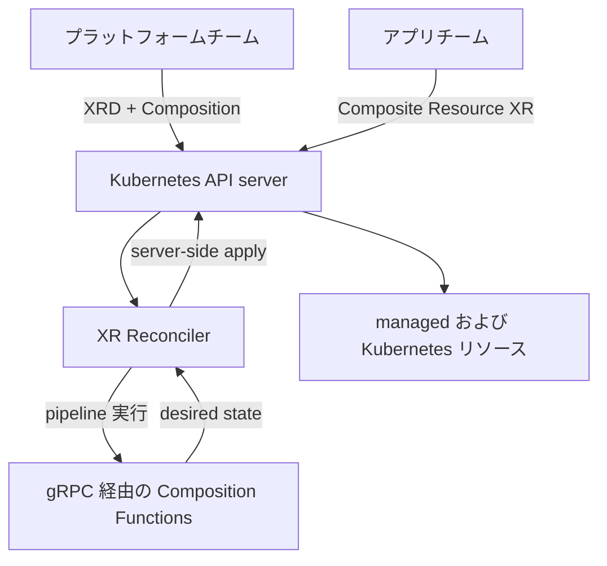

# アーキテクチャ

## 全体像

Crossplane は Kubernetes API server の上で動くコントローラ群である。自前の状態ストアは追加しない。desired state と observed state は etcd 内のカスタムリソースで、コントローラがループで reconcile する。単一の `crossplane` バイナリがサブコマンド `core` / `rbac` / `render` を提供する (`cmd/crossplane/main.go:87`)。`core` コントローラプロセスは 5 つのトップレベルのコントローラ群を組み立て、それぞれが 1 つの関心事 (composition、package 管理、operations、RBAC、protection) を担う。

## コンポーネント

### apiextensions: composition エンジン

`internal/controller/apiextensions/` はコアの composition エンジンである。XRD・Composition・CompositionRevision・composite resource (XR) を扱う。reconcile パスの中心であり、`apiextensions.Setup(mgr, ao)` (`cmd/crossplane/core/core.go:539`) で起動される。

### pkg: package manager

`internal/controller/pkg/` は Provider・Configuration・Function パッケージ (OCI image) をインストールする。依存を解決し、パッケージの revision を管理する。依存解決は `internal/dag/dag.go:17` の directed acyclic graph ("Package dag implements a Directed Acyclic Graph for Package dependencies") を用いる。`pkg.Setup(mgr, po)` (`cmd/crossplane/core/core.go:642`) で起動される。

### ops: Operations (v2)

`internal/controller/ops/` は v2 の機能である。function pipeline を Job のように一回完走させる。形態は `operation` / `cronoperation` / `watchoperation`。feature flag が立てば `ops.Setup` (`cmd/crossplane/core/core.go:550`) で条件付きに起動される。

### rbac と protection

`internal/controller/rbac/` は RBAC Manager で、各 XRD が必要とする ClusterRole を生成する。`internal/controller/protection/` は usage と削除保護を扱い、foreground deletion とクロスリソース参照保護を含む。`protection.Setup` (`cmd/crossplane/core/core.go:654`) で起動される。

### engine: 動的なコントローラのライフサイクル

`internal/engine/engine.go:17` ("Package engine manages the lifecycle of a set of controllers") は、XRD が適用・削除されるたびに対応する XR コントローラを起動・停止する。これにより、起動中のコントローラ集合が定義済み API の集合に追従する。

## リクエストの流れ

代表的な操作は composite resource (XR) の reconcile である。入口は `internal/controller/apiextensions/composite/reconciler.go:564` の `(*Reconciler).Reconcile`。

1. XR を Get する (`reconciler.go:574`)。
2. circuit breaker の状態を確認し condition をセットする (`reconciler.go:592`)。
3. pause annotation を尊重し、paused なら return する (`reconciler.go:600`)。
4. XR が削除中なら finalizer を除去して return する。削除時に function は走らない (`reconciler.go:618`)。
5. finalizer を付与する (`reconciler.go:642`)。
6. Composition 参照を解決する (`reconciler.go:656` `SelectComposition`)。
7. CompositionRevision を選択して取得する (`reconciler.go:674`、`reconciler.go:693`)。
8. `resource.Compose(ctx, xr, ...)` を呼び、function pipeline を実行する (`reconciler.go:745`)。

`Compose` の実体は `internal/controller/apiextensions/composite/composition_functions.go:288` の `(*FunctionComposer).Compose`。既存の composed リソースを観測し、protobuf の state を構築し、pipeline の各ステップで function を gRPC 経由に呼び (`composition_functions.go:405` `c.pipeline.RunFunction`)、desired state を次のステップへ引き継ぎ、最後に composed リソースを構築して apply する。

## 主要な設計判断

- **gRPC 経由の composition function。** v2 は patch-and-transform を廃し、composition を function の pipeline にした。各 function は別プロセス/コンテナで動く gRPC サービスである。契約は `proto/fn/v1/run_function.proto` の `RunFunctionRequest` (`run_function.proto:39`) と `State` (`run_function.proto:281`)。function は完全な desired state を返し、含めなかったものは削除される。これにより composition を任意の言語で書ける。[Functions docs](https://docs.crossplane.io/latest/packages/functions/) を参照。
- **server-side apply の field ownership。** composed リソースは SSA の field manager で所有される。`ComposedFieldOwnerName(xr)` (`composition_functions.go:755`) が XR ごとの field manager 名を導出し、複数の composer が 1 つのリソースを安全に分担できる。
- **組み込みの circuit breaker。** XR reconciler は処理前に circuit 状態を確認し (`reconciler.go:592`)、暴走 watch を遮断して状態を condition として公開する。

## 拡張ポイント

- **XRD と Composition** はプラットフォームチームが新しい API を定義し、それを function pipeline にマップする。
- **パッケージ** (OCI image としての Provider・Configuration・Function) はクラスタを拡張し、`internal/dag/` の DAG で解決される。
- **function の gRPC 契約** (`proto/fn/v1/run_function.proto`) は、サードパーティが任意言語で composition ロジックを書くために実装するインターフェースである。
